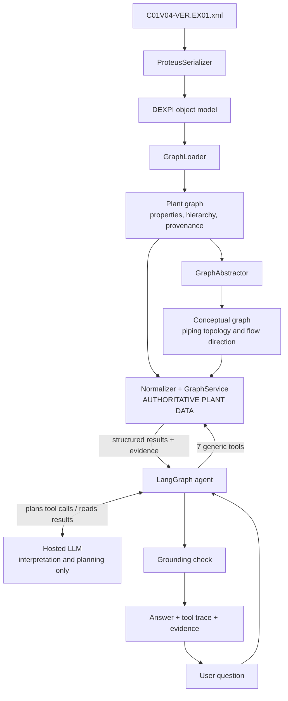

# P&ID graph agent

An agent that answers natural-language questions about a plant by querying the knowledge
graph that [pyDEXPI](https://github.com/process-intelligence-research/pyDEXPI) builds from the
DEXPI reference P&ID `C01V04-VER.EX01.xml`.

> The LLM interprets intent and plans graph operations; it is not the source of plant
> knowledge. Plant-specific facts are retrieved from deterministic operations over the pyDEXPI
> graph. A deterministic grounding validator checks cited identifiers, values and supported
> relation classes before model-generated prose is shown.

Every answer comes with the tool calls that produced it, the graph facts it rests on, and the
result of a grounding check.

The agent uses an open-weight LLM through NVIDIA-hosted inference
(`nvidia/nemotron-3-super-120b-a12b`). The model interprets the question, plans graph
operations and words the answer. pyDEXPI and NetworkX hold the plant facts, deterministic
tools retrieve them, and code checks the answer against the evidence it cites. Inference is
remote because the project was built and tested on an 8 GB MacBook; nothing needs a GPU or a
local model.

| Looking for | Go to |
|---|---|
| Install and ask a question | [How to run](#how-to-run) |
| Optional local chat UI | [Local chat UI](#local-chat-ui) |
| Design note | [Design note](#design-note) |
| Transcripts, including failures | [Example transcripts](#example-transcripts) |
| Evaluation set, scorer and score | [Evaluation](#evaluation) |
| A 10-minute explanation with diagrams | [docs/HOW_IT_WORKS.md](docs/HOW_IT_WORKS.md) |
| Requirement-by-requirement audit | [docs/SUBMISSION_AUDIT.md](docs/SUBMISSION_AUDIT.md) |
| Follow-up: complex and rephrased questions | [docs/FOLLOWUP_EXERCISE.md](docs/FOLLOWUP_EXERCISE.md) |

## How to run

```bash
git clone <this repository> && cd <this repository>
uv sync                                          # install (Python 3.12 is fetched if needed)
cp .env.example .env                             # then put your NVIDIA_API_KEY in .env
uv run pid-agent "What is P4711 connected to, and through which pipes?"
```

`uv run pid-agent` without a question opens an interactive prompt. Add `--no-trace` for the
answer only or `--json` for the full structured result. `--pid FILE` loads another DEXPI file
instead of C01 (or set `PID_DATA_FILE`), for example one of the official examples:

```bash
uv run pid-agent --pid data/dexpi-1.3-examples/I03V01-VER.EX01.xml "Which valve does LICSA03 act on?"
```

Without any API key you can still call the graph tools directly and run the tests:

```bash
uv run pid-agent tool traverse '{"start_entity_id": "P4711", "direction": "downstream", "entity_types": ["valve"]}'
uv run pytest                                    # 784 deterministic tests, no network
uv run python evals/evaluator.py                 # re-score every saved evaluation run
uv run python scripts/ingestion_matrix.py        # all 35 DEXPI 1.3 examples through ingestion
```

Re-running an evaluation needs a key and makes live model calls: `uv run python
evals/evaluator.py --run` for C01, `--dataset-name c02 --run` (or `c03`, `i03`, `i05`, `e12`,
`e06`, `p02`, `p04`) for a cross-P&ID suite; see
[Cross-P&ID Generalization](#cross-pid-generalization).

### Local chat UI

```bash
uv run pid-agent-ui
```

Opens a local [Streamlit](https://streamlit.io) page (installed by `uv sync`). It is a
presentation layer over the same agent: it calls `PidAgent.ask` and shows the answer, then, in
expandable sections, the tool calls with their inputs and results, the graph evidence, the
grounding status with each validated claim and the graph fact behind it, and any graph notes
(ambiguity, missing properties, open ends, truncated searches). Each question is an independent agent run; earlier messages stay on screen but are
not sent to the model. The UI was added after the evaluation below and played no part in it.


*The screenshot was taken before the evidence-reference grounding was added; it shows a saved DeepSeek answer, and the status label has since changed.*

### Configuration

Set in `.env` (see `.env.example`). One provider is used per run; there is no automatic
failover.

| `LLM_PROVIDER` | Key variable | `LLM_MODEL` |
|---|---|---|
| `nvidia` (default) | `NVIDIA_API_KEY` | `nvidia/nemotron-3-super-120b-a12b` (default) |

Other adapters exist behind the same interface and are selected only by setting
`LLM_PROVIDER`: `groq` (`GROQ_API_KEY`, default model `openai/gpt-oss-20b`), `deepseek`
(`DEEP_SEEK_API_KEY`) and `openrouter` (`OPENROUTER_API_KEY`); the last two need `LLM_MODEL`.

`LLM_BASE_URL` overrides the NVIDIA endpoint (default `https://integrate.api.nvidia.com/v1`)
and `LLM_TIMEOUT_SECONDS` the per-call timeout (default 240 s for NVIDIA).

**Model choice.** Four NVIDIA-hosted candidates were tried on this agent's own tasks: native
tool calling with the real tool schema, then six questions through the full agent. Nemotron 3
Super was the only one with no malformed tool calls and had the most answers grounded on the
first attempt; `openai/gpt-oss-20b` on NVIDIA produced malformed tool names, Nemotron 3.5
Lightning timed out on every question, and one listed model was not callable. This is a
task-specific observation from a small sample, not a general ranking.

**What "open" means here.** Nemotron 3 Super's weights are public under the *NVIDIA Nemotron
Open Model License*, which permits commercial use, modification and redistribution with
notice requirements. NVIDIA describes it as an open model with open weights. It is not an
OSI-approved open-source licence, so the accurate term is open-weight. The Apache-2.0
`openai/gpt-oss-20b` remains selectable with `LLM_PROVIDER=groq`. The agent framework
(LangGraph), pyDEXPI and NetworkX are open source.

**Earlier runs.** Development started on Groq `openai/gpt-oss-20b`, whose free daily quota
ran out, and the first complete evaluation was run on DeepSeek `deepseek-chat` (a hosted
alias; no licensing claim is made for it). Those runs are kept below as historical records.
The OpenRouter adapter is tested only against mocks.

## Design note

**Ingestion.** `ProteusSerializer` parses the XML into the DEXPI object model, `GraphLoader`
turns that into a NetworkX `MultiDiGraph` (the *plant graph*: 214 nodes, every DEXPI object,
edges are only "composition" and "reference"), and `GraphAbstractor.build_conceptual_graph`
collapses it into the *conceptual graph* (36 nodes: equipment, valves, fittings, instrument
functions; pipes become edges). Nothing is hand-written; the graph was inspected before any
design decision.

**Why two graphs.** Each is authoritative for a different thing:

- *Conceptual graph: topology.* Its piping edges run DEXPI source to target, which is the
  drawn flow direction. I verified this against the XML: all 23 segments follow
  `FromID -> ToID`, and the eight flow-arrow symbols point the same way.
- *Plant graph: properties, hierarchy, provenance.* The abstraction copies line attributes
  onto nodes with first-writer-wins (one tee ends up on the wrong line), and it drops nozzles
  and chambers, where design pressure and temperature live. So entity properties and line
  context are always re-read from the plant graph.
- *Recovered open ends.* The abstraction silently drops four pipes that have only one end on
  the drawing. They are recovered from the plant graph and marked `open_end`, with provenance,
  and are never given a destination.
- *Chamber-aware traversal.* Both sides of a heat exchanger merge into one node. A path that
  enters through one chamber may only leave through the same chamber; a boundary that was not
  crossed is reported as a structured fact.

Graph node ids are random per load, so public ids are the stable Proteus ids
(`CentrifugalPump-1`).

**Entity resolution** is deterministic and tiered: exact tag, tag ignoring case, id, any other
identifier (only five items have a tag; valves are found by position number, component code,
or line plus component number), identifiers inside a phrase, then type words. An identifier
shared by several items returns all of them flagged ambiguous. Fuzzy matches are only ever
suggestions.

**Tools.** Seven generic operations, no question-specific ones (three more for multi-step analysis were added in the [follow-up](#follow-up-complex-reasoning-and-rephrasing)):
`find_entities`, `list_entities`, `get_entity`, `get_connections` (adjacency),
`traverse` (reachability, cycle-safe, depth-bounded), `find_path` (route) and
`get_properties`. Every result is structured and carries evidence items that point back to
graph objects.

**Agent.** A LangGraph state machine:
plan -> execute tools -> plan again if needed -> answer citing evidence ids -> validation ->
(one regeneration from evidence only) -> final answer, or a cautious answer assembled directly
from evidence. When the answer is just what some result rows say, the model replies with the
ids alone and the application prints those rows, so the model is not used to reformat facts. The model chooses tools and words the answer. Budgets (8 planning turns, 16
tool calls, repeated-call detection) guarantee termination.

**Grounding.** Code gives every row of a tool result an evidence id (`E2.3` = row 3 of step
2, `R2` = the whole result) and turns the rows into typed facts (subject, relation or
property, value, qualifiers, graph source). The answer cites ids instead of restating
evidence: "P4711 feeds H1007 through line 47122. [E2.3]". For each sentence, code resolves the
ids and checks association, not just presence: an identifier or value must be in the cited
facts; a value must belong to an item the sentence names (so "P4712's line is DN 80" fails
even though both tokens exist in the evidence); and a relation stated with a wording from a
small fixed vocabulary (connected; feeds, supplies, discharges to, sends fluid to, flows to,
fed by; downstream/upstream of; operates, actuates, controls; sends its signal to; senses or
measures at) must be one a tool result shows, in that direction. Relations worded otherwise
are checked only for the items and values they name, and a statement about the plant with
nothing checkable in it makes the answer at most `limited`. Adjacent pipes
may be followed only under the chamber rule; `800.0 mm` never supports `DN 800`; nothing is
converted. Tool inputs, messages and warnings never become facts. No model judges the answer.
A fully cited answer that passes is `grounded`; one that passes only against all evidence,
without ids, is `limited`; anything unsupported gets one rewrite and is then withheld. A model
output cut off at its token limit is detected and never parsed as an answer
([agent/evidence_refs.py](src/pid_agent/agent/evidence_refs.py),
[agent/claims.py](src/pid_agent/agent/claims.py)).

**Visible workflow.** The trace lists the actual tool calls, inputs and results. It contains
no model reasoning.



## Example transcripts

All nine are from the final evaluation run (NVIDIA `nvidia/nemotron-3-super-120b-a12b`), unedited.
Each block shows the actual tool calls and the answer; the linked file has every tool result,
the grounded statements and the evidence. `[E2.3]` is an evidence id: row 3 of the tool result
in step 2.

**1. Direct connection** ([full](evals/runs/nvidia-nvidia-nemotron-3-super-120b-a12b/transcripts/eval-03.txt))

```
Q: What sits directly on either side of the pipe reducer, and what size is the pipe on each side?
1 find_entities {"query": "reducer"}                                              -> success
2 get_connections {"entity_id": "PipeReducer-1", "direction": "both", "relationship": "piping"} -> success
A: The pipe reducer (PipeReducer-1) has an upstream connection to SwingCheckValve-1
   (SwingCheckValve 47124/C2) via pipe segment S2 on line 47124 with nominal diameter DN 80 [E2.2].
   It has a downstream connection to BallValve-1 (BallValve 47124/C4) via pipe segment S3 on
   line 47124 with nominal diameter DN 50 [E2.3].
GROUNDING: grounded    3 model calls, 19 s
```

**2. Multi-hop traversal** ([full](evals/runs/nvidia-nvidia-nemotron-3-super-120b-a12b/transcripts/eval-04.txt))

```
Q: Which pumps are upstream of the tubular heat exchanger?
1 find_entities {"query": "tubular heat exchanger"}                               -> success
2 traverse {"start_entity_id": "TubularHeatExchanger-1", "direction": "upstream", "entity_types": ["pump"]} -> success
A: The pumps upstream of the tubular heat exchanger (H1008) are ReciprocatingPump-1 (P4712)
   and CentrifugalPump-1 (P4711). [E1.1, E2.1, E2.2]
GROUNDING: grounded    3 model calls, 16 s
```

**3. Property lookup** ([full](evals/runs/nvidia-nvidia-nemotron-3-super-120b-a12b/transcripts/eval-09.txt))

```
Q: What fluid code and piping class does line 47125 carry?
1 find_entities {"query": "47125", "entity_type": "line"}                          -> success
2 get_properties {"ids": "PipingNetworkSystem-5", "requested_properties": ["fluidCode", "pipingClass"]} -> success
A: Line 47125 carries fluid code MNc [E2.1]. Its piping class is 73HG12 [E2.4].
GROUNDING: grounded    3 model calls, 50 s
```

**4. Items along a route** ([full](evals/runs/nvidia-nvidia-nemotron-3-super-120b-a12b/transcripts/eval-08.txt))

```
Q: Going from pump P4712 to heat exchanger H1008, which valves do I pass through?
1 find_entities {"query": "P4712", "entity_type": "pump"}                          -> success
2 find_entities {"query": "H1008", "entity_type": "heatExchanger"}                 -> success
3 find_path {"source_entity_id": "ReciprocatingPump-1", "target_entity_id": "TubularHeatExchanger-1", "direction": "downstream"} -> success
A: You pass through BallValve 47126/C7 (BallValve-4) on the line 47126, DN 50, fluid MNc. [R3]
GROUNDING: grounded    4 model calls, 19 s
```

**5. Ambiguity is surfaced, not guessed** ([full](evals/runs/nvidia-nvidia-nemotron-3-super-120b-a12b/transcripts/eval-02.txt))

```
Q: What is the nominal diameter at component C1?
1 find_entities {"query": "C1"}                                                    -> ambiguous
2 get_properties {"ids": [five candidates], "requested_properties": ["nominalDiameter"]} -> success
A: The supplied P&ID does not contain a single nominal diameter for component C1 because the
   identifier "C1" matches multiple entities (GlobeValve-2, ButterflyValve-1, PipeTee-2,
   GlobeValve-1, GlobeValve-3) that have different nominal diameters, and the graph does not
   select one of them.
GROUNDING: limited (first draft rejected; the rewrite cited no evidence ids)    4 model calls, 243 s
```

**6. Missing data** ([full](evals/runs/nvidia-nvidia-nemotron-3-super-120b-a12b/transcripts/eval-11.txt))

```
Q: How much does heat exchanger H1007 weigh?
1 find_entities {"query": "H1007"}                                                 -> success
2 get_properties {"ids": ["PlateHeatExchanger-1"]}                                 -> success
A: The P&ID does not contain a weight property for heat exchanger H1007. [R2]
GROUNDING: grounded    3 model calls, 14 s
```

**7. Struggle: the right route, an incomplete answer** ([full](evals/runs/nvidia-nvidia-nemotron-3-super-120b-a12b/transcripts/eval-07.txt))

```
Q: Trace the route from heat exchanger H1007 to tank T4750 and give the line number and pipe size along it.
1 find_entities "H1007"   2 find_entities "T4750"
3 find_path {"source_entity_id": "PlateHeatExchanger-1", "target_entity_id": "Tank-1", "direction": "any"} -> success
A: The route from heat exchanger H1007 to tank T4750 follows line 47123 with a pipe size of DN 80. [E3.1]
GROUNDING: grounded    score 0.67
```

`find_path` returned the route through GlobeValve-2. Everything the answer says is true and
grounded, but it was asked to trace the route and left the valve out.

**8. Failure: the planner stopped one step early** ([full](evals/runs/nvidia-nvidia-nemotron-3-super-120b-a12b/transcripts/eval-13.txt))

```
Q: For control loop 4712.02: where is the pressure sensed, and which valve does the loop end up acting on?
1 find_entities {"query": "4712.02"}                                               -> success
2 get_connections {"entity_id": "ProcessInstrumentationFunction-2", "relationship": "instrumentation"} -> success
A: Pressure is sensed by PT4712.02 [E2.3]. The control loop acts on valve PV4712.02 [E2.2].
GROUNDING: grounded    score 0.50
```

It read the controller's links once and answered with the transmitter and the actuating
function. The question asked where the transmitter senses (BlindFlange-2) and which valve the
actuator operates (GlobeValve-1); both need one more lookup that the model did not make. The
grounding check cannot catch this: nothing in the answer is false.

**9. Failure: a narrow reading after a rewrite** ([full](evals/runs/nvidia-nvidia-nemotron-3-super-120b-a12b/transcripts/eval-05.txt))

```
Q: If I follow the piping downstream from the swing check valve, where does the drawing end?
1 find_entities {"query": "swing check valve"}                                     -> success
2 traverse {"start_entity_id": "SwingCheckValve-1", "direction": "downstream"}     -> success
   draft rejected: it cited a malformed evidence id
A: The drawing ends at the FlowOutPipeOffPageConnector-1 (FlowOutPipeOffPageConnector-1). [E2.18, R2]
GROUNDING: regenerated    score 0.25
```

The traversal returned all four ends. The rewrite named only the off-page connector and
dropped the two blind flanges and the dead-end ball valve.

Transcripts from earlier development, including three failures on older builds, are in
[examples/transcripts/](examples/transcripts/) and [examples/live-smoke/](examples/live-smoke/).

## Evaluation

- **Set:** 15 questions in [evals/questions.json](evals/questions.json): entity resolution and
  ambiguity (2), adjacency (1), reachability including a depth-limited case (3), routes (2),
  line and chamber properties (2), missing data (1), instrumentation (2), a nonexistent tag
  and a false premise (2).
- **Gold facts** were read from the deterministic graph tools, never from an LLM, and
  `tests/test_eval.py` re-derives them from the C01 graph on every test run.
- **Scoring** ([evals/evaluator.py](evals/evaluator.py)) uses no LLM judge. Each question
  lists required facts and, where it makes sense, forbidden ones.
  `score = max(0, required found - forbidden found) / required`, so a question scores between
  0 and 1. "Fully correct" means a score of 1.0; the points total is the sum of the 15 scores.
- **Run:** each question asked once, no retries, nothing changed between questions.

### Final run: NVIDIA `nvidia/nemotron-3-super-120b-a12b`

| | |
|---|---|
| Fully correct | **12 of 15** |
| Points | **13.42 of 15** (mean score 0.894) |
| Partially correct | 3 (scores 0.25, 0.67, 0.50) |
| Grounding | 14 grounded (11 on the first attempt, 3 after one rewrite), 1 limited |
| Unsupported claims detected in final answers | 0 (by the evaluation and grounding checks used for this run) |
| Truncated outputs, provider failures | 0, 0 |
| Model calls / graph tool calls | 52 / 33 (3.5 / 2.2 per question) |
| Latency per question | median 21.4 s, mean 51.9 s, p95 140.8 s (fastest 13.7 s, slowest 242.5 s) |

The three partial answers:

| Question | What happened |
|---|---|
| 5, where the drawing ends | The traversal found all four ends. The answer read "drawing end" narrowly and, after a rewrite, named only the off-page connector |
| 7, route H1007 to T4750 | The correct path was retrieved; the answer omitted the globe valve on it |
| 13, control loop 4712.02 | The planner stopped one graph lookup too early and reported the transmitter and actuating function, not the sensing point and the valve |

None of the three contains a false statement; they are incomplete. Two are answer-writing
failures and one is a planning failure. They are left as they are.

**Latency.** The graph tools took about 0.15 s in total across the whole run. Hosted model
inference accounted for effectively all of the 779 s. The spread comes from the provider: two
questions of the same shape took 14 s and 109 s.

These results predate the [post-evaluation hardening](#post-evaluation-hardening) of the validator.

**Provenance.** [run.json](evals/runs/nvidia-nvidia-nemotron-3-super-120b-a12b/run.json) records commit `1fb4106`, but the run was made from
the working tree before it was committed; the code that ran is the commit that follows it,
"feat: ground answers with evidence references". The evaluator now records whether the tree
was clean and a hash of uncommitted changes, for future runs.

Per run, under [evals/runs/](evals/runs/): `run.json` (raw results with full traces),
`results.json` (scores) and `transcripts/`. `uv run python evals/evaluator.py` re-scores every
saved run without a key.

### Earlier runs (not comparable)

| | Groq `openai/gpt-oss-20b` | DeepSeek `deepseek-chat` |
|---|---|---|
| Questions asked | 1 of 15 (stopped by the provider's daily token quota) | 15 of 15 |
| Result | question 1 fully correct; no score claimed | 15 fully correct, mean 1.00 |

These used an earlier agent with a token-level grounding check: an answer passed if its
identifiers and values appeared anywhere in the tool results. The current agent requires
evidence ids and checks that values belong to the items named and that stated relations are
shown, and it runs a different model. The scores are therefore not directly comparable; the
earlier runs are kept as a record.

**How much to read into this.** It is one run of one model on 15 questions that I wrote
knowing the graph and the tools. Hosted models are not deterministic. The scorer checks that
required facts are present, not everything else the answer says; that is the grounding
check's job, and it has the limits listed below.

## Cross-P&ID Generalization

**Objective.** Review feedback: "A single file is not a strong indicator of performance." The
question is whether the same pipeline (ingestion, graph tools, agent, grounding validator)
works on P&IDs it was not built against, with no dataset-specific logic.

**Ingestion: 35/35.** All 35 official DEXPI 1.3 examples were exercised through the
deterministic ingestion/graph pipeline; eight structurally diverse datasets were selected for
live agent reasoning evaluation. Every file completes every stage (parse, GraphLoader,
GraphAbstractor, normalize, GraphService); per-file counts are in
[evals/ingestion/matrix.md](evals/ingestion/matrix.md) (`uv run python scripts/ingestion_matrix.py`).
The only links still dropped are one "composition" connector reference each in C02 and P02.

**The eight evaluated datasets** ([evals/datasets/](evals/datasets/), 37 questions, gold facts
re-derived from each file by `tests/test_datasets.py`):

| Suite | File | Why it was chosen | Questions |
|---|---|---|---|
| c02 | C02V03-VER.EX02 (BASF) | Column with nozzles and a chamber; tags with spaces (`K 2750`), superscripts (`PIS⁺Z⁺A275003`), placeholder line numbers | 7 |
| c03 | C03V04-VER.EX02 (Equinor) | Piping with no equipment tags; flanges, orifice, ESD valve, off-page connector | 6 |
| i03 | I03V01 | Level loop whose controller-to-actuator link is a `SignalLineFunction` | 4 |
| i05 | I05V01 | Flow-ratio control; one loop number (031) shared by four instruments | 4 |
| e12 | E12V01 | Plate heat exchanger with chambers and nozzles | 4 |
| e06 | E06V01 | Pump to exchanger through nozzles | 4 |
| p02 | P02V01 | Reuses C01's tag P4712 for a different pump type (leakage test) | 4 |
| p04 | P04V01 | Open pipe ends; tag `H-1008`, close to C01's `H1008` | 4 |

**Live run** (NVIDIA `nvidia/nemotron-3-super-120b-a12b`, each of the 37 questions asked once, no
retries, no question rewrites, no per-dataset prompts or routing; C01 not rerun):

| Suite | Q | Fully correct | Partial | Incorrect / withheld | Points | Mean | Grounded (of which after a rewrite) | Limited | Unsupported claims in answers | Latency median / mean | LLM / tool calls |
|---|---|---|---|---|---|---|---|---|---|---|---|
| c02 | 7 | 7 | 0 | 0 / 0 | 7.0 | 1.00 | 7 (2) | 0 | 0 | 17.1 s / 17.1 s | 30 / 21 |
| c03 | 6 | 5 | 0 | 1 / 0 | 5.0 | 0.83 | 6 (0) | 0 | 0 | 9.6 s / 11.4 s | 23 / 17 |
| i03 | 4 | 2 | 0 | 0 / 2 | 2.0 | 0.50 | 2 (1) | 0 | 0 | 22.2 s / 26.7 s | 23 / 15 |
| i05 | 4 | 3 | 0 | 0 / 1 | 3.0 | 0.75 | 3 (0) | 0 | 0 | 31.6 s / 38.9 s | 23 / 18 |
| e12 | 4 | 3 | 0 | 0 / 1 | 3.0 | 0.75 | 3 (0) | 0 | 0 | 7.0 s / 7.6 s | 14 / 9 |
| e06 | 4 | 4 | 0 | 0 / 0 | 4.0 | 1.00 | 4 (0) | 0 | 0 | 8.1 s / 9.4 s | 13 / 9 |
| p02 | 4 | 3 | 0 | 0 / 1 | 3.0 | 0.75 | 3 (0) | 0 | 0 | 13.6 s / 17.1 s | 21 / 16 |
| p04 | 4 | 3 | 0 | 1 / 0 | 3.0 | 0.75 | 4 (3) | 0 | 0 | 18.5 s / 20.3 s | 20 / 13 |
| **Cross-P&ID (excl. C01)** | **37** | **30** | **0** | **2 / 5** | **30.0** | **0.811** | **32 (6)** | **0** | **0** | **12.7 s / 18.1 s** (668 s total) | **167 / 118** |

"Withheld" means the validator rejected the drafts and the agent returned a "could not
determine" answer with the raw tool results; the six claims it rejected never reached an
answer. "Unsupported claims in answers" counts what the evaluation and grounding checks used
for the recorded run detected, not a proof that every sentence is true. Provider failures and truncated outputs: 0. Runs are under `evals/datasets/<suite>/runs/`.

**C01 baseline (kept separate, not rerun):** 15 questions, 12 fully correct, 13.42/15 points
(mean 0.894), 14 grounded, 1 limited, 0 unsupported claims detected.

**What had to change, all generic:**

- *Schema:* DEXPI also writes signal links as `SignalLineFunction`; the normalizer now maps it
  to `signal_line` like `SignalConveyingFunction`. I03, I05 and I12 had dropped these links
  before; C01 is unchanged.
- *Validator, four robustness fixes* (found by a 16-question pre-fix smoke test, kept under
  `evals/datasets/*/smoke-pre-fix/`):
  1. a number inside a written-out tag ("2750" of "K 2750") names that item when the cited
     facts give the tag to exactly one item; it is no longer a free-floating value;
  2. answer and evidence cut identifiers at the same characters, so `PIS⁺Z⁺A275003` is
     matched (distinct identifiers stay distinct);
  3. relation words are looked for in the prose only, with names masked, so
     "ActuatingFunction-1" no longer reads as "actuates";
  4. an identifier shared by several items (loop 031) is accepted only when the sentence names
     items that the cited facts give it to; otherwise it is still rejected as ambiguous.

  The existing adversarial tests (DN moved to another line, invented ids and lines, unsupported
  or reversed relations, wrong values, nonexistent citations) still fail validation, and
  `tests/test_validator_identifiers.py` repeats them on the new identifiers.

**Remaining failures** (classified, not fixed; A planning, B entity resolution, C retrieval, D
abstraction/schema, E direction, F missing data, G synthesis, H validator, I eval expectation,
J parser/schema):

| Question | Class | What happened |
|---|---|---|
| c03-04 | I | "The pipe fitting" matches seven items, because flanges, the orifice and the reducer are DEXPI pipe fittings too. The agent asked which one, which is a fair answer to an ambiguous question (in the pre-fix smoke test it picked `PipeFitting-1` and scored 1.0) |
| p04-03 | I | The answer is right ("a plate heat exchanger, not a tubular one"), but the forbidden pattern also matched the hedged clause "whether H1008 is a tubular heat exchanger" |
| i03-01 | A (and H) | The agent looked for instrumentation on the tank itself, did not reach the blind flange where the level is sensed, and hit the 8-step limit. Its draft ("no instrumentation") was wrong, and it was withheld only because it cited `E2.0`, the status id of an *empty* result, which the validator does not recognise |
| e12-04 | H | Correct draft ("H1201 has no connections") withheld for the same reason: the status id `E2.0` of an empty result is not a known reference |
| i03-02 | H | "LICSA03 actuates GlobeValve-1" is true for the loop, but the controller reaches the valve through `ActuatingFunction-1`; the validator does not chain a signal line and an operated-valve link |
| i05-01 | H, G | The signal chain was right and every hop cited, but the summary sentence named the valve and two instruments without the actuating function between them, and "loop 031" was cited only against the valve row (fix 4 correctly still rejects that) |
| p02-03 | D | The connector number 123 sits on the connector's reference object; the composition link between the two is the one link still dropped for P02, so the value cannot be paired with the connector |

On the 16 pre-fix smoke questions the score went from 11.5 to 13.0: c02-03 and c02-05 now
pass, and p04-04 (the DN 150 premise) was answered fully this time without any change for it.
c03-04 went the other way as described above. i03-02 and i05-01 still fail, for the
reasons in the table, not for the identifier defects.

Known validator limitation, unchanged: when a sentence names two items and a value that the
tool results give to *another* line of one of them, the value is reported as "uncited" (answer
at most limited) rather than rejected. Fix 1 gives spaced tags such as `K 2750` the same
treatment single-token tags already had.

**Provenance.** The suites' `run.json` record commit `1ea8f1b` with `dirty: true`: the run was
made from the working tree before these changes were committed. The code that ran is the
commits that follow it.

**Source and licence.** The 34 example files in
[data/dexpi-1.3-examples/](data/dexpi-1.3-examples/) are copied unchanged from DEXPI e.V.,
*TrainingTestCases*, `dexpi 1.3/example pids/` (https://gitlab.com/dexpi/TrainingTestCases),
licensed CC BY 4.0; see [NOTICE](NOTICE).

## Post-evaluation hardening

The published evaluation results were produced before the post-evaluation validator hardening
below. Evaluation artifacts are preserved unchanged; the 0.894 (C01) and 0.811 (cross-P&ID)
scores belong to the evaluated commits, and nothing was re-run.

After an external-style review, three gaps in the relation check were closed:

- A hedge word ("if", "your") anywhere in a sentence used to switch relation checking off, so
  "If you follow the piping, H1007 feeds P4711." passed although the flow runs the other way.
  Now only a negation (for the rest of its clause: "P4711 does not feed T4750", "..., not
  T4750") or a clause reporting the user's words or an assumption is treated as not asserted.
- Relation wordings come from a small data-driven vocabulary, each mapped to one canonical
  relation and checked in its direction, so "H1007 sends fluid to P4711." is rejected.
- A statement about the plant with no identifier, value or checkable relation ("It is the
  main cooling water pump.") is reported as unchecked; the answer is then at most `limited`.

Tests: `tests/test_relation_grounding.py`. Two existing tests changed: a cost test whose
scripted answer had relied on the hedge bypass, and the documented gloss limitation, which is
now detected as unchecked instead of passing as grounded.

## Follow-up: Complex Reasoning and Rephrasing

A follow-up exercise asked for operational, multi-step questions (isolation, trips, fail
positions, blocked-in equipment, loop mapping), for the same question to give the same facts
when reworded, and for less regex in semantic grounding. For this the agent gained general
graph operations (isolation boundary, instrumentation chain, line trace, reachability with
items treated as closed) and a structured answer path, now the default (`ANSWER_MODE=structured`):
the model records what is asked, cites evidence rows as direct or derived facts, names what the
P&ID does not establish as typed unknowns, and the application writes the answer. The
sentence-level validator described above is used only for the recorded runs in this README
(`ANSWER_MODE=prose`).

Results on C01 with NVIDIA-hosted Nemotron 3 Super, an open-weight model released under the
NVIDIA Nemotron Open Model License:

- 27 complex questions: mean score 0.64 (11 correct, 11 partial, 3 incorrect, 2 withheld).
- 10 rephrasing groups, 41 phrasings, 3 repeats each: 22 of 41 phrasings repeat-consistent,
  1 of 10 groups fully cross-phrasing consistent.
- 0 contradictions between answers.
- 0 model-authored factual prose shown, and no cited fact outside the tool evidence.

The agent is safe but not yet consistent on complex phrasings: answers differ in which valid
facts they retrieve and cite, not in what those facts say. Details, causes and limitations:
[docs/FOLLOWUP_EXERCISE.md](docs/FOLLOWUP_EXERCISE.md).

## Limitations

- **The graph, not the plant.** "Downstream" is drawn piping direction. Valve positions and
  operating state are not in the P&ID, so nothing here says where fluid is flowing.
- **The abstraction loses detail.** Open-ended pipes and chamber sides had to be recovered
  from the plant graph. Chamber references exist only on the two heat exchangers, so the
  chamber rule does nothing for other equipment.
- **Most components have no tag.** Valves are addressed by derived identifiers such as
  `47126/C5`; the agent says when an identifier is derived.
- **`find_path` returns only the shortest route.**
- **Instrumentation is one call per hop**; there is no multi-hop instrumentation traversal.
- **Latency.** NVIDIA's hosted endpoint was slow and uneven during testing: a model call
  usually returned in 2 to 30 s but at times took 90 to 145 s, so one question took between
  half a minute and several minutes. The agent makes one call per tool round plus one for the
  answer, and one more if a draft is rewritten.
- **"Feeds" can stop at a fitting.** Asked what a pump feeds, the model sometimes reports the
  direct neighbour (a tee) and does not traverse to the equipment beyond it. The answer is
  true and grounded but shallow. The generic operation exists
  (`traverse` with `stop_at_types=["equipment"]`); choosing it is up to the model.
- **What the grounding check cannot prove.** It checks identifiers, values and a fixed
  relation vocabulary; it does not prove that a sentence is true. A statement about the plant
  with nothing checkable in it (an invented purpose, a general-knowledge gloss such as
  expanding the instrument code "TICSA") is not verified; it only makes the answer `limited`,
  and a gloss added to a sentence that also names a checked item ("P4711 is the main cooling
  pump") is not caught. A relation worded outside the vocabulary is only checked for its items
  and values. Relations are never chained: "the loop actuates the valve" through a signal line
  and an operated-valve link is rejected unless one tool result shows it, and the drawing ends
  of a traversal are not counted as downstream of its start. Several items with several values
  in one sentence can be mis-paired among themselves. A fact is only as right as the graph: errors in the
  source P&ID pass through, and "not in the graph" does not mean "not in the plant".
- **Answers without evidence ids** are checked against all tool results and labelled
  `limited`.
- **No "enough evidence" detector.** The model may make redundant calls; budgets bound it.
- **Provider and model variance**, and Groq's free daily limit covers roughly one and a half
  15-question runs.
- **OCR is not implemented.** The DEXPI XML is the authoritative source and is read
  structurally. A later extension could use an OCR or document-parsing model (NVIDIA lists
  `nvidia/nemotron-parse`) to find tags on a scanned drawing and match them to graph entities;
  it would never replace the graph as the source of topology.
- **Not built:** visual highlighting on the drawing, hosting (the bonus item),
  conversational memory between questions. The chat UI is local only.

## Development notes

- Real commit history is kept. [prompts/](prompts/) holds the assignment and the instructions
  given to the AI coding tool, in order; one early instruction was not saved and is marked so.
- [docs/HOW_IT_WORKS.md](docs/HOW_IT_WORKS.md) is a short explanation with diagrams and two
  worked questions. [docs/ARCHITECTURE_DEEP_DIVE.md](docs/ARCHITECTURE_DEEP_DIVE.md) is the
  long, file-by-file reference.
- [docs/SUBMISSION_AUDIT.md](docs/SUBMISSION_AUDIT.md) checks each requirement of the
  assignment; [docs/DEMO_SCRIPT.md](docs/DEMO_SCRIPT.md) is a five-minute demo.
- Licence: AGPL-3.0, because the code builds on pyDEXPI, which is AGPL-3.0. See
  [LICENSE](LICENSE) and [NOTICE](NOTICE). The C01 file is © DEXPI e.V.

**Time spent.** Approximately 5–6 hours on the core implementation, followed by
additional time on model/provider evaluation, grounding hardening, evaluation
runs, documentation, and final verification. I used AI coding tools throughout,
as encouraged in the assignment.
