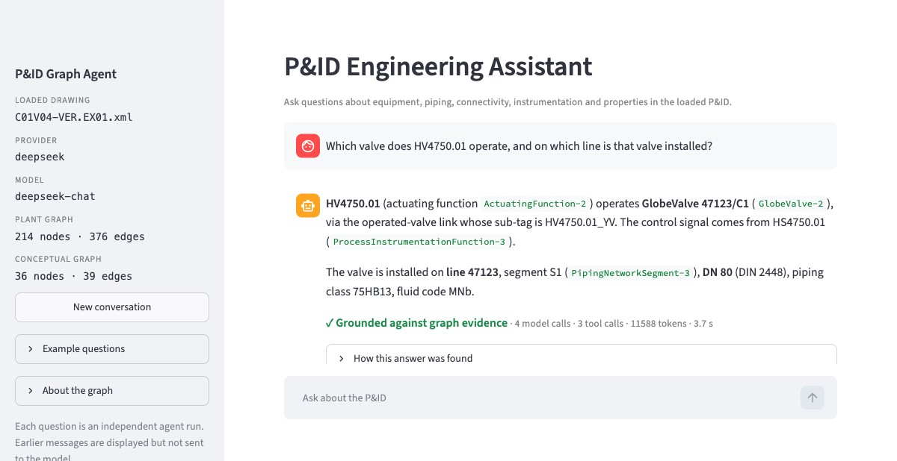
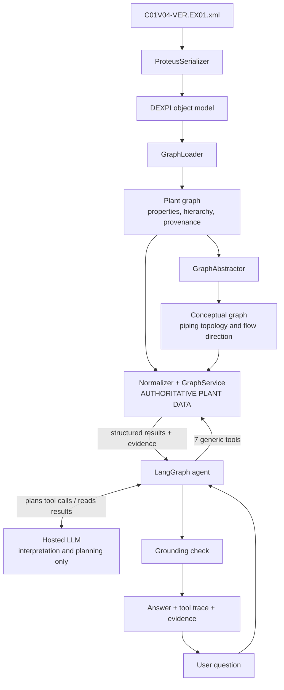

# P&ID graph agent

An agent that answers natural-language questions about a plant by querying the knowledge
graph that [pyDEXPI](https://github.com/process-intelligence-research/pyDEXPI) builds from the
DEXPI reference P&ID `C01V04-VER.EX01.xml`.

> The LLM interprets intent and plans graph operations; it is not the source of plant
> knowledge. All factual answers are derived from deterministic operations over the pyDEXPI
> graph.

Every answer comes with the tool calls that produced it, the graph facts it rests on, and the
result of a grounding check.

| Looking for | Go to |
|---|---|
| Install and ask a question | [How to run](#how-to-run) |
| Optional local chat UI | [Local chat UI](#local-chat-ui) |
| Design note | [Design note](#design-note) |
| Transcripts, including failures | [Example transcripts](#example-transcripts) |
| Evaluation set, scorer and score | [Evaluation](#evaluation) |
| A 10-minute explanation with diagrams | [docs/HOW_IT_WORKS.md](docs/HOW_IT_WORKS.md) |
| Requirement-by-requirement audit | [docs/SUBMISSION_AUDIT.md](docs/SUBMISSION_AUDIT.md) |

## How to run

```bash
git clone <this repository> && cd <this repository>
uv sync                                          # install (Python 3.12 is fetched if needed)
cp .env.example .env                             # then put your API key in .env
uv run pid-agent "What is P4711 connected to, and through which pipes?"
```

`uv run pid-agent` without a question opens an interactive prompt. Add `--no-trace` for the
answer only or `--json` for the full structured result.

Without any API key you can still call the graph tools directly and run the tests:

```bash
uv run pid-agent tool traverse '{"start_entity_id": "P4711", "direction": "downstream", "entity_types": ["valve"]}'
uv run pytest                                    # 501 deterministic tests, no network
uv run python evals/evaluator.py                 # re-score the saved evaluation runs
```

### Local chat UI

```bash
uv run pid-agent-ui
```

Opens a local [Streamlit](https://streamlit.io) page (installed by `uv sync`). It is a
presentation layer over the same agent: it calls `PidAgent.ask` and shows the answer, then, in
expandable sections, the tool calls with their inputs and results, the graph evidence, the
grounding status with each validated claim and the graph fact behind it, and any graph notes
(ambiguity, missing properties, open ends, truncated searches). Each question is an independent agent run; earlier messages stay on screen but are
not sent to the model. The UI was added after the evaluation below and played no part in it.



*The screenshot shows the UI rendering the saved DeepSeek evaluation answer for question 12.*

### Configuration

Set in `.env` (see `.env.example`). One provider is used per run; there is no automatic
failover.

| `LLM_PROVIDER` | Key variable | `LLM_MODEL` |
|---|---|---|
| `groq` (default) | `GROQ_API_KEY` | `openai/gpt-oss-20b` (default) |
| `deepseek` | `DEEP_SEEK_API_KEY` | must be set, e.g. `deepseek-chat` |
| `openrouter` | `OPENROUTER_API_KEY` | must be set to a tool-calling model id |

**Which model was actually used.** The design target is the open-weight `openai/gpt-oss-20b`
(weights published by OpenAI under Apache-2.0) hosted on Groq, and all early development runs used it. Groq's free tier allows 200,000 tokens
per day, which ran out during development. The formal evaluation below therefore has one
complete run on **DeepSeek, model `deepseek-chat`**, and a run on **Groq, model
`openai/gpt-oss-20b`** that the quota stopped after the first question. `deepseek-chat` is a
hosted API alias; I have not verified which released weights it serves and make no licensing
claim for it. To run with `openai/gpt-oss-20b`, put a Groq key in `.env` and leave the
defaults. The OpenRouter adapter is tested only against mocks.

## Design note

**Ingestion.** `ProteusSerializer` parses the XML into the DEXPI object model, `GraphLoader`
turns that into a NetworkX `MultiDiGraph` (the *plant graph*: 214 nodes, every DEXPI object,
edges are only "composition" and "reference"), and `GraphAbstractor.build_conceptual_graph`
collapses it into the *conceptual graph* (36 nodes: equipment, valves, fittings, instrument
functions; pipes become edges). Nothing is hand-written; the graph was inspected before any
design decision.

**Why two graphs.** Each is authoritative for a different thing:

- *Conceptual graph: topology.* Its piping edges run DEXPI source to target, which is the
  drawn flow direction. I verified this against the XML: all 23 segments follow
  `FromID -> ToID`, and the eight flow-arrow symbols point the same way.
- *Plant graph: properties, hierarchy, provenance.* The abstraction copies line attributes
  onto nodes with first-writer-wins (one tee ends up on the wrong line), and it drops nozzles
  and chambers, where design pressure and temperature live. So entity properties and line
  context are always re-read from the plant graph.
- *Recovered open ends.* The abstraction silently drops four pipes that have only one end on
  the drawing. They are recovered from the plant graph and marked `open_end`, with provenance,
  and are never given a destination.
- *Chamber-aware traversal.* Both sides of a heat exchanger merge into one node. A path that
  enters through one chamber may only leave through the same chamber; a boundary that was not
  crossed is reported as a structured fact.

Graph node ids are random per load, so public ids are the stable Proteus ids
(`CentrifugalPump-1`).

**Entity resolution** is deterministic and tiered: exact tag, tag ignoring case, id, any other
identifier (only five items have a tag; valves are found by position number, component code,
or line plus component number), identifiers inside a phrase, then type words. An identifier
shared by several items returns all of them flagged ambiguous. Fuzzy matches are only ever
suggestions.

**Tools.** Seven generic operations, no question-specific ones:
`find_entities`, `list_entities`, `get_entity`, `get_connections` (adjacency),
`traverse` (reachability, cycle-safe, depth-bounded), `find_path` (route) and
`get_properties`. Every result is structured and carries evidence items that point back to
graph objects.

**Agent.** A LangGraph state machine:
plan -> execute tools -> plan again if needed -> draft answer with structured claims ->
claim validation -> (one regeneration from evidence only) -> final answer, or a cautious answer
assembled directly from evidence. The model chooses tools and words the answer. Budgets (8 planning turns, 16
tool calls, repeated-call detection) guarantee termination.

**Grounding.** The model ends its answer with a block of structured claims (subject,
predicate, object or value, qualifiers) from a small fixed vocabulary that mirrors the tools:
`has_property`, `connected_to`, `reachable`, `path`, `operates`, `open_end`, `not_found` and
so on. Code turns the tool results into typed facts and accepts a claim only if one fact
entails it: the same subject, the same relation or property, the same value and unit. "DN 80"
on one line does not support "DN 80" on another, and `800.0 mm` never supports `DN 800`; no
unit is converted. No model judges the answer. Tool inputs, messages and warnings never become
facts, so a value the user typed cannot ground anything. A second, token-level pass then
checks that every identifier and value in the answer text is covered by a supported claim; it
can only reject. An answer whose claims all hold is `grounded`; one that passes only the
token-level pass (for example because the model supplied no claims) is shown as `limited`;
anything unsupported gets one rewrite and is then withheld. Each supported claim is returned
with the fact, evidence id and DEXPI objects it rests on
([agent/claims.py](src/pid_agent/agent/claims.py)).

**Visible workflow.** The trace lists the actual tool calls, inputs and results. It contains
no model reasoning.



## Example transcripts

All from real runs. Each block shows the actual tool calls; full transcripts with every tool
result are in the linked files. The first six are from the evaluation run
(DeepSeek `deepseek-chat`, evaluation commit `407d6ba`).

**1. Route with pipe properties** ([full](evals/runs/deepseek-deepseek-chat/transcripts/eval-07.txt))

```
Q: Trace the route from heat exchanger H1007 to tank T4750 and give the line number and pipe size along it.
1 find_entities {"query": "H1007"}                                   -> success
2 find_entities {"query": "T4750"}                                   -> success
3 find_path {"source_entity_id": "PlateHeatExchanger-1", "target_entity_id": "Tank-1"} -> success
A: H1007 nozzle N2 (Chamber-1) -> GlobeValve 47123/C1 (GlobeValve-2) -> T4750 nozzle N1.
   Line number: 47123 (segment S1), nominal diameter DN 80, fluid code MNb.
GROUNDING: grounded
```

**2. Reachability with several end points** ([full](evals/runs/deepseek-deepseek-chat/transcripts/eval-05.txt))

```
Q: If I follow the piping downstream from the swing check valve, where does the drawing end?
1 find_entities {"query": "swing check valve"}                       -> success
2 traverse {"start_entity_id": "SwingCheckValve-1", "direction": "downstream"} -> success
A: Four terminal points: BallValve 47126/C2, BlindFlange 47126/C6, BlindFlange 47126/C11 and
   FlowOutPipeOffPageConnector-1 ... The off-page connector is a real pipe leaving this
   drawing; its destination is not shown ... The traversal did not continue through H1008
   from Chamber-3 to Chamber-4 - those are separate chambers/sides.
GROUNDING: grounded
```

**3. Ambiguity is surfaced, not guessed** ([full](evals/runs/deepseek-deepseek-chat/transcripts/eval-02.txt))

```
Q: What is the nominal diameter at component C1?
1 find_entities {"query": "C1"}                                      -> ambiguous
A: "C1" is not unique in this P&ID - five components carry the piping component number C1,
   on five different lines: GlobeValve-2 (47123/C1), ButterflyValve-1 (47124/C1),
   PipeTee-2 (47126/C1), GlobeValve-1 (47127/C1), GlobeValve-3 (47141/C1).
   Tell me which line (or the tag/type) you mean and I'll give you the nominal diameter.
GROUNDING: grounded
```

**4. Missing data** ([full](evals/runs/deepseek-deepseek-chat/transcripts/eval-11.txt))

```
Q: How much does heat exchanger H1007 weigh?
1 find_entities {"query": "H1007"}                                   -> success
2 get_properties {"ids": "PlateHeatExchanger-1"}                     -> success
A: The supplied P&ID does not contain a weight for H1007 (PlateHeatExchanger-1). No
   mass/weight property exists for it. (It then lists the properties that do exist.)
GROUNDING: grounded
```

**5. Struggle: correct, but ten tool calls** ([full](evals/runs/deepseek-deepseek-chat/transcripts/eval-13.txt))

```
Q: For control loop 4712.02: where is the pressure sensed, and which valve does the loop end up acting on?
1 find_entities "4712.02"   2 list_entities   3 get_entity (controller)   4 get_connections (controller)
5 get_entity (transmitter)  6 get_entity (actuator)  7 get_connections (transmitter)
8 get_connections (actuator)  9 get_entity (blind flange)  10 get_entity (valve)
A: Pressure sensed by PT4712.02 at BlindFlange 47126/C11; signal to PICSA4712.02, then to
   PV4712.02, which operates GlobeValve 47127/C1. The actuator is configured fail close.
GROUNDING: grounded     6 model calls, 23,870 tokens
```

Four of the ten calls were not needed. Following an instrumentation chain takes one call per
hop, and nothing stops the model from exploring further once it has the answer.

**6. Struggle: first draft rejected by the grounding check** ([full](evals/runs/deepseek-deepseek-chat/transcripts/eval-10.txt))

```
Q: What design pressure limits apply to each chamber of tank T4750?
1 find_entities {"query": "T4750"}                                   -> success
2 get_entity {"entity_id": "Tank-1", "include_children": true}       -> success
   draft rejected: "DN 20000" (the graph says nominalDiameter 20000.0 mm, which is not a DN)
A: Chamber 1: -0.1 bar to 0.1 bar. Chamber 2: -0.1 bar to 0.05 bar.
GROUNDING: regenerated
```

**7. Failure: wrong answer after hitting the turn limit**
([full](examples/transcripts/dev-failure-groq-instrumentation-turn-limit.txt); Groq
`openai/gpt-oss-20b`, development build before `c0a881c`)

```
Q: Which instrument operates the globe valve on line 47127, and what is its fail action?
1 find_entities "line 47127" (type valve) -> the line   2 get_connections on the line -> error
3 get_entity (line)   4-7 find_entities on the valve and on its alias PV4712.02_YV (x4)
8 find_entities "OperatedValveReference-1" -> not_found      LIMIT: 8 planning steps
A: ... The fail action of that instrument cannot be determined from the supplied P&ID data.
```

Wrong: the graph says *fail close*. Looking up the valve's alias returned the valve itself, so
the model went round in a circle. Fixed generally in `67221a5` (type-plus-line resolution,
link counts on entities, instrumentation links explained in words).

**8. Failure: truncated search presented as the end**
([full](examples/transcripts/dev-partial-deepseek-truncated-traversal.txt); DeepSeek, `308dc59`)

```
Q: Where does pump P4712 discharge to?
1 find_entities   2 get_connections (downstream)   3 traverse {"direction": "downstream", "max_depth": 4}
A: ... the discharge ultimately reaches tank T4750 via the relief branch, with the remaining
   branches ending at valves C2, C5 and C7.
```

Partly wrong: C5 and C7 are not ends. The model chose depth 4 and never saw the heat exchanger
and off-page connector beyond it. Results now mark such entities `continues_beyond_max_depth`
(`db563eb`); question 6 of the evaluation exercises this.

**9. Failure: correct answer withheld**
([full](examples/transcripts/dev-withheld-deepseek-chamber-warning.txt); DeepSeek, `308dc59`)

The model's draft was right but quoted two identifiers that the tool had only put in a
warning, so the grounding check withheld it and returned an evidence list instead. Chamber
boundaries are now structured evidence (`db563eb`).

## Evaluation

- **Set:** 15 questions in [evals/questions.json](evals/questions.json): entity resolution and
  ambiguity (2), adjacency (1), reachability including a depth-limited case (3), routes (2),
  line and chamber properties (2), missing data (1), instrumentation (2), a nonexistent tag
  and a false premise (2). None repeats a development question.
- **Gold facts** were read from the deterministic graph tools, never from an LLM. Each
  question lists the tool calls its facts came from, and `tests/test_eval.py` re-derives them
  from the C01 graph on every test run.
- **Scoring** ([evals/evaluator.py](evals/evaluator.py)) uses no LLM judge. Each question has
  required facts and, where it makes sense, forbidden ones (an invented weight, a valve that
  is not on the route). `score = max(0, required found - forbidden found) / required`.
  Matching ignores case, markdown, dash style and spacing inside identifiers. An answer the
  agent withheld scores 0; provider failures are reported separately.
- **This evaluation predates claim-level grounding.** Both runs used the earlier token-level
  check. The structured-claim validation described in the design note was added afterwards
  and is covered by deterministic tests ([tests/test_claims.py](tests/test_claims.py): 20
  adversarial cases and the corresponding positive cases, with no model involved). The
  evaluation was not re-run, so these scores say nothing about how a live model performs with
  the claims format.
- **Live smoke test after that change.** Seven questions were asked once each
  ([examples/live-smoke/](examples/live-smoke/)); this is not a score. On Groq
  `openai/gpt-oss-20b`: one answer fully grounded, one wrong draft correctly withheld, then
  the daily quota stopped the run. The remaining five were asked on DeepSeek `deepseek-chat`
  as a diagnostic: three grounded (two after one rewrite), one correctly reported as
  ambiguous, one `limited` because of a claims-parsing bug. That run exposed four general
  issues, since fixed: claims written one per line, a missing direction on open-end facts, a
  mislabelled status after an empty rewrite, and an output-token limit too small for the
  claims block.
- **Runs:** each question asked once, no retries of answers, no changes between questions.
  The questions and scorer were committed (`407d6ba`) before the first run and are identical
  for both runs. The agent code is the same frozen commit (`a8d56b3`) in both.

| | Groq `openai/gpt-oss-20b` | DeepSeek `deepseek-chat` |
|---|---|---|
| Questions asked | 1 of 15 (stopped by the provider's daily token quota) | 15 of 15 |
| Mean score | none claimed | **1.00** |
| Outcomes | question 1: full credit; questions 2-15: not asked | 15 correct |
| Required facts found | 2 of 2 on the one question | 41 of 41 |
| Forbidden facts found | 0 | 0 |
| Model calls / tool calls | 3 / 2 on the one question | 50 / 43 (3.3 / 2.9 per question) |
| Tokens | 6,153 on the one question | 149,044 (about 9,900 per question) |
| Drafts rejected by grounding, then regenerated | 0 | 3 (questions 1, 10, 15) |
| Fallback answers, turn-limit hits | 0, 0 | 0, 0 |

**Groq `openai/gpt-oss-20b`** is supported and was exercised. The frozen evaluation started
successfully on it and question 1 scored full credit. Groq's daily token quota (HTTP 429,
200,000 tokens per day) then prevented the remaining questions from being asked, so no
GPT-OSS evaluation score is claimed, and one question says nothing about how the model would
score overall. Nothing was filled in from another model. The partial run is preserved
separately and can be completed with `LLM_PROVIDER=groq uv run python evals/evaluator.py --run`,
which only asks the questions that have no answer yet.

**DeepSeek `deepseek-chat`**: the complete 15-question evaluation was run once on it.

Per run, under [evals/runs/](evals/runs/): `run.json` (raw results with full traces),
`results.json` (scores) and `transcripts/`.
[DeepSeek run](evals/runs/deepseek-deepseek-chat/) |
[Groq run](evals/runs/groq-openai-gpt-oss-20b/)

**How much to read into this.** I read all 15 DeepSeek answers against the gold facts by hand
and agree with the scores, but a perfect score on 15 questions mostly shows the set is not
hard enough to separate good from excellent:

- It is one run of one model. Hosted models are not deterministic even at temperature 0.
- The complete run is not on the intended open-weight model. On `openai/gpt-oss-20b` (Groq),
  an earlier 15-question development run, before the stabilization fixes, gave 11 correct, 1
  overly literal, 1 incomplete, 1 wrong and 1 withheld. Apart from the single evaluation
  question above, those fixes have not been re-measured on that model.
- The scorer checks that required facts are present. It does not check everything else the
  answer says; that is the grounding check's job, and it is not perfect either.
- I wrote the questions knowing the graph and the tools.
- Of the three rejected drafts, two were real catches (a diameter in mm rewritten as "DN")
  and one was a false alarm by the property-attribution check.

## Limitations

- **The graph, not the plant.** "Downstream" is drawn piping direction. Valve positions and
  operating state are not in the P&ID, so nothing here says where fluid is flowing.
- **The abstraction loses detail.** Open-ended pipes and chamber sides had to be recovered
  from the plant graph. Chamber references exist only on the two heat exchangers, so the
  chamber rule does nothing for other equipment.
- **Most components have no tag.** Valves are addressed by derived identifiers such as
  `47126/C5`; the agent says when an identifier is derived.
- **`find_path` returns only the shortest route.**
- **Instrumentation is one call per hop**; there is no multi-hop instrumentation traversal.
- **Claim-level grounding has only a small live smoke test**, not an evaluation: eight live
  answers across two models, two of them on the open-weight model. If a model omits or
  under-fills the claims block, the answer is still checked token by token and labelled
  `limited`, which is the old behaviour. An answer in that state can contain values that are
  in the tool results but were not matched to a claim.
- **What claim validation cannot prove.** It checks the claims the model lists; a sentence
  with no identifier, number or claim (a general-knowledge gloss such as expanding the
  instrument code "TICSA") is not detected. A claim is only as right as the graph: errors or
  omissions in the source P&ID pass through, and "not in the graph" does not mean "not in the
  plant". Facts outside the fixed predicates cannot be stated at all.
- **No "enough evidence" detector.** The model may make redundant calls; budgets bound it.
- **Provider and model variance**, and Groq's free daily limit covers roughly one and a half
  15-question runs.
- **Not built:** OCR ingestion, visual highlighting on the drawing, hosting (the bonus item),
  conversational memory between questions. The chat UI is local only.

## Development notes

- Real commit history is kept. [prompts/](prompts/) holds the assignment and the instructions
  given to the AI coding tool, in order; one early instruction was not saved and is marked so.
- [docs/HOW_IT_WORKS.md](docs/HOW_IT_WORKS.md) is a short explanation with diagrams and two
  worked questions. [docs/ARCHITECTURE_DEEP_DIVE.md](docs/ARCHITECTURE_DEEP_DIVE.md) is the
  long, file-by-file reference.
- [docs/SUBMISSION_AUDIT.md](docs/SUBMISSION_AUDIT.md) checks each requirement of the
  assignment; [docs/DEMO_SCRIPT.md](docs/DEMO_SCRIPT.md) is a five-minute demo.
- Licence: AGPL-3.0, because the code builds on pyDEXPI, which is AGPL-3.0. See
  [LICENSE](LICENSE) and [NOTICE](NOTICE). The C01 file is © DEXPI e.V.

**Time spent.** Approximately 5–6 hours of hands-on work across understanding
the pyDEXPI graph, designing the graph abstraction and agent workflow,
directing implementation, reviewing/debugging behavior, building the
evaluation, and documenting the result. I used AI coding tools throughout,
as encouraged in the assignment.
