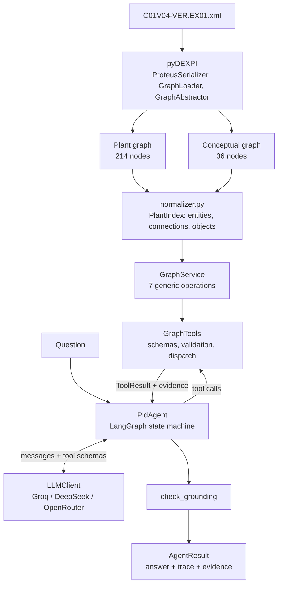
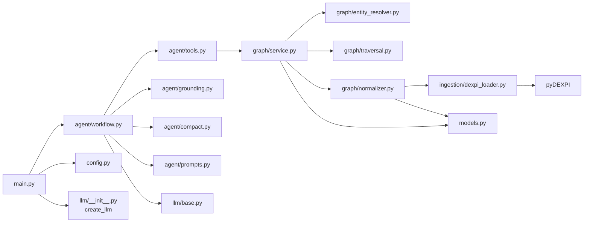
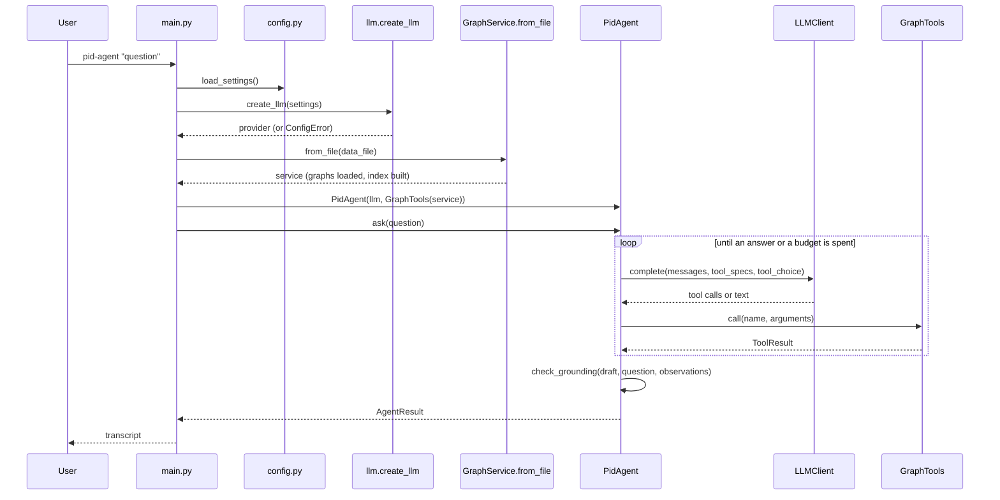
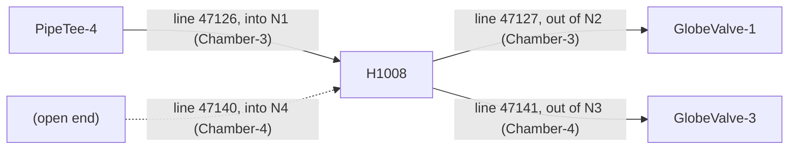
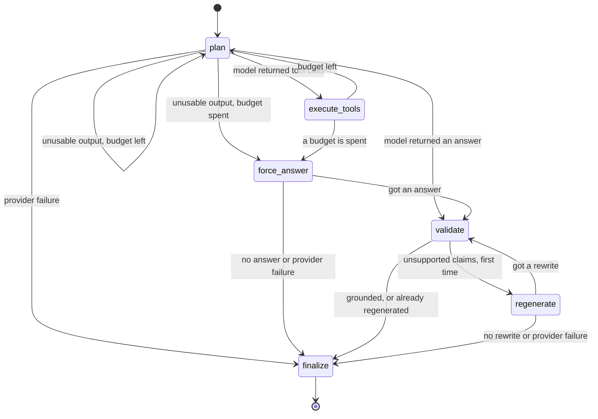
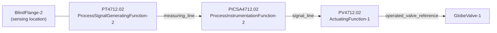

# Architecture deep dive

A study guide to how this repository works, file by file and question by question. It
describes the code as it is at the frozen implementation commit `a8d56b3` (nothing under
`src/` has changed since). The README is the short version; this is the long one.

Entity names such as `P4711` appear freely here because this document explains the dataset.
None of this text is sent to the model.

Contents: [1 Big picture](#1-the-big-picture) · [2 Repository map](#2-repository-map) ·
[3 Entry point](#3-application-entry-point) · [4 Ingestion](#4-graph-ingestion) ·
[5 Two graphs](#5-why-there-are-two-graph-views) · [6 Normalization](#6-normalization) ·
[7 Entity resolution](#7-entity-resolution) · [8 Tools](#8-the-seven-graph-tools) ·
[9 Direction](#9-process-direction) · [10 Chambers](#10-chamber-aware-traversal) ·
[11 Open ends](#11-open-ends) · [12 Agent](#12-agent-architecture) ·
[13 Planning](#13-planning) · [14 End-to-end trace](#14-tool-calling-end-to-end) ·
[15 Instrumentation trace](#15-a-second-example-instrumentation) ·
[16 Tool results](#16-structured-tool-results) · [17 Evidence](#17-evidence-model) ·
[18 Grounding](#18-grounding-validation) · [19 Regeneration](#19-regeneration-and-fallback) ·
[20 Failures](#20-failure-handling) · [21 Providers](#21-llm-provider-abstraction) ·
[22 Secrets](#22-configuration-and-secrets) · [23 Visible workflow](#23-visible-workflow-requirement) ·
[24 Evaluation](#24-evaluation-architecture) · [25 Eval walk-through](#25-walk-through-of-four-real-evaluation-questions) ·
[26 Testing](#26-testing-strategy) · [27 What went wrong](#27-what-went-wrong-and-what-i-changed) ·
[28 Trade-offs](#28-design-decisions-and-trade-offs) · [29 Limitations](#29-known-limitations) ·
[30 Scaling](#30-how-i-would-scale-this-to-a-real-oil--gas-system) ·
[31 Cheat sheet](#31-interview-cheat-sheet) · [32 Glossary](#32-glossary)

---

## 1. The big picture

**The assignment.** Build an agent that answers natural-language questions about one plant
drawing as a visible, multi-step workflow: find the things the question names, then traverse
the graph from them. Answers must be grounded in the graph, the steps must be shown, and it
must work on questions and phrasings the author never saw.

**What a P&ID is, for our purposes.** A piping and instrumentation diagram shows equipment
(pumps, heat exchangers, tanks), the pipes between them, the valves and fittings on those
pipes, and the instruments that measure and control. It is a diagram of *what is connected to
what*, with engineering attributes attached (line numbers, nominal diameters, design limits).
It does not show operating state.

**DEXPI / Proteus XML.** DEXPI is a data model for P&IDs. Proteus XML is a file format that
carries it: every pump, nozzle, pipe segment and instrument function is an XML element with
an ID, attributes and references to other elements. `data/C01V04-VER.EX01.xml` is the DEXPI
reference example "C01".

**What pyDEXPI does.** It parses that XML into Python objects and can export them as a
NetworkX graph, and it can simplify that graph. We build on its graph; we do not write our
own parser or a stand-in dataset.

**Why this is a graph problem, not document RAG.** The questions are about structure: what
is connected, what is downstream, what lies on the route between two items. Those are graph
operations (neighbours, reachability, shortest path) with exact answers. Chunking the XML
into text and retrieving by embedding similarity would return passages that *mention* a pump,
not the set of valves reachable from it. There is also nothing to retrieve approximately: the
conceptual graph has 36 nodes, and every lookup is an exact index lookup. So there is no
vector database, and no embeddings.

**The division of labour.**

> The LLM interprets intent and plans graph operations; it is not the source of plant
> knowledge. All factual answers are derived from deterministic operations over the pyDEXPI
> graph.

- The **LLM** reads the question, chooses which generic tool to call with which arguments,
  reads the results, decides whether it needs more, and words the answer.
- **Deterministic code** loads the graph, resolves names to entities, computes neighbours,
  traversals, paths and property lookups, and checks the drafted answer against what the
  tools returned.



---

## 2. Repository map

```
src/pid_agent/
  main.py                 CLI entry point
  config.py               Settings from environment / .env
  models.py               Entity, Connection, Evidence, ToolResult (pydantic)
  errors.py               PidAgentError and subclasses
  ingestion/
    dexpi_loader.py       XML -> pyDEXPI -> plant graph + conceptual graph
    graph_inspector.py    prints graph statistics (pid-agent inspect)
  graph/
    normalizer.py         raw graphs -> PlantIndex
    entity_resolver.py    deterministic name -> entity resolution
    traversal.py          FlowGraph: cycle-safe, chamber-aware BFS
    service.py            GraphService: the seven operations
  agent/
    tools.py              argument models, tool descriptions, GraphTools dispatcher
    prompts.py            system prompt and the three auxiliary prompts
    state.py              AgentState, TraceStep, AgentResult
    compact.py            model-facing view of tool results; evidence rendering
    grounding.py          post-generation grounding check
    workflow.py           PidAgent (LangGraph) and format_transcript
  llm/
    base.py               LLMClient protocol, LLMResponse, ToolCall, LLMError
    groq_provider.py      Groq SDK adapter
    openai_compatible.py  shared HTTP adapter
    openrouter_provider.py, deepseek_provider.py   name + base URL
    __init__.py           create_llm(settings)
evals/
  questions.json          15 questions with gold facts
  evaluator.py            run + deterministic scorer
  runs/<provider-model>/  run.json, results.json, transcripts/
tests/                    424 deterministic tests (+4 live, deselected)
prompts/                  the assignment and the development instructions, in order
```

**Dependency flow** (each layer only knows the ones below it):



File by file:

| File | Owns | Called by | Calls |
|---|---|---|---|
| `main.py` | Argument parsing, choosing between "ask", "tool", "tools", "inspect", printing | the `pid-agent` script (`pyproject.toml`: `pid-agent = "pid_agent.main:main"`) | `load_settings`, `create_llm`, `GraphService.from_file`, `GraphTools`, `PidAgent.ask`, `format_transcript` |
| `config.py` | `Settings` dataclass; `load_settings()` reads `.env` and the environment; `API_KEY_VARIABLES` maps provider to key variable | `main.py`, `evals/evaluator.py`, scripts | `python-dotenv` |
| `models.py` | The pyDEXPI-free data shapes: `Entity`, `SubObject`, `IdentifierOrigin`, `NozzleRef`, `Provenance`, `Connection`, `Evidence`, `ToolResult` | normalizer, service, tools, traversal | pydantic |
| `errors.py` | `PidAgentError` and `ConfigError`, `DataFileNotFoundError`, `DexpiParseError`, `GraphNormalizationError` | everything; `main.py` catches `PidAgentError` and prints one line | — |
| `ingestion/dexpi_loader.py` | `load_plant(path)` -> `LoadedPlant(source_file, plant_graph, conceptual_graph)` | `GraphService.from_file`, tests | pyDEXPI |
| `graph/normalizer.py` | `normalize(loaded)` -> `PlantIndex(entities, connections, objects, warnings)` | `GraphService.from_file` | `models.py` |
| `graph/entity_resolver.py` | `EntityResolver.resolve(query, entity_type)` -> `Resolution` | `GraphService` | — |
| `graph/traversal.py` | `FlowGraph.bfs(...)` -> `TraversalOutcome` | `GraphService.traverse`, `find_path` | — |
| `graph/service.py` | `GraphService`: `find_entities`, `list_entities`, `get_entity`, `get_connections`, `traverse`, `find_path`, `get_properties` | `GraphTools` | resolver, traversal, index |
| `agent/tools.py` | Pydantic argument models, `TOOL_DESCRIPTIONS`, `tool_specs()`, `GraphTools.call(name, arguments)` | `PidAgent`, CLI `tool` command | `GraphService` |
| `agent/workflow.py` | `PidAgent`, `AgentLimits`, `format_transcript` | `main.py`, evaluator | everything in `agent/`, `llm/base.py` |
| `llm/*` | One `complete(messages, tools, tool_choice)` per provider | `PidAgent` | Groq SDK or `httpx` |

Nothing above `graph/` imports pyDEXPI, and nothing in `graph/` knows an LLM exists.

---

## 3. Application entry point

The real syntax has **no `ask` subcommand**. A question is simply the arguments:

```bash
uv run pid-agent "Which pumps are upstream of the tubular heat exchanger?"
uv run pid-agent                       # interactive prompt
uv run pid-agent tool get_entity '{"entity_id": "P4711"}'   # one tool, no LLM
uv run pid-agent tools                 # print the tool schemas
uv run pid-agent inspect               # graph statistics
```

What happens for a question:

1. `uv run pid-agent` runs `pid_agent.main:main` (declared under `[project.scripts]`).
2. `main()` parses arguments with `_build_parser()`: flags `-v`, `--json`, `--no-trace`, and
   positional `words`. If the first word is `tools`, `inspect` or `tool` it handles that;
   anything else is a question.
3. `load_settings()` loads `.env` (without overriding variables already set in the shell) and
   builds a frozen `Settings`. Only the key of the selected provider is read.
4. `_build_agent(settings)` calls `create_llm(settings)` **first**. A missing key fails here
   with one clear line, before the graph is loaded.
5. `_graph_tools(settings)` calls `GraphService.from_file(...)`, which runs `load_plant` then
   `normalize`. The graph is loaded once per process.
6. `PidAgent(llm, tools)` compiles the LangGraph state machine in its constructor.
7. `_answer()` calls `agent.ask(question)`, which returns an `AgentResult`.
8. Output: `format_transcript(result)` by default, `result.answer` with `--no-trace`, or the
   whole result as JSON with `--json`.



---

## 4. Graph ingestion

All of it is in `ingestion/dexpi_loader.py`, function `load_plant`:

```python
model = ProteusSerializer().load(str(path.parent), path.name)
plant_graph = GraphLoader().parse_dexpi_to_graph(model)
conceptual_graph = GraphAbstractor.build_conceptual_graph(plant_graph)
```

- **`ProteusSerializer`** turns the XML into the DEXPI object model (Python objects).
- **`GraphLoader`** turns every DEXPI object into a node of a `networkx.MultiDiGraph`. Node
  attributes are the object's data attributes plus `label` (class name), `labels` (the class
  inheritance chain joined with colons) and `proteusId`. Edges are only of two kinds:
  `composition` (owner to part) and `reference` (object to object it points at), each with an
  `attr_name` such as `nozzles`, `segments`, `sourceItem`.
- **`GraphAbstractor`** produces simplified copies by removing or collapsing nodes.

Graph views pyDEXPI can produce from C01 (sizes observed when inspecting the file; the first
and last are asserted in `tests/test_ingestion.py`):

| View | Nodes | Edges | Used by the application |
|---|---|---|---|
| plant (raw `GraphLoader` output) | 214 | 376 | **Yes**: properties, hierarchy, provenance |
| complete (plant minus model/metadata nodes) | 212 | 348 | No |
| process (pipes collapsed, nozzles and chambers kept) | 66 | 78 | No |
| conceptual (`build_conceptual_graph`) | 36 | 39 | **Yes**: topology |

The process graph adds nothing the other two do not already give us, so it is not built.

`load_plant` raises `DataFileNotFoundError` for a missing file and wraps anything pyDEXPI
throws on bad input in `DexpiParseError`. It also suppresses pyDEXPI's warnings and logs one
line with the graph sizes.

---

## 5. Why there are two graph views

**Short version:** the conceptual graph is right about *shape and direction* and wrong or
silent about *details*; the plant graph has every detail but its edges do not mean flow.

**The raw plant graph cannot be traversed as flow.** A pipe in the plant graph is a *node*.
It has edges `Pipe --sourceItem--> Nozzle-2` and `Pipe --targetItem--> Nozzle-3`. Both edges
point *out of* the pipe. Following NetworkX successors from a pump leads to its nozzles,
chamber and impeller (composition), never to the next piece of equipment. Edge direction
there means "owns" or "refers to".

**The conceptual graph fixes shape.** `GraphAbstractor` collapses each pipe node into one
edge from its source item to its target item and folds nozzles into their equipment. The
result reads like the drawing: `P4711 -> H1007 -> GlobeValve-2 -> T4750 -> ...`.

**But the conceptual graph loses or corrupts things.** Concrete C01 examples:

| Topic | Plant graph | Conceptual graph |
|---|---|---|
| Equipment properties | `CentrifugalPump-1`: `designShaftPower = 60.0 kW` | Same (survives) |
| Pipe attributes | Pipes have none of their own; they live on `PipingNetworkSegment` and `PipingNetworkSystem` | Copied onto each pipe **edge**: line 47122, S1, DN 80. Correct on all 27 edges (tested) |
| Component line context | `PipeTee-1` is an item of segment 11 on line **47126** | The node says line **47125**: segment attributes are copied onto any referenced node, first writer wins |
| Nozzles | `H1007` has N1..N4 | Removed |
| Chambers | `Chamber-1` upper design pressure 60.0 bar, `Chamber-2` 30.0 bar | Removed; design limits are gone |
| Exchanger sides | N1/N2 on Chamber-1, N3/N4 on Chamber-2 | One node; the sides are indistinguishable |
| Pipes with one end on the drawing | 4 such pipes exist (lines 47130, 47131, 47140, tail of 47141) | Silently dropped |
| Instrumentation | Loops, actuating systems, actuators as separate objects | Merged into function nodes; fail action ends up as a merged attribute |

So the rule implemented in `graph/normalizer.py` is:

- **Topology and direction** come from the conceptual graph's piping edges.
- **Piping attributes on conceptual edges** may be used (they were verified).
- **Piping attributes on conceptual nodes** are never used.
- **Entity properties, sub-objects, line context and provenance** are re-read from the plant
  graph.
- **What the abstraction dropped** (open-ended pipes, which nozzle and chamber a pipe
  attaches to) is recovered from the plant graph and clearly marked.

Using only the conceptual graph would lose design limits, nozzle and chamber structure and
four real pipes, and would report one tee on the wrong line.

---

## 6. Normalization

`graph/normalizer.py` contains a private `_Normalizer` class and the public
`normalize(loaded) -> PlantIndex`. `run()` executes six steps in order.

**Stable identifiers: `public_id(node)`.** NetworkX node ids are random UUIDs, different on
every load (tested). The public id is the node's `proteusId` (`CentrifugalPump-1`), which is
stable. Pipe nodes have no `proteusId`; they get `<owner id>/<attribute>/<position>`, for
example `PipingNetworkSegment-3/connections/2` (the second connection of segment 3). A test
checks that no UUID appears anywhere in the index and that two loads give identical ids.

**`_collect_segments()`** records for each segment its id, its line (system) id, and the
merged attributes of line and segment (segment values win, the same precedence pyDEXPI uses).

**`_build_entities()`** makes one `Entity` per conceptual node:

- `properties`: the plant node's own attributes, minus bookkeeping keys (`label`, `labels`,
  `proteusId`, `collapsed_from`, ...).
- `type`, `type_hierarchy`: the class name and the inheritance chain with abstract mixins
  removed, e.g. `["CentrifugalPump", "Pump", "Equipment"]`. This is what lets "pump" or
  "valve" match.
- `category`: `equipment`, `piping_component` or `instrumentation`.
- `children` (`_children`): composition descendants that are not entities themselves
  (nozzles, chambers, impeller) plus objects the abstraction merged in (for example the
  `ControlledActuator` behind an actuating function). Nozzles get a `chamber` property.
- `piping_context` (`_piping_context`): the segment and line that *own* the item, read from
  the plant graph.
- `identifiers` and `identifier_origins`: see below.
- `name`: tag, position number or instrument number if present, else e.g.
  `BallValve 47126/C5`.

**Identifiers and their origin.** Only five items have a `tagName` (P4711, P4712, H1007,
H1008, T4750). Others are found through `positionNumber` (`SV 104.01`),
`pipingComponentName` (`73KH12`), `pipingComponentNumber` (`C5`), instrument numbers, and so
on. Three kinds are distinguished (`IdentifierOrigin.kind`):

- `source_identifier`: a field literally on the object.
- `derived_identifier`: composed here, e.g. `lineComponent = "47126/C5"` (line number of the
  owning line plus the component number) and `instrumentTag = "PICSA4712.02"`.
- `alias`: a literal field of a *related* object, e.g. a valve's `operatedValveReference =
  "PV4712.02_YV"`, which is the sub-tag of the instrumentation link pointing at it.

Results say which kind matched, so a derived identifier is never presented as if it were
written in the file.

**`_build_lines()`** also makes the 11 `PipingNetworkSystem` objects entities (category
`piping_line`, `in_topology = False`), with their segments as children, so "line 47125" can
be found and queried.

**`_build_piping_connections()`** creates a `Connection` for each conceptual piping edge.
The edge's `collapsed_node_id` names the plant pipe node, which gives the stable id and, via
the pipe's `sourceItem` / `targetItem`, the nozzle and chamber at each end (`NozzleRef`). It
asserts that the conceptual edge's endpoints agree with the plant pipe, else
`GraphNormalizationError`.

**Recovered open ends.** The same method then scans the plant graph for pipe nodes that no
conceptual edge came from. Those are the four pipes with a missing end. Real example
(`PipingNetworkSegment-20/connections/1`):

```json
{
  "source": null,
  "target": "PlateHeatExchanger-1",
  "connection_type": "open_end",
  "open_end": "source",
  "target_nozzle": {"id": "Nozzle-13", "sub_tag": "N3", "chamber_id": "Chamber-2"},
  "properties": {"lineNumber": "47130", "nominalDiameterRepresentation": "DN 50", "fluidCode": "WKa"},
  "provenance": {
    "derived_from": "plant_graph",
    "present_in_conceptual_graph": false,
    "note": "This pipe exists in the DEXPI model but has no source item on this drawing ..."
  }
}
```

The source is `null` because the file does not say where the pipe comes from. Writing
anything there would be inventing topology.

**`_build_instrumentation_connections()`** turns the remaining conceptual edges into
connections with `relationship = "instrumentation"` and one of four types:
`sensing_location`, `measuring_line`, `signal_line`, `operated_valve_reference`.

**`_build_objects()`** indexes every other addressable plant object (segments, nozzles,
chambers, `MetaData-1`) as an `ObjectRecord`, so `get_properties` can read them.

Resulting `PlantIndex` for C01: 47 entities (36 in the topology + 11 lines), 43 connections
(25 pipe, 2 direct piping connection, 4 open end, 12 instrumentation), 151 objects.

---

## 7. Entity resolution

`graph/entity_resolver.py`, class `EntityResolver`, entry point `resolve(query, entity_type)`.
At construction it builds three indexes: tags, normalized identifiers (case and punctuation
removed by `normalize_identifier`), and type phrases (every contiguous run of words in every
class name, so `("ball", "valve")`, `("valve",)`, `("check", "valve")`, ...).

Tiers, tried in order; the first that matches wins (`TIER_CONFIDENCE`):

| Tier | Meaning | Confidence |
|---|---|---|
| `exact_tag` | query is exactly a tag | 1.0 |
| `tag_case_insensitive` | same, ignoring case | 0.98 |
| `proteus_id` | query is an entity id | 0.98 |
| `identifier` | query equals any identifier after normalization | 0.95 |
| `embedded_identifier` | identifiers found inside a phrase | 0.9 |
| `type` | the phrase names a type | 0.8 |

Real examples (all asserted in `tests/test_entity_resolution.py`):

| Input | What happens | Result |
|---|---|---|
| `P4711` | `_match_whole`: tag hit | `CentrifugalPump-1`, `exact_tag` |
| `p4711` | tag, ignoring case | `CentrifugalPump-1`, `tag_case_insensitive` |
| `sv104.01` | normalized equals `SV 104.01` | `SpringLoadedGlobeSafetyValve-1`, `identifier` |
| `pump P4711` | `_match_embedded` finds `P4711`; "pump" agrees with its type | unique |
| `valve P4711` | identifier found; "valve" contradicts the type | the pump, **plus a warning** |
| `73KH12` | five ball valves share this code | all five, `ambiguous = true` |
| `C1` | five items have component number C1 | all five, ambiguous |
| `C1 on line 47127` | line number narrows the candidates | `GlobeValve-1` |
| `globe valve on line 47127` | `_items_on_lines`: a type plus a line names items of that type on it | `GlobeValve-1` |
| `all pumps` | `_match_types`; plural or quantifier means a set | both pumps, not ambiguous |
| `the heat exchanger` | type, singular, two candidates | both, **ambiguous** |
| `X9999` | nothing | `not_found`, no suggestions |
| `P4771` | nothing; `_suggest` finds near misses | `not_found`, suggestions P4711 and P4712 at 0.8 |

**Fuzzy matches never bind.** `_suggest` uses `difflib` similarity (cutoff 0.75, at most 5)
and its output goes into `resolution.suggestions`, never into the matches. If a user types
`P4771`, the system says it does not exist and offers candidates; it does not quietly answer
about `P4711`.

**The `entity_type` argument** filters type-tier matches, but never erases an identifier
match: `H1007` with type "heater" still returns the exchanger, with a warning that the type
was unknown.

**How this prevents hallucination.** The model never has to guess which graph object a name
means. Either the resolver returns exactly one entity with the reason it matched, or it
returns several flagged ambiguous, or it returns none. All three are explicit in the result
and the model is instructed to relay them.

---

## 8. The seven graph tools

Each tool is a method on `GraphService` (`graph/service.py`), exposed through `GraphTools`
(`agent/tools.py`), and returns a `ToolResult`. `GraphTools.call` validates arguments with a
pydantic model (unknown fields are rejected), times the call, and converts any exception
into a `ToolResult` with `status = "error"`; a tool can never crash the agent.

Wherever an `entity_id` is expected, `_require_entity` also accepts a unique identifier
(`"P4711"`), says so in a warning, and records the entity as evidence. An ambiguous or
unknown value is refused.

The three connectivity tools mean different things:

| Tool | Concept | Answers |
|---|---|---|
| `get_connections` | **adjacency** | What touches X, one hop? |
| `traverse` | **reachability** | What can be reached from X, any number of hops? |
| `find_path` | **route** | How do I get from X to Y? |

### 8.1 `find_entities`

- **Purpose:** turn a name, identifier or description into entities.
- **Inputs:** `query` (string), `entity_type` (optional).
- **Output:** `entities` (summary + `match_tier`, `match_reason`, `identifier_kind`, `links`),
  `resolution` (`status`, `ambiguous`, `match_count`, `suggestions`), `status` of `success`,
  `ambiguous` or `not_found`.
- **Implementation:** `EntityResolver.resolve`; `_link_counts` adds how many piping and
  instrumentation connections each match has.
- **Graph view:** the normalized index (identifiers from the plant graph).
- **Use it** to get an id from anything the user wrote. **Do not use it** to look up an id
  you already have.
- **Edge cases:** shared identifiers; a connection id or sub-object id is explained ("is a
  connection, not an entity") instead of "not found".
- **Example:** `find_entities({"query": "P4711"})` ->
  `{"status": "success", "entities": [{"id": "CentrifugalPump-1", "name": "P4711", "type": "CentrifugalPump", "match_tier": "exact_tag", "links": {"piping_upstream": 1, "piping_downstream": 1}}]}`

### 8.2 `list_entities`

- **Purpose:** enumerate a type or category, or discover which types exist.
- **Inputs:** `entity_type` (optional).
- **Output:** `entities` (summaries), or with no argument `properties.types`,
  `properties.categories` and `properties.other_objects` (`["MetaData-1"]`).
- **Implementation:** `EntityResolver.entities_of_type` (supertypes work: "valve" returns 11).
- **Use it** for "every pump", "all valves". **Do not use it** to find one named item.
- **Edge cases:** unknown type returns `status = "empty"` with the catalogue.
- **Example:** `list_entities({"entity_type": "pump"})` -> `CentrifugalPump-1`, `ReciprocatingPump-1`.

### 8.3 `get_entity`

- **Purpose:** everything about one entity.
- **Inputs:** `entity_id`, `include_children` (default false).
- **Output:** `properties` (own), `piping_context` (owning segment and line), `identifiers`,
  `links`, and either `children` or `children_available`.
- **Graph view:** plant graph (via the index).
- **Use it** to see what an entity is and what it has. **Do not use it** for neighbours.
- **Edge cases:** for a line it lists segments, each with its items and connection ids.
- **Example:** `get_entity({"entity_id": "BallValve-3"})` -> type `BallValve`, identifiers
  `73KH12`, `C5`, `47126/C5`; piping context line 47126, segment S5, DN 25.

### 8.4 `get_connections` (adjacency)

- **Purpose:** the direct neighbours of one entity and what connects them.
- **Inputs:** `entity_id`, `direction` (`upstream` / `downstream` / `both`), `relationship`
  (`piping` / `instrumentation` / `all`).
- **Output:** `connections`, each with source, target, type, pipe properties, nozzles,
  `neighbor`, and `neighbor_is` (piping) or `reference_direction` (instrumentation).
- **Implementation:** a scan of `index.connections` for those touching the entity.
- **Graph view:** conceptual topology with plant-graph nozzles; open ends from the plant graph.
- **Use it** for "what is X connected to", "which line leaves X". **Do not use it** hop by
  hop to explore; that is what `traverse` is for.
- **Edge cases:** the direction filter applies to piping only; open ends appear with
  `neighbor = null`; a line is rejected with an explanation; the neighbour is often a tee.
- **Example:** `get_connections({"entity_id": "GlobeValve-3", "direction": "downstream", "relationship": "piping"})`
  -> one connection, `"to": null, "open_end": "target", "lineNumber": "47141"`.

### 8.5 `traverse` (reachability)

- **Purpose:** everything reachable along piping from an entity.
- **Inputs:** `start_entity_id`, `direction`, `entity_types`, `max_depth`, `stop_at_types`.
- **Output:** `entities` sorted by distance, each with `distance`, `path_entities`,
  `path_connections`, `through_equipment`, and `terminal` or `continues_beyond_max_depth`;
  `connections` used by those paths; `boundaries`; `meta` with `cycle_detected`,
  `start_is_in_cycle`, `truncated_by_max_depth`, `endpoints`, `unexplored_beyond_max_depth`.
- **Implementation:** `FlowGraph.bfs` (breadth-first, visited set, depth bound; section 10).
  `max_depth` is clamped to 1..25.
- **Graph view:** conceptual piping edges only.
- **Use it** for "downstream of", "upstream of", "what does it feed", "where does it end".
  **Do not use it** for a route to a known target, or for instrumentation.
- **Edge cases:** recycle loops (each entity once, at its shortest distance); type filters do
  not hide `meta.endpoints`; open ends reached are listed.
- **Example:** `traverse({"start_entity_id": "Tank-1", "direction": "downstream", "entity_types": ["equipment"]})`
  -> `P4712` (distance 5, `through_equipment: []`), `H1008` (distance 11,
  `through_equipment: ["ReciprocatingPump-1"]`), plus one chamber boundary.

`through_equipment` is the path fact that separates "fed directly" from "reached through
another machine". `terminal` means nothing further is drawn in that direction.
`continues_beyond_max_depth` means the search stopped there only because of the depth limit.

### 8.6 `find_path` (route)

- **Purpose:** the shortest piping route between two entities.
- **Inputs:** `source_entity_id`, `target_entity_id`, `direction` (`downstream`, `upstream`,
  `any`).
- **Output:** `paths[0]` with `length`, ordered `entities`, and `steps` (each with the pipe's
  full properties and `travelled`: `with_flow` or `against_flow`).
- **Implementation:** the same `FlowGraph.bfs`, then the reach of the target.
- **Use it** for "between A and B", "route from A to B". **Do not use it** to explore.
- **Edge cases:** if no path exists in the asked direction but one exists the other way, a
  warning says so; shortest path only; an instrumentation entity gets an explanatory warning.
- **Example:** `find_path({"source_entity_id": "Tank-1", "target_entity_id": "ReciprocatingPump-1"})`
  -> 5 steps on line 47124, diameters DN 80, DN 80, DN 80, DN 50, DN 50.

### 8.7 `get_properties`

- **Purpose:** read named properties, and say which requested ones do not exist.
- **Inputs:** `ids` (entity, connection or object ids), `requested_properties` (optional).
- **Output:** per id `found` (each with `property`, `value`, `source_object_id`, `scope`),
  `missing`, `available`.
- **Implementation:** `_property_sources` gathers own properties, the owning segment's, and
  every child's; `_property_report` matches names exactly, then loosely (substring or all
  words present), flagging loose matches as partial.
- **Graph view:** plant graph.
- **Use it** for any value. **Do not use it** for connectivity.
- **Edge cases:** if everything requested is missing, `status = "empty"`.
- **Example:** `get_properties({"ids": ["PlateHeatExchanger-1"], "requested_properties": ["upperLimitDesignPressure"]})`
  -> `60.0 bar` on `Chamber-1` and `30.0 bar` on `Chamber-2`, each with `scope: "child:Chamber"`.

---

## 9. Process direction

- A piping `Connection` runs `source -> target`, and that is the drawn flow direction.
  "Downstream" follows connections from source to target; "upstream" goes the other way.
- It comes from DEXPI's `sourceItem` / `targetItem` on each pipe, which pyDEXPI reads from
  the XML element `<Connection FromID="..." ToID="..."/>`. `GraphAbstractor` creates each
  conceptual pipe edge from source item to target item.
- **This was verified, not assumed** (`tests/test_flow_direction.py`):
  - all 23 segments in the XML start at their `FromID` and end at their `ToID` in our
    connections;
  - the eight `PipeFlowArrow` symbols on segments point along the centre line in that order;
  - the flow-in off-page connector has nothing upstream, the flow-out one nothing downstream;
  - both pumps have one inlet and one outlet.
- **Raw plant-graph direction is not flow** (section 5).
- **Excluded from flow traversal:** instrumentation connections and open ends.
  `FlowGraph.__init__` keeps only connections with `relationship == "piping"` that have both
  ends. Tests assert that no instrumentation entity ever appears in a traversal.
- **Instrumentation direction** is the direction of the reference or signal (transmitter to
  controller to actuator to valve). The tools label it `reference_direction`, never
  upstream or downstream.
- **Topology is not operation.** Valve positions and operating state are not in a P&ID.
  "Downstream" means "connected in the drawn direction", not "fluid is flowing there". The
  system prompt tells the model to say so.

---

## 10. Chamber-aware traversal

**The problem.** A heat exchanger has two separate sides. In C01, `H1008`
(`TubularHeatExchanger-1`) has nozzles N1 and N2 on `Chamber-3` and N3 and N4 on `Chamber-4`.
The conceptual graph merges it into one node:



A naive traversal that arrives from `PipeTee-4` would continue to both `GlobeValve-1` and
`GlobeValve-3`. But `GlobeValve-3` is on the other side, carrying a different fluid (QSb, not
MNc). Process fluid does not get there. Reporting it as "downstream of P4712" would be a
false path.

**The mechanism** (`graph/traversal.py`, `FlowGraph.bfs`):

- Each connection knows the nozzle at each end and that nozzle's chamber (recovered from the
  plant graph by the normalizer).
- The BFS state is `(entity id, chamber the path is in)`, not just the entity.
- When expanding an entity that was entered through a nozzle with a known chamber, an exit
  whose nozzle belongs to a *different* known chamber is skipped and recorded in
  `outcome.chamber_skips`.
- Nozzles with no chamber recorded do not block anything.
- An entity reached through both chambers is expanded once per chamber.

**Starting at the exchanger is different.** The start state has no entry chamber, so every
exit is followed: `traverse("TubularHeatExchanger-1", "downstream", max_depth=1)` returns
both `GlobeValve-1` and `GlobeValve-3`. Both really are downstream *of the exchanger*.

**Nothing is hidden.** `GraphService._chamber_boundaries` turns each skip into a structured
entry in `result.boundaries` and an `Evidence` item of kind `boundary`:

```json
{"type": "chamber_boundary", "equipment": "TubularHeatExchanger-1",
 "entered_chamber": "Chamber-3", "blocked_chamber": "Chamber-4",
 "blocked_connection": "PipingNetworkSegment-23/connections/1", "direction": "downstream"}
```

`get_connections` on the exchanger still shows every pipe, so the raw topology stays
queryable.

**Limit of the rule.** Chamber references exist only on the two heat exchangers' nozzles in
C01. For pumps and the tank there is nothing to go on, so the rule does nothing there.

---

## 11. Open ends

Covered in section 6; the points to remember:

- There are four: into `H1007` N3 (line 47130), out of `H1007` N4 (47131), into `H1008` N4
  (47140), and out of `GlobeValve-3` (47141).
- They are real pipes in the DEXPI model. pyDEXPI's abstraction drops them because it cannot
  make an edge with one end.
- They come back as `Connection` objects with `connection_type = "open_end"`,
  `provenance.derived_from = "plant_graph"`, `provenance.present_in_conceptual_graph = false`,
  and `source` or `target` set to `null`.
- `Connection.is_traversable` is false for them, so they are never walked through.
- `get_connections` lists them with `neighbor: null`; `traverse` lists the ones it runs into.
- The compact view the model sees carries a `note` saying the other end is not represented.

This is the assignment's "If the data doesn't contain something, say so. Don't make it up"
applied to topology: the pipe exists, its far end is unknown, and both facts are stated.

---

## 12. Agent architecture

`agent/workflow.py`, class `PidAgent`. `_build_graph()` builds a LangGraph `StateGraph` over
`AgentState` with six nodes.



| Node | Method | What it does |
|---|---|---|
| `plan` | `_plan` | One model call with messages and tool schemas. Stores tool calls in `pending_calls`, or text in `draft`. |
| `execute_tools` | `_execute_tools` | Runs each pending call through `GraphTools.call`, appends a `TraceStep`, stores the full result in `observations`, sends the compact view back as a tool message. |
| `force_answer` | `_force_answer` | A budget is spent: one model call with `tool_choice="none"` asking for an answer from what was collected. |
| `validate` | `_validate` | `check_grounding(draft, question, observations)`. |
| `regenerate` | `_regenerate` | One rewrite from evidence only, in a fresh conversation. |
| `finalize` | `_finalize` | Returns the draft if grounded, else `_fallback_answer`. |

Routing functions: `_after_plan`, `_after_tools`, `_after_answer`, `_after_validate`, and
`_limit_reason` which names the spent budget.

**`AgentState` fields** (`agent/state.py`):

| Field | Meaning |
|---|---|
| `question_id`, `question` | Identifier and text of the question |
| `messages` | The chat sent to the model: system, user, assistant tool calls, tool results |
| `pending_calls` | Tool calls the model just requested, not yet executed |
| `trace` | List of `TraceStep`: every tool call with input, status, compact result, duration, and whether it was executed |
| `observations` | The **full** `ToolResult` dicts; this is what grounding checks against |
| `resolved_entities` | id -> name, type and the step it was first seen in |
| `iterations` | Number of planning turns so far |
| `tool_calls_made` | Executed tool calls so far |
| `duplicate_calls` | Identical repeated calls so far |
| `malformed_streak` | Consecutive unusable model outputs |
| `limit_reached` | Which budget ended planning, if any |
| `draft` | The current candidate answer |
| `answer` | The final answer |
| `unsupported_claims` | Claims of the current draft that failed grounding |
| `claims_checked` | How many claims the last check examined |
| `rejected_drafts` | Each rejected draft with its failed claims |
| `grounding_attempts` | 0 or 1: whether a regeneration has happened |
| `grounding_status` | `grounded`, `regenerated`, `fallback` or `not_validated` |
| `failure_reason`, `failure_category` | Set on provider failure or when no answer was produced |
| `usage` | `llm_calls`, `prompt_tokens`, `completion_tokens`, `total_tokens` |

**Budgets** (`AgentLimits`): 8 planning turns, 16 executed tool calls, 2 identical repeats,
2 consecutive malformed outputs. LangGraph's own recursion limit is set from these, so the
graph cannot loop forever.

`ask()` returns an `AgentResult` with the answer, trace, de-duplicated evidence, resolved
entities, grounding status, rejected drafts, limits, failure information, usage and duration.

---

## 13. Planning

**What the model receives on each planning call:**

1. **System prompt** (`agent/prompts.py`, `SYSTEM_PROMPT`). It states the grounding rules,
   how to treat `ambiguous` and `not_found`, that suggestions are not matches, what piping
   direction means and does not mean, what open ends, chamber boundaries and truncated
   traversals are, that adjacency, reachability and route are different relations, and
   working rules (reuse ids, answer when you have the fact, report all matching items). It
   contains no entity names and no question-to-tool recipes; a test asserts that.
2. **Tool schemas** (`tool_specs()`): seven tools, each a name, a description and a JSON
   schema generated from its pydantic argument model.
3. **The conversation so far**: the question, the model's earlier tool calls, and for each
   call a tool message containing the **compact** result.

It never receives the graph, the full tool results, API keys, or anything about the dataset
before it asks.

**Compaction** (`agent/compact.py`, `compact_result`). Removed: evidence lists, provenance
ids, timings, internal bookkeeping. Kept: status, message, entities with match reasons,
connections with line, segment, diameter, fluid and nozzles, paths, property reports
(including `missing`, and `available` when something is missing), warnings, boundaries, and
the meta flags that affect interpretation. Traversals get a leaner view (`_traverse_view`):
each entity with `distance`, `via`, `through_equipment` and its terminal or frontier flag,
and each pipe as ends, line and diameter. Instrumentation links gain a `meaning` in words
(`INSTRUMENTATION_MEANING`), so the model need not know DEXPI class names.

**Tool choice.** The first planning call uses `tool_choice="required"`, so the graph is
always consulted before anything is said. Later calls use `"auto"`: the model decides
whether to call more tools or answer.

**Protection against loops** (`_execute_tools`):

- An identical call (same tool, same arguments, `null` arguments ignored) is not executed
  again; the model gets "already made in step N". Two of those end planning.
- A lookup that only re-finds an entity already in `resolved_entities` gets a short "already
  identified in step N" reply (`_reuse_note`).
- A call with unparseable arguments is reported back and counted.
- Calls beyond the tool budget are skipped.

**Why the model chooses the operations.** The assignment's main test is unseen questions.
Any table from phrasing to tool sequence would work for the phrasings in the table and fail
on the rest. Instead the tools are generic and their *semantics* are described; the model
maps the question onto them. The same seven tools answered the four example questions, the
development questions and the 15 evaluation questions with no question-specific code.

---

## 14. Tool calling end to end

A real run from the evaluation (`evals/runs/deepseek-deepseek-chat/transcripts/eval-07.txt`,
DeepSeek `deepseek-chat`). It needs entity resolution, a route, and pipe properties.

**Question:** "Trace the route from heat exchanger H1007 to tank T4750 and give the line
number and pipe size along it."

**Planner input, turn 1:** system prompt + seven tool schemas + the question;
`tool_choice="required"`.

**Model decision, turn 1:** two tool calls in one turn.

```json
{"name": "find_entities", "arguments": {"query": "H1007"}}
{"name": "find_entities", "arguments": {"query": "T4750"}}
```

**Execution.** `GraphTools.call` validates each against `FindEntitiesArgs` and calls
`GraphService.find_entities`, which calls `EntityResolver.resolve`. Both hit the `exact_tag`
tier. No NetworkX operation is needed; it is a dictionary lookup.

**Structured result (compact view) for the first:**

```json
{"status": "success", "entities": [{"id": "PlateHeatExchanger-1", "name": "H1007",
  "type": "PlateHeatExchanger", "match_tier": "exact_tag", "match_reason": "tagName = 'H1007'",
  "links": {"piping_upstream": 1, "piping_downstream": 1, "open_ended_pipes": 2}}]}
```

**Evidence recorded:** `entity PlateHeatExchanger-1`, `entity Tank-1`.

**Model decision, turn 2** (`tool_choice="auto"`):

```json
{"name": "find_path", "arguments": {"source_entity_id": "PlateHeatExchanger-1",
  "target_entity_id": "Tank-1", "direction": "downstream"}}
```

**Execution.** `GraphService.find_path` calls `FlowGraph.bfs("PlateHeatExchanger-1",
"downstream", 25)`. The BFS follows outgoing piping connections: from the exchanger, entered
at no chamber (it is the start), to `GlobeValve-2`, then to `Tank-1`. `outcome.reached["Tank-1"]`
holds the two steps.

**Structured result (compact view):**

```json
{"status": "success", "paths": [{"length": 2, "direction": "downstream",
  "entities": ["PlateHeatExchanger-1 (H1007)", "GlobeValve-2 (GlobeValve 47123/C1)", "Tank-1 (T4750)"],
  "steps": [
    {"travelled": "with_flow", "from": "PlateHeatExchanger-1 (H1007)", "to": "GlobeValve-2 (GlobeValve 47123/C1)",
     "lineNumber": "47123", "segmentNumber": "S1", "nominalDiameterRepresentation": "DN 80", "fluidCode": "MNb",
     "from_nozzle": "N2 [Chamber-1]"},
    {"travelled": "with_flow", "from": "GlobeValve-2 (GlobeValve 47123/C1)", "to": "Tank-1 (T4750)",
     "lineNumber": "47123", "segmentNumber": "S1", "nominalDiameterRepresentation": "DN 80", "fluidCode": "MNb",
     "to_nozzle": "N1"}]}],
 "meta": {"shortest_path_only": true}}
```

**Evidence recorded:** `path PlateHeatExchanger-1->Tank-1`,
`connection PipingNetworkSegment-3/connections/1`, `connection PipingNetworkSegment-3/connections/2`.

**Model decision, turn 3:** no tool call; text. That text becomes `draft`.

> Route from H1007 (PlateHeatExchanger-1) to T4750 (Tank-1), downstream:
> H1007 nozzle N2 (Chamber-1) -> GlobeValve 47123/C1 (GlobeValve-2) -> T4750 nozzle N1.
> Line number: 47123 (segment S1), nominal diameter DN 80, fluid code MNb. Two hops, one line
> throughout; no equipment between the exchanger and the tank other than the globe valve.

**Grounding.** `check_grounding` extracted 15 claims (the tags, ids, `47123`, `S1`, `DN 80`,
`MNb`, `N2`, `N1`, `Chamber-1`, ...). All were found in the three observations. Status
`grounded`, so the draft is the final answer.

**Totals:** 3 model calls, 3 tool calls, 8,411 tokens, 2.4 s.

Only observable things are listed here: what was sent, what the model returned, what the
tools did. The model's private reasoning is never read or stored (the adapters keep only
`message.content` and tool calls).

---

## 15. A second example: instrumentation

Also a real run (`eval-12`): "Which valve does HV4750.01 operate, and on which line is that
valve installed?"

| Step | Call | What came back |
|---|---|---|
| 1 | `find_entities {"query": "HV4750.01"}` | `ActuatingFunction-2`, matched on `actuatingFunctionNumber`; `links: {"instrumentation": 2}` |
| 2 | `get_connections {"entity_id": "ActuatingFunction-2", "relationship": "instrumentation"}` | Two links: `signal_line` from `ProcessInstrumentationFunction-3` (HS4750.01), meaning "'from' sends its control signal to 'to'"; and `operated_valve_reference` to `GlobeValve-2`, meaning "'from' is the actuating function that operates the valve 'to'" |
| 3 | `get_entity {"entity_id": "GlobeValve-2"}` | `piping_context`: line 47123, segment S1, DN 80 |

Answer: HV4750.01 (`ActuatingFunction-2`) operates GlobeValve 47123/C1 (`GlobeValve-2`); the
valve is on line 47123, segment S1, DN 80. Grounded, 14 claims checked.

A full loop in C01 is four hops. For loop 4712.02:



**Why this is not flow traversal.** These edges are signals and references, not pipes. A
transmitter is not "upstream" of a valve. So instrumentation connections are excluded from
`FlowGraph`, `traverse` never follows them, and `get_connections` labels them with
`reference_direction` and a `meaning` instead of upstream or downstream. The cost is that a
chain takes one `get_connections` call per hop.

Properties of merged objects are reachable too: `get_properties("ActuatingFunction-1",
["failAction"])` finds `fail close` on the child `ControlledActuator-1`.

---

## 16. Structured tool results

Every tool returns a `ToolResult` (`models.py`):

| Field | Content | Evidence for grounding? |
|---|---|---|
| `tool`, `input` | What was called with what | **No** (echoes the caller) |
| `status` | `success`, `empty`, `not_found`, `ambiguous`, `error` | — |
| `message` | Human-readable summary | **No** (may echo the query) |
| `entities` | Matched or reached entities | Yes |
| `connections` | Connections with properties | Yes |
| `paths` | Routes with steps | Yes |
| `boundaries` | Chamber boundaries not crossed | Yes |
| `properties` | Property reports, type catalogue | Yes (entries marked as errors are skipped) |
| `resolution` | Resolution status and suggestions | Yes |
| `evidence` | List of `Evidence` | Yes |
| `warnings` | Human-readable caveats | **No** |
| `meta` | Flags and counts | Only `stopped_at`, `endpoints`, `unexplored_beyond_max_depth` |

**Why warnings and inputs are not evidence.** They can contain text the user or the model
wrote. `find_entities("P4771")` produces the message "No entity ... matches 'P4771'" and a
tool given `entity_types: ["XQ-999 unit"]` warns that `'XQ-999 unit'` is not a type. If that
text counted as evidence, a made-up tag would become "supported" simply by being asked
about. So only fields that the graph layer fills from graph data count. Two tests exercise
exactly this.

That rule once caused a bug (section 27): chamber-boundary identifiers used to exist only in
a warning. The fix was to put those facts in a structured field, not to trust warnings.

---

## 17. Evidence model

`Evidence` (`models.py`): `kind`, `id`, `fact`, `source_graph`, `source_object_ids`.

| Kind | Example `id` | `fact` contains | `source_graph` |
|---|---|---|---|
| `entity` | `CentrifugalPump-1` | type, name, identifiers (and properties from `get_entity`) | `plant_graph` |
| `connection` | `PipingNetworkSegment-2/connections/1` | source, target, type, line 47122, S1, DN 80, MNb | `conceptual_graph` |
| `open_end` | `PipingNetworkSegment-20/connections/1` | source `null`, target `PlateHeatExchanger-1`, line 47130 | `plant_graph` |
| `property` | `CentrifugalPump-1.designShaftPower` | object, property, value `60.0 kW`, scope `own` | `plant_graph` |
| `property` (chamber) | `Chamber-2.upperLimitDesignPressure` | value `30.0 bar`, scope `child:Chamber` | `plant_graph` |
| `path` | `PlateHeatExchanger-1->Tank-1` | ordered entities, connection ids, distance | `conceptual_graph` |
| `boundary` | `TubularHeatExchanger-1:Chamber-3\|Chamber-4` | equipment, both chambers, blocked connection | `plant_graph` |

**Provenance.** `source_object_ids` lists the DEXPI objects a fact came from; for a pipe that
is the connection, its segment and its line. A test checks that every id in every evidence
item is a real object in the index.

**How it ties the answer to the graph.** The answer may only contain plant-specific tokens
that appear in tool results, and every tool result item carries evidence pointing at graph
objects. `AgentResult.evidence` is the de-duplicated list, printed at the end of every
transcript.

---

## 18. Grounding validation

`agent/grounding.py`, entry point `check_grounding(answer, question, observations)`.

**Step 1: build the corpus.** `EvidenceCorpus` walks the evidence-bearing sections of every
observation and collects:

- `terms`: every string and its pieces, normalized (case, spaces);
- `numbers` and `quantities`: numbers, and number-with-unit pairs such as `(60.0, "kw")`;
- `fields`: for each field name, the values seen under it (so it knows `47122` is a
  `lineNumber`);
- `ids`, `connection_ids`: which tokens are object ids and which are connection ids;
- `quantity_fields`: which property each number-with-unit belongs to.

**Step 2: extract claims.** `extract_claims` first normalizes typography (`TYPOGRAPHY`:
minus sign, non-breaking hyphen, narrow spaces), splits into sentences, then applies five
patterns in order, blanking out what each matched:

| Kind | Pattern | Examples |
|---|---|---|
| `value_with_unit` | number + engineering unit | `60.0 kW`, `-1.0 bar`, `46.8 m2` |
| `nominal_diameter` | `DN` + number | `DN 80`, `DN80` |
| `identifier` | any token mixing letters and digits | `P4711`, `73KH12`, `CentrifugalPump-1`, `47126/C5` |
| `type_name` | CamelCase words | `PlateHeatExchanger` |
| `number` | decimals, or integers of 3+ digits | `47122`, `104.01` |

Ordinary prose, small counts ("2 pumps") and ordinals yield no claims. That keeps the check
conservative: it does not reject natural-language glue.

**Step 3: check each claim** (`EvidenceCorpus.supports`):

- A term must be in `terms`.
- A number with a unit must match as a number *and* a unit, so `60 kW` matches `60.0 kW` but
  `80 mm` does not match `DN 80`.
- A value directly after any dash character is accepted with either sign (`Claim.after_dash`),
  so "–1.0 bar" matches `-1.0 bar`; a plain `1.0 bar` does not.

**Step 4: terms from the question.** If a claim is not in the evidence but is in the
question (the user's `DN100`, or a tag that was not found), it is allowed only in a sentence
containing a disclaimer word (`DISCLAIMER`: not, no, cannot, assumed, instead, ...). "P4771
was not found" passes; "P4771 feeds H1007" does not.

**Step 5: role check** (`_role_problems`). "line X", "segment X", "component X", "nozzle X",
"chamber X" and "connection X" require X to be a value of that kind of field, or an id of
that kind of object (`id_fits_role`). "segment C3" fails when `C3` is a component number.

**Step 6: attribution check** (`_attribution_problem`). If a value belongs to property A in
the evidence but the sentence names property B and not A, it is flagged: "the design
pressure head is 60.0 kW" fails because 60.0 kW belongs to `designShaftPower`.

**Why `DN 800` is rejected when the graph says `800 mm`.** `DN` is a nominal size
designation from a standard, not a measurement. The graph holds `nominalDiameter = 800.0 mm`
on a chamber, which is a quantity `(800.0, "mm")`. `DN 800` is a `nominal_diameter` claim
that needs the *string* `dn800` in the evidence, and it is not there. Accepting it would let
the model turn a measurement into an engineering designation the drawing never states.

**Real catches in the evaluation run:**

- Question 1: the draft described H1008's chamber as "DN 800". Rejected, regenerated without it.
- Question 10: the draft said the tank chambers were "DN 20000". Rejected, regenerated.

**Known false positives (honest list):**

- Question 15: "Its `designHeatFlowRate` is 313.0 kW (design heat transfer area 46.8 m²)."
  The attribution check saw the words "heat transfer area" next to 313.0 kW, did not
  recognize the correct property name because it was written as one camelCase word, and
  flagged it. The value was right. One regeneration fixed it.
- Slash-joined names: "N1/N2" is one token to the extractor and is not in the evidence, so it
  is rejected even though N1 and N2 both are.

**Known false negatives:** a wrong statement built only from supported tokens (two real
valves in the wrong order), and general-knowledge glosses with no checkable token.

---

## 19. Regeneration and fallback

```
draft -> _validate -> unsupported claims?
   no  -> finalize: answer = draft            (grounding_status = "grounded")
   yes -> first time? -> _regenerate -> _validate
            still unsupported, or no rewrite -> finalize: fallback  ("fallback")
            clean                            -> finalize: answer    ("regenerated")
```

- **Regeneration** (`_regenerate`) is a new, two-message conversation:
  `REGENERATION_SYSTEM_PROMPT`, and a user message with the question, every executed tool
  call with its compact result, the rejected draft, and the list of unsupported claims. No
  tools are offered. It happens **at most once** (`grounding_attempts`).
- **`force_answer`** is different: it runs when a planning budget is spent, and asks the
  model to answer from what it has. Its output goes through the same validation.
- **Fallback** (`_fallback_answer`) contains no model text. It states why there is no answer
  (a withheld draft, a provider failure, or no usable output) and then lists what the tools
  returned, rendered deterministically by `render_evidence`. Every rejected draft is kept in
  `rejected_drafts` for inspection.

The principle: if the model cannot produce an answer the evidence supports, the user gets
the evidence and an honest statement, not the unsupported text.

---

## 20. Failure handling

`LLMError` (`llm/base.py`) carries a `category`:

| Category | When |
|---|---|
| `rate_limit` | HTTP 429 |
| `authentication` | HTTP 401, 403 |
| `invalid_request` | HTTP 400, 404, 413, 422 |
| `provider_unavailable` | HTTP 5xx, connection errors, timeouts |
| `output_parse_failed` | the response body is not a chat completion or not JSON |
| `unknown_provider_error` | anything else |

`category_for_status` does the HTTP mapping for every provider.

Separately, Groq answers HTTP 400 with code `tool_use_failed` or `output_parse_failed` when
the *model* emits an unusable tool call. That is a model slip, not an outage: `GroqProvider`
returns `LLMResponse(malformed_output=...)`, and the agent asks the model to try again.

**Infrastructure is kept apart from correctness.** When `complete` raises `LLMError`, the
node stores `failure_reason` and `failure_category` and routes to `finalize`. The answer
says "the language model provider call failed ... This is an infrastructure failure, not a
statement about the P&ID", and the transcript prints `FAILURE [infrastructure: rate_limit]`.
The evaluator scores such a question as `infrastructure_failure` and leaves it out of the
mean.

**The Groq quota event.** Groq's free tier allows 200,000 tokens per day for this model.
Development runs used it up. When the frozen evaluation was started on
`openai/gpt-oss-20b`, question 1 completed and question 2's second model call returned HTTP
429 ("tokens per day: limit 200000, used 199142"). The agent recorded a `rate_limit`
failure; the evaluator stopped instead of sending 13 more requests; questions 2 to 15 are
recorded as not asked. Nothing was filled in from another model.

Graph-side errors never raise to the user either: an unknown entity is `not_found`, a bad
direction is `status = "error"` with the allowed values, and a missing data file is one line
from `main.py`.

---

## 21. LLM provider abstraction

```python
class LLMClient(Protocol):
    def complete(self, messages, tools=None, tool_choice="auto") -> LLMResponse: ...
```

`LLMResponse` has `content`, `tool_calls` (a list of `ToolCall` with parsed `arguments`, the
raw string, and a `parse_error` if the JSON was bad), `malformed_output`, `usage`, `model`,
`duration_ms`. The agent sees only these types.

| Class | File | How it talks to the provider |
|---|---|---|
| `GroqProvider` | `llm/groq_provider.py` | The `groq` SDK; temperature 0, up to 3 SDK retries |
| `OpenAICompatibleProvider` | `llm/openai_compatible.py` | `httpx` POST to `/chat/completions`; parses with `response_from_chat_completion` |
| `OpenRouterProvider` | `llm/openrouter_provider.py` | Subclass: a name and a base URL |
| `DeepSeekProvider` | `llm/deepseek_provider.py` | Subclass: a name and a base URL |

`create_llm(settings)` picks exactly one from `LLM_PROVIDER`. Groq has a default model;
OpenRouter and DeepSeek require `LLM_MODEL` and raise `ConfigError` otherwise (no model id
is assumed).

**No automatic failover.** If the selected provider fails, the run fails and says so. A run
that silently switched model halfway could not be attributed to any model, and an evaluation
score from it would be meaningless. A test asserts that a 429 produces exactly one request,
to the configured host.

The workflow, the graph layer, grounding and the evaluator contain no provider-specific code.

---

## 22. Configuration and secrets

- `.env` holds the real keys. It is listed in `.gitignore` (along with `.env.*`, except
  `.env.example`) and has never been committed.
- `.env.example` is committed and has variable names with empty values.
- `load_settings()` reads `.env` with `override=False`, so a variable set on the command
  line wins. That is how the evaluation was run on another provider without editing `.env`:
  `LLM_PROVIDER=deepseek LLM_MODEL=deepseek-chat uv run python evals/evaluator.py --run`.
- `API_KEY_VARIABLES`: `groq -> GROQ_API_KEY`, `openrouter -> OPENROUTER_API_KEY`,
  `deepseek -> DEEP_SEEK_API_KEY`. Only the selected provider's variable is read.
- `Settings.llm_api_key` is declared with `repr=False`, so printing or logging the settings
  cannot show it.
- Provider error text is shortened, has account identifiers removed, and has the key
  replaced by `<redacted>` if a provider echoes it.
- Before every commit the staged diff was scanned for key-shaped strings and for the actual
  values in `.env`.

---

## 23. Visible workflow requirement

"For each question, show the steps the agent took (the tool calls and what they returned)
as well as the final answer."

Each executed call becomes a `TraceStep`: `step`, `tool`, `input`, `status`, `result` (the
compact view the model saw), `duration_ms`, `executed`. Calls that were refused (duplicates,
malformed arguments) are also in the trace with `executed = false`.

`format_transcript(result)` prints it. A reviewer sees:

```
QUESTION [eval-07]
Trace the route from heat exchanger H1007 to tank T4750 and give the line number and pipe size along it.

STEP 1
Tool:   find_entities
Input:  {"query": "H1007"}
Status: success
Result: { ... the entity that matched, and why ... }

STEP 3
Tool:   find_path
Input:  {"source_entity_id": "PlateHeatExchanger-1", "target_entity_id": "Tank-1", "direction": "downstream"}
Status: success
Result: { ... two steps, line 47123, DN 80 ... }

FINAL ANSWER
Route from H1007 (PlateHeatExchanger-1) to T4750 (Tank-1), downstream: ...

GROUNDING: grounded (15 plant-specific claims checked, 0 unsupported)

EVIDENCE (5 graph facts)
  [entity] PlateHeatExchanger-1  <- plant_graph: PlateHeatExchanger-1
  [path] PlateHeatExchanger-1->Tank-1  <- conceptual_graph: ...
  [connection] PipingNetworkSegment-3/connections/1  <- conceptual_graph: ...

USAGE: 3 model calls, 8411 tokens, 2412 ms
```

The trace is a record of operations, not of reasoning: it shows what was called and what
came back. `--json` gives the same as structured data.

---

## 24. Evaluation architecture

**Files.**

- `evals/questions.json`: 15 questions. Each has `id`, `category`, `question`, `gold` (the
  deterministic tool calls its facts come from), `required` facts and optional `forbidden`
  facts. A fact has a description, `any_of` (accepted spellings; `re:` marks a regular
  expression) and, for required facts, `evidence` strings.
- `tests/test_eval.py`: for every question it executes the `gold` tool calls against the
  real graph and asserts that every `evidence` string appears in their output. That is how
  the gold is tied to the graph rather than to my memory. It also tests the scorer.
- `evals/evaluator.py`: `run_questions` asks each question once and saves the raw results
  and a transcript per question; `score_run` scores a saved run; `main` does either.
- `evals/runs/<provider>-<model>/`: `run.json`, `results.json`, `transcripts/`.

**Scoring** (`score_answer`, `judge`):

```
score = max(0, required facts found - forbidden facts found) / required facts
```

- A fact is found when any accepted spelling occurs in the normalized answer (`matches`
  ignores case, markdown emphasis, dash style, and spacing or hyphens inside an identifier,
  and requires word boundaries, so `DN 80` does not match `DN 800`).
- Partial credit is the fraction of required facts.
- A forbidden fact (an invented weight, a valve not on the route) cancels one required fact.
- Outcomes: `correct` (1.0), `partially_correct`, `incorrect` (0), `abstained` (the agent's
  own fallback; scored 0), `infrastructure_failure` (not scored, excluded from the mean).

**Why no LLM judge.** A judge model would add its own errors and variance, cost tokens the
free tier does not have, and make the score depend on a second prompt. The facts in question
are identifiers, numbers and short phrases, which string matching checks exactly and
repeatably. Anyone can re-run `uv run python evals/evaluator.py` and get the same numbers
without a key.

**Why the set was committed before the run.** Commit `407d6ba` contains the questions, gold
and scorer; the run happened after it. That makes it checkable that nothing was adjusted
after seeing answers.

**Results.**

| | Groq `openai/gpt-oss-20b` | DeepSeek `deepseek-chat` |
|---|---|---|
| Questions asked | 1 of 15 (provider daily quota) | 15 of 15 |
| Mean score | none claimed | 1.00 |
| Required facts found | 2 of 2 on that question | 41 of 41 |
| Model calls / tool calls / tokens | 3 / 2 / 6,153 | 50 / 43 / 149,044 |
| Regenerations | 0 | 3 |

**Methodological limits.** One run per model; hosted models vary even at temperature 0. The
complete run is not on the intended open-weight model. The scorer checks that required
facts are present, not that everything else in the answer is right. I wrote the questions
knowing the graph and the tools. A perfect score on 15 questions mostly shows the set is not
hard enough to separate good from excellent.

---

## 25. Walk-through of four real evaluation questions

All from the DeepSeek run.

**Adjacency and property (eval-03).** "What sits directly on either side of the pipe
reducer, and what size is the pipe on each side?"

- *Difficulty:* the reducer has no tag; "directly" means one hop; the size differs per side.
- *Tools:* `find_entities("reducer")`, `list_entities("Reducer")` (redundant),
  `get_connections(PipeReducer-1)`, `get_entity(PipeReducer-1)`.
- *Facts that mattered:* upstream `SwingCheckValve-1` via segment S2, DN 80; downstream
  `BallValve-1` via S3, DN 50.
- *Answer:* both neighbours with their sides and both diameters.
- *Grounding:* grounded. *Score:* 4 of 4 facts.

**Multi-hop reachability (eval-05).** "If I follow the piping downstream from the swing
check valve, where does the drawing end?"

- *Difficulty:* needs reachability, not adjacency; four separate end points across branches;
  a recycle loop; a chamber boundary on the way.
- *Tools:* `find_entities`, then one unfiltered `traverse` downstream.
- *Facts:* terminal entities `BallValve-2`, `BlindFlange-1`, `BlindFlange-2`,
  `FlowOutPipeOffPageConnector-1` (`meta.endpoints`).
- *Answer:* all four, the route to each, a note that the off-page connector leaves the
  drawing with no destination shown, and the chamber boundary at H1008.
- *Grounding:* grounded, including `Chamber-3` and `Chamber-4`, which are evidence because
  the boundary is structured. *Score:* 4 of 4.

**Instrumentation (eval-13).** "For control loop 4712.02: where is the pressure sensed, and
which valve does the loop end up acting on?"

- *Difficulty:* a four-hop instrumentation chain, one call per hop; "4712.02" is a loop
  number, not a tag.
- *Tools:* 10 calls: `find_entities`, `list_entities`, then alternating `get_entity` and
  `get_connections` on the controller, the transmitter and the actuator, then `get_entity`
  on the flange and the valve.
- *Facts:* `PT4712.02` senses at `BlindFlange-2`; signal to `PV4712.02`
  (`ActuatingFunction-1`); it operates `GlobeValve-1`.
- *Answer:* correct chain, plus fail close and a note that `PV4712.02_YV` is an alias.
- *Grounding:* grounded. *Score:* 4 of 4. *Cost:* 6 model calls, 23,870 tokens; four of the
  calls were unnecessary. This is the "struggle" example in the README.

**False premise (eval-15).** "Since H1008 is rated for 500 kW, which line feeds it?"

- *Difficulty:* the premise is false (the graph says 313.0 kW); the real question still has
  an answer; one of the feeding pipes is open-ended.
- *Tools:* `find_entities`, `get_connections` (upstream piping), `get_properties`.
- *Facts:* line 47126 from `PipeTee-4`; `designHeatFlowRate = 313.0 kW`; line 47140 is an
  open end into the other chamber.
- *Answer:* both upstream lines (47140 described as open-ended, source not named), and a
  note that the P&ID does not contain a 500 kW rating; the graph gives 313.0 kW.
- *Grounding:* first draft rejected by the attribution check (a false alarm, section 18);
  regenerated. *Score:* 3 of 3: the line, the real value, and not accepting the premise.

---

## 26. Testing strategy

424 deterministic tests, no network (`uv run pytest`). Four live tests are deselected by
default (`-m live`).

| File | Tests | What it pins down |
|---|---|---|
| `test_ingestion.py` | 12 | C01 loads; graph sizes; only five tags; node ids unstable, Proteus ids stable; the abstraction's two documented defects; missing and malformed files |
| `test_normalizer.py` | 12 | Deterministic ids across loads; no UUID leaks; conceptual edge attributes equal plant segment attributes for all 27; open ends recovered and marked; children; lines |
| `test_entity_resolution.py` | 50 | Every tier; ambiguity; line context; type words; suggestions never bind; identifier provenance |
| `test_traversal.py` | 16 | BFS mechanics on tiny hand-built graphs: direction, distance, cycles, depth, stop, chambers |
| `test_traversal_boundaries.py` | 35 | Chamber boundaries as structured evidence; terminal versus truncated frontier |
| `test_flow_direction.py` | 9 | Direction verified against the raw XML (FromID/ToID, flow arrows); instrumentation excluded |
| `test_graph_tools.py` | 58 | Each tool: valid, unknown, empty, invalid arguments, open ends, loops, limits |
| `test_properties.py` | 31 | Real property values; loose name matching; absent properties really absent |
| `test_compaction.py` | 22 | The model-facing view keeps what reasoning needs and drops bookkeeping |
| `test_grounding.py` | 43 | Claim extraction; supported and invented facts; inputs and warnings are not evidence; roles; attribution; dashes |
| `test_agent.py` | 59 | The workflow with a scripted model: one tool, many tools, ambiguity, not found, missing data, loops, limits, malformed output, provider failure, grounding failure |
| `test_llm.py`, `test_openrouter.py`, `test_deepseek.py` | 51 | Adapters against mocks: requests, parsing, usage, error categories, no key leakage, no failover |
| `test_eval.py` | 26 | Gold facts re-derived from the graph; scorer behaviour |

**What they give confidence in.** The graph layer is correct on C01 for the cases covered;
direction matches the source file; the agent's control flow terminates and handles every
failure path; grounding accepts and rejects what it should on the cases written; the
adapters build correct requests and never leak a key; the evaluation gold is true of the
graph.

**What they do not prove.** That a real model will choose the right tools (the agent tests
script the model's decisions). That answers are correct on unseen questions. That the code
works on a P&ID other than C01 (several tests freeze C01 values, and the chamber and open-end
logic has only been exercised on this file). That grounding has no blind spots.

---

## 27. What went wrong and what I changed

| # | Symptom | Root cause | General fix | Why it is not question-specific |
|---|---|---|---|---|
| 1 | "Where does P4712 discharge to?" walked hop by hop for six calls and then named only the tank, omitting the heat exchanger and off-page connector (Groq); other runs answered with just the adjacent tee | Planning (adjacency used where reachability was needed) plus tool semantics: results did not distinguish "reached directly" from "reached through other equipment", and an equipment filter hid the off-page connector | `through_equipment`, `terminal` and `meta.endpoints` on every traversal; tool descriptions state adjacency / reachability / route | They are path facts computed for every start entity and direction; tested from three different starts |
| 2 | With `max_depth=4` the model said branches "end at valves C5 and C7" (DeepSeek) | The result said `truncated_by_max_depth`, but nothing marked *which* entities were merely cut off | `continues_beyond_max_depth` and explicit `terminal: false` on frontier entities; `meta.unexplored_beyond_max_depth` | Derived from the BFS for any traversal that hits its depth limit; tested on four start/depth combinations |
| 3 | A correct answer was withheld for citing `Chamber-4` and a connection id (DeepSeek) | Those identifiers existed only in a warning; warnings are not evidence | `result.boundaries` and a `boundary` evidence kind; warnings remain non-evidence | Applies to every chamber boundary; tests also show a prose-only warning still grounds nothing |
| 4 | "Which instrument operates the globe valve on line 47127, and what is its fail action?" hit the 8-turn limit and wrongly said no fail action exists (Groq) | Looking up the valve's alias returned the valve itself, so the model circled; nothing told it an instrumentation link existed | Type-plus-line resolution; `links` counts on entities; alias notes that name the related entity; `meaning` on instrumentation links; "already identified" reminders | All are properties of results for any entity; tested on three different valves |
| 5 | "−1.0 bar" was rejected as unsupported | The model used a typographic minus or en dash; the extractor saw `1.0 bar` | Typography normalization; a value directly after any dash is accepted with either sign | Operates on characters, not on a question |
| 6 | Drafts said "DN 800" and "DN 20000" for chambers | The model rewrote `800.0 mm` as a DN designation | None needed: grounding caught it and the regenerated answer dropped it | The check already distinguishes a DN string from a quantity in mm |
| 7 | A correct "313.0 kW" was flagged as attributed to the wrong property | The attribution check did not recognize the property name written as one camelCase word, and saw another property's words in the same sentence | Not fixed; one regeneration recovers; documented | — |
| 8 | Live verification and the GPT-OSS evaluation could not complete | Groq free tier: 200,000 tokens per day; each model call resends about 2,100 tokens of prompt and schemas | Error categories; infrastructure failures kept out of scores; a second provider for diagnostics; evaluator resumes and stops on a rate limit | Infrastructure handling, independent of any question |

Three earlier, smaller ones worth knowing:

- A wrong `entity_type` argument used to erase a correct identifier match (`H1007` with type
  "heater" returned nothing). Now the match is kept with a warning.
- `designFlowRate` did not find `designVolumeFlowRate`, and the model abstained wrongly.
  Property names now match if all their words are present, flagged as partial.
- An unfiltered traversal sent about 21,000 characters to the model. The traversal view is
  now about 7,000.

The method each time: reproduce it, classify the cause (planning, tool semantics,
compaction, synthesis, grounding, infrastructure), fix the general cause, add tests with
*other* entities, and never add a rule keyed to a question.

---

## 28. Design decisions and trade-offs

| Decision | Benefit | Cost | A production version might |
|---|---|---|---|
| NetworkX, in memory | pyDEXPI already produces it; zero infrastructure; exact algorithms | Rebuilt on every start; one process; no persistence | Use a graph database with the same service interface |
| pyDEXPI as the source | The real graph, as the assignment requires; no parser to write | Its abstraction has defects we had to work around | Contribute fixes upstream or own the abstraction step |
| Two graph views | Each used for what it is right about; nothing lost | A normalizer that must reconcile them (the largest file) | Build one purpose-made graph from the DEXPI model directly |
| Seven generic tools | Generalizes to unseen questions; small surface to test | The model must compose them; some questions take many calls | Add generic composites (multi-hop instrumentation traversal) where calls are wasted |
| LLM as planner only | Handles phrasing; cannot corrupt facts | Planning quality depends on the model; non-deterministic | Add planning evals; possibly a cheaper router for simple questions |
| Deterministic execution | Testable, repeatable, explainable | Every capability must be coded | Same |
| Lexical grounding check | Catches invented values with no second model | False positives and blind spots | Add structured claim extraction, still checked deterministically |
| No vector database | Nothing to maintain; exact lookups | No fuzzy semantic search over descriptions | Add retrieval only for free-text documents (datasheets, procedures) |
| No OCR | Out of scope; the XML is authoritative | Cannot ingest a scanned drawing | OCR for entity discovery only, never for topology |
| No UI | Time went to correctness | CLI only | A trace viewer with the drawing highlighted |
| No automatic failover | Every run attributable to one model | A provider outage stops the run | Failover in production, with the model recorded per answer; never in evaluation |

---

## 29. Known limitations

- **Slash-joined identifiers.** "N1/N2" is extracted as one token and rejected. Cost: one
  regeneration. Left as is by decision.
- **Instrument-code glossing.** The model may expand "TICSA" into words from general
  knowledge. There is no checkable token, so grounding cannot catch it.
- **No "enough evidence" detector.** Nothing deterministic tells the model to stop. The
  prompt, duplicate detection and budgets bound it; in the evaluation one question used ten
  tool calls where six would do.
- **Token overhead.** Every model call resends about 2,100 tokens of system prompt and tool
  schemas, so cost is roughly calls × 2,100 plus results. The evaluation averaged about
  9,900 tokens per question.
- **Model variance.** The same question can take different tool routes on different runs,
  even at temperature 0.
- **Abstraction loss.** Chamber information exists only for the two heat exchangers. The
  chamber rule does nothing elsewhere.
- **Topology, not operation.** No valve positions, no flow rates in operation, no state.
- **`find_path` is shortest path only.** Alternative routes are not listed.
- **Instrumentation is one call per hop.**
- **Grounding is lexical.** It can pass a wrong statement made of real tokens.
- **Resolver heuristics.** A small stop-word list and a plural rule decide whether a type
  phrase is a set or an ambiguity.
- **Only C01.** Nothing has been run on another drawing.
- **Evaluation.** One run, one complete model, questions written by the author, a
  presence-based scorer.
- **Provider quotas.** The intended open-weight model has only one evaluation question
  answered.

---

## 30. How I would scale this to a real oil & gas system

**Production extensions, not implemented in this take-home.**

- **Many drawings.** A plant has hundreds of P&IDs joined by off-page connectors. The four
  open ends and two off-page connectors in C01 are exactly where other sheets would attach.
  Resolve connector pairs across sheets and traverse across them; entity ids would need a
  drawing or plant namespace.
- **Persistent graph store.** Keep the same `GraphService` interface and back it with a
  graph database, loaded once and updated on drawing revisions, instead of parsing on start.
- **Equipment registry and document provenance.** Link tags to the asset register and to
  datasheets; record which drawing revision each fact came from, and surface it in evidence.
- **Hybrid retrieval.** Topology and attributes stay in the graph. Free-text sources
  (datasheets, procedures, maintenance history) would be retrieved separately and cited as a
  different evidence kind, never merged into graph facts.
- **Access control and audit.** Per-user scoping of which units can be queried; the existing
  trace is already close to an audit record and would be stored per question.
- **Caching.** Tool results are deterministic for a given graph revision and can be cached;
  the system prompt and schemas are a stable prefix suited to provider prompt caching.
- **Observability.** The code already logs tool and model calls with durations; export them
  as traces with token and cost metrics and alert on fallback and turn-limit rates.
- **Evaluation.** Larger sets per unit written by process engineers, graded partly by
  engineers; regression runs on every model or prompt change; several runs per question to
  measure variance.
- **Human review.** Route answers that fell back, hit limits, or touch safety-relevant
  items (relief valves, interlocks) to a person.
- **Provider redundancy and cost control.** Failover between providers with the serving
  model recorded on every answer; per-question token budgets; a smaller model for simple
  lookups.
- **Operating data.** Join live valve positions and measurements, clearly separated from
  drawing topology, to answer "is fluid flowing there now".

---

## 31. Interview cheat sheet

**A. 30 seconds.** It is an agent that answers questions about a P&ID by querying the graph
pyDEXPI builds from the DEXPI file. The model only plans: it picks from seven generic graph
tools and words the answer. Every fact comes from deterministic graph operations, every tool
call is shown, and a grounding check rejects any identifier or value in the answer that the
tools did not return.

**B. 2 minutes.** `ProteusSerializer` parses the XML, `GraphLoader` gives a 214-node plant
graph, `GraphAbstractor` gives a 36-node conceptual graph. A normalizer merges them into an
index of entities and connections with stable Proteus ids: topology and flow direction from
the conceptual graph, properties and provenance from the plant graph, plus four open-ended
pipes and the chamber information the abstraction dropped. `GraphService` offers seven
operations: find, list, get entity, get connections (adjacency), traverse (reachability,
cycle-safe and chamber-aware), find path (route), get properties. A LangGraph state machine
runs plan, execute tools, repeat, draft, grounding check, at most one regeneration, then a
final answer or an evidence-only fallback, all under fixed budgets. Entity resolution is
deterministic and reports ambiguity instead of guessing. Providers sit behind one interface.
There are 424 tests and a 15-question evaluation with a deterministic scorer.

**C. Why not RAG or a vector database?** The questions are structural: neighbours,
reachability, routes. Those have exact graph answers, and similarity search over text chunks
cannot compute them. The graph has 36 nodes; every lookup is exact. Embeddings would add
approximation where none is needed.

**D. Why two graphs?** The conceptual graph has the right shape and direction but drops
nozzles, chambers and four pipes, and copies line attributes onto the wrong node in one
case. The plant graph has everything but its edges mean "owns" or "refers to", not flow. So
topology comes from one and facts from the other.

**E. Why an LLM at all?** To map arbitrary phrasing onto graph operations and to compose
several of them. That is the part that has to generalize to unseen questions. It is not
trusted with facts.

**F. How do you prevent hallucinations?** Four layers. Deterministic entity resolution that
reports ambiguity and never binds a fuzzy match. Tools that return structured results and
state what is missing. A first turn that must call a tool. A grounding check on the draft:
identifiers, numbers with units, DN values and roles must appear in tool results; inputs and
warnings do not count; one regeneration, then an evidence-only fallback.

**G. How does downstream traversal work?** Piping connections run source to target, taken
from DEXPI's source and target items, which come from `FromID` and `ToID` in the XML; I
verified that against the file's flow arrows. `FlowGraph.bfs` does a breadth-first search
over those connections with a visited set and a depth bound, returns each entity once with
its distance and path, and flags cycles, real ends and depth-limit frontiers.

**H. How do you handle heat exchangers?** The conceptual graph merges both sides into one
node. Each connection knows its nozzle and that nozzle's chamber, recovered from the plant
graph. The search state is (entity, chamber), so a path that enters through one chamber
cannot leave through the other. The boundary is reported as structured evidence. Starting at
the exchanger follows both sides.

**I. How do you handle missing data?** `get_properties` lists requested properties that do
not exist under `missing`; the model is told to say the P&ID does not contain them. Unknown
tags return `not_found` with suggestions that are never used as matches. Pipes whose far end
is not on the drawing are open ends with a null destination.

**J. How do you evaluate it?** Fifteen questions across seven categories, gold facts read
from the graph tools and re-derived by a test, a deterministic scorer with required and
forbidden facts and partial credit, committed before the run. DeepSeek `deepseek-chat`
scored 1.00. The Groq `gpt-oss-20b` run was stopped by the provider's daily quota after one
question, so no score is claimed for it.

**K. Biggest failure discovered?** Two worth telling. A correct answer withheld because the
identifiers it cited existed only in a warning, which grounding rightly ignores; the fix was
to make chamber boundaries structured evidence. And a depth-limited traversal whose frontier
the model described as the end of the line; the fix was to mark frontier entities
explicitly. Both were found by running a real model, classified before touching code, and
fixed in the tool results, not in the prompt.

**L. With another day?** Complete the evaluation on the open-weight model. A generic
multi-hop traversal over instrumentation links. Fix the two known grounding false positives.
Run on a second DEXPI file to find what is C01-specific. A harder evaluation set with
several runs per question.

**M. In production?** Many linked drawings with cross-sheet connectors, a persistent graph
store behind the same service interface, document provenance per fact, access control and
stored traces for audit, provider failover with the model recorded per answer, live
operating data kept separate from topology, and engineer-written evaluation sets.

---

## 32. Glossary

| Term | In this project |
|---|---|
| **P&ID** | The drawing being queried: equipment, piping, valves and instruments, with attributes. Shows connection, not operation. |
| **DEXPI** | The data model for P&IDs that C01 follows; its class names (`CentrifugalPump`, `PipingNetworkSegment`) are our entity types. |
| **Proteus** | The XML format carrying the DEXPI model. `proteusId` values from it are our stable public ids. |
| **NetworkX** | The Python graph library pyDEXPI exports to. |
| **MultiDiGraph** | A directed graph allowing parallel edges; the type of both pyDEXPI graphs. |
| **Node** | In the plant graph, any DEXPI object (even a pipe). In the conceptual graph, an item you can ask about. |
| **Edge** | Plant graph: `composition` or `reference`. Conceptual graph: a pipe or an instrumentation link. |
| **Topology** | Which entities are connected and in which drawn direction; taken from the conceptual graph. |
| **Adjacency** | Direct, one-hop connection. `get_connections`. |
| **Reachability** | Connected through any number of hops. `traverse`. |
| **Path** | A specific route between two entities. `find_path` returns the shortest. |
| **Upstream / downstream** | Against / along a piping connection's source-to-target direction. Drawing direction, not live flow. |
| **Nozzle** | The point where a pipe attaches to equipment. Lost in the conceptual graph; recovered as `NozzleRef` on connections. |
| **Piping segment** | `PipingNetworkSegment`: a run of pipe with one diameter, fluid code and class. Segments belong to a line (`PipingNetworkSystem`). |
| **Nominal diameter** | The `DN` designation of a segment, e.g. `DN 80`. A designation, not a measurement; `800.0 mm` is not `DN 800`. |
| **Instrumentation** | Measuring and control functions and their links; a separate relationship type, never part of flow traversal. |
| **Actuator** | `ActuatingFunction` with its merged `ControlledActuator`; operates a valve through an `operated_valve_reference` link and carries `failAction`. |
| **Controller** | `ProcessInstrumentationFunction` (e.g. PICSA4712.02); receives a measurement and sends a signal. |
| **Provenance** | Where a fact came from: `source_graph` and `source_object_ids` on evidence; `derived_from` on connections. |
| **Grounding** | Checking that plant-specific claims in the answer appear in tool results. |
| **Tool calling** | The model returning a structured request (tool name + JSON arguments) instead of text; our code executes it. |
| **Agent** | `PidAgent`: the loop that lets the model call tools repeatedly, then validates the answer. |
| **Open end** | A pipe present in the DEXPI model with one end missing on this drawing; kept with a null end. |
| **Chamber** | One side of a piece of equipment (the two sides of a heat exchanger). Design limits live here; traversal does not cross between chambers. |
