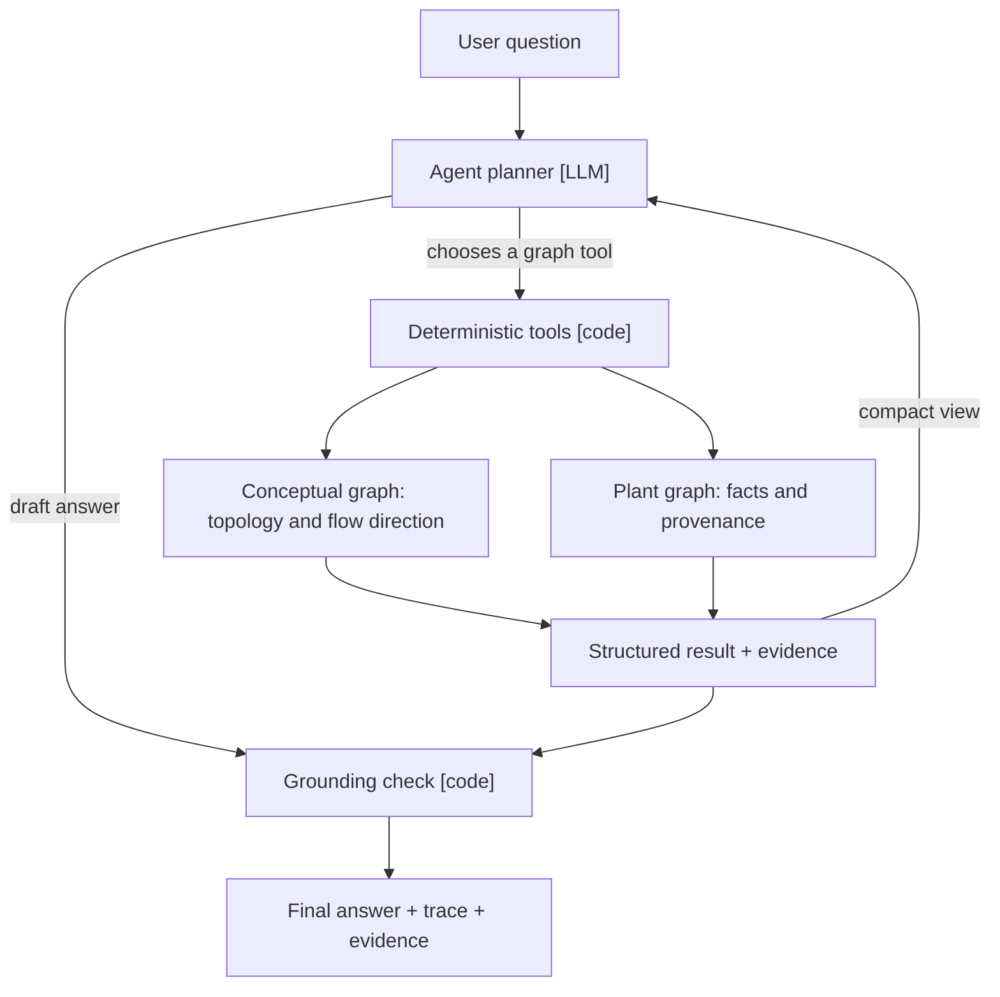
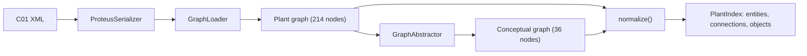
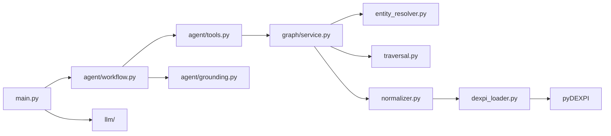
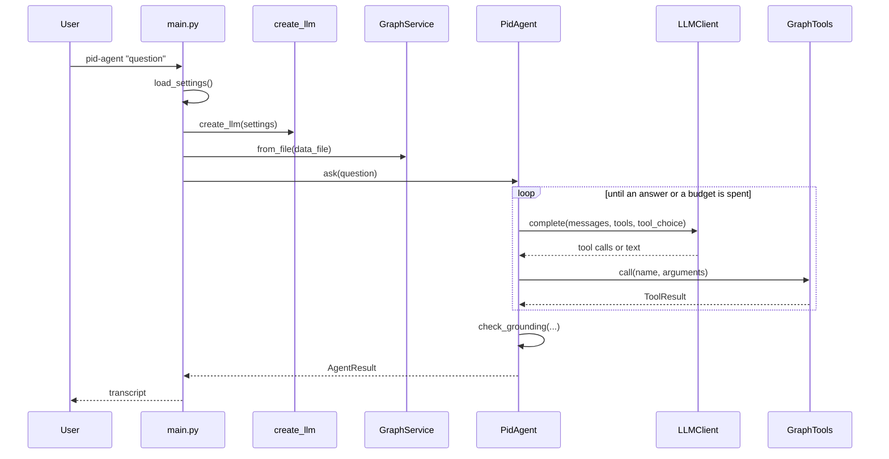
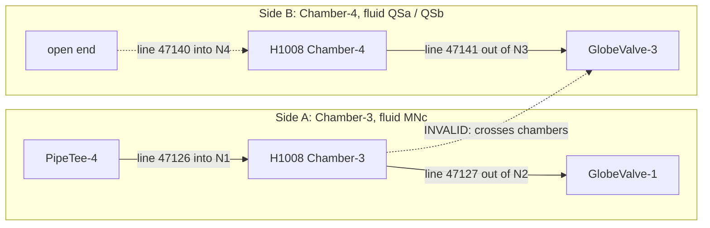
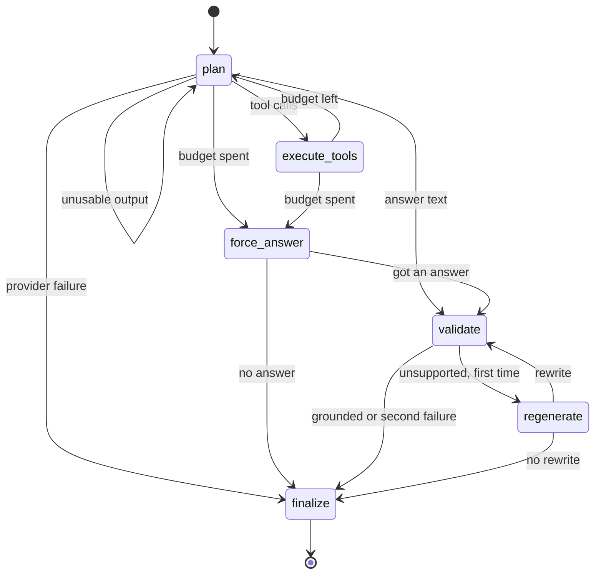
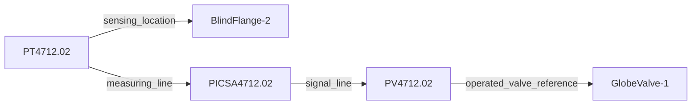
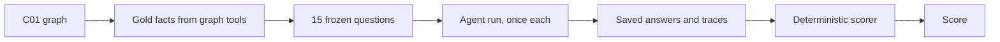

# P&ID graph agent: architecture deep dive

```text
P&ID XML -> pyDEXPI -> NetworkX graphs -> LLM planner -> deterministic graph tools -> evidence -> grounding -> answer + trace
```

This project answers natural-language questions about one plant drawing, the DEXPI reference P&ID "C01". pyDEXPI parses the drawing into NetworkX graphs. A language model reads the question and decides which of seven generic graph operations to run. Deterministic code runs them, returns structured results with evidence, and then checks the drafted answer against that evidence. Every answer is returned with the tool calls that produced it.

> **Key idea**
> The LLM interprets intent and plans graph operations; it is not the source of plant knowledge. All factual answers are derived from deterministic operations over the pyDEXPI graph.

This document describes the code at the frozen implementation commit `a8d56b3` (nothing under `src/` has changed since). The [README](../README.md) is the short version. Entity names such as `P4711` appear freely here because this document explains the dataset; none of this text is sent to the model.

---

## Start here

### I have 5 minutes

1. [System at a glance](#system-at-a-glance): who does what.
2. [Architecture](#architecture): one diagram.
3. [One question, end to end](#one-question-end-to-end): a real run, stage by stage.
4. [Top 10 things to remember](#top-10-things-to-remember).

### I have 20 minutes

1. [From XML to graphs](#from-xml-to-graphs)
2. [Two graph views](#two-graph-views)
3. [The seven graph tools](#the-seven-graph-tools), especially [adjacency, reachability, path](#adjacency-reachability-and-path)
4. [Agent workflow](#agent-workflow)
5. [Grounding](#grounding)
6. [Evaluation](#evaluation)
7. [Known limitations](#known-limitations)

### I want the implementation details

1. [Repository map](#repository-map) and [application entry point](#application-entry-point)
2. [Normalization](#normalization) and [entity resolution](#entity-resolution)
3. [Process direction](#process-direction) and [chamber-aware traversal](#chamber-aware-traversal)
4. [Agent state](#agent-state) and [planning](#planning-what-the-model-sees)
5. [LLM providers](#llm-providers) and [failure handling](#failure-handling)
6. [Testing strategy](#testing-strategy)

For study before a conversation: [what went wrong and what I changed](#what-went-wrong-and-what-i-changed), [if an answer is wrong, where do I look?](#if-an-answer-is-wrong-where-do-i-look), [interview cheat sheet](#interview-cheat-sheet), [glossary](#glossary).

---

## System at a glance

| Layer | Responsibility | Deterministic? | Main implementation |
|---|---|---|---|
| Input | The DEXPI/Proteus XML of drawing C01 | n/a | [`data/C01V04-VER.EX01.xml`](../data/C01V04-VER.EX01.xml) |
| DEXPI ingestion | XML to plant graph and conceptual graph | Yes | [`ingestion/dexpi_loader.py`](../src/pid_agent/ingestion/dexpi_loader.py) → `load_plant` |
| Graph normalization | Stable ids, entities, connections, open ends, chambers | Yes | [`graph/normalizer.py`](../src/pid_agent/graph/normalizer.py) → `normalize` |
| Entity resolution | Names and descriptions to entities; ambiguity | Yes | [`graph/entity_resolver.py`](../src/pid_agent/graph/entity_resolver.py) → `EntityResolver.resolve` |
| Graph operations | Seven generic tools; traversal | Yes | [`graph/service.py`](../src/pid_agent/graph/service.py) → `GraphService`; [`graph/traversal.py`](../src/pid_agent/graph/traversal.py) → `FlowGraph.bfs` |
| LLM planning | Choose tools, decide when to stop, word the answer | **No** | [`agent/workflow.py`](../src/pid_agent/agent/workflow.py) → `PidAgent._plan`; [`llm/`](../src/pid_agent/llm/) |
| Grounding | Check the draft's plant-specific claims against tool results | Yes | [`agent/grounding.py`](../src/pid_agent/agent/grounding.py) → `check_grounding` |
| Presentation | Trace, evidence, transcript, CLI | Yes | [`agent/workflow.py`](../src/pid_agent/agent/workflow.py) → `format_transcript`; [`main.py`](../src/pid_agent/main.py) |
| Evaluation | 15 questions, gold facts, scorer | Yes (the scorer) | [`evals/evaluator.py`](../evals/evaluator.py), [`evals/questions.json`](../evals/questions.json) |

### LLM versus deterministic code

| | LLM (probabilistic) | Deterministic code |
|---|---|---|
| Interprets the question's wording | Yes | |
| Chooses which tool to call, with which arguments | Yes | |
| Decides whether another graph operation is needed | Yes | Enforces budgets |
| Drafts the answer text | Yes | |
| Loads the P&ID | | Yes |
| Resolves a name to a graph entity | | Yes |
| Traverses topology, finds paths | | Yes |
| Retrieves properties | | Yes |
| Produces evidence | | Yes |
| Checks the answer against evidence | | Yes |

Throughout this document, steps are labelled **[LLM]** or **[code]** where it matters.

---

## Architecture



How the two graphs are produced:



**Why this is a graph problem and not document retrieval.** The questions are structural: what is connected, what is downstream, what lies on the route between two items. Those are graph operations with exact answers. Embedding text chunks and retrieving by similarity returns passages that mention a pump, not the set of valves reachable from it. With 36 topology nodes, every lookup is an exact index lookup, so there is no vector database and no embeddings.

[Back to Start here](#start-here)

---

## One question, end to end

A real run from the evaluation: [`evals/runs/deepseek-deepseek-chat/transcripts/eval-07.txt`](../evals/runs/deepseek-deepseek-chat/transcripts/eval-07.txt) (DeepSeek `deepseek-chat`). It needs entity resolution, a route, and pipe properties.

> "Trace the route from heat exchanger H1007 to tank T4750 and give the line number and pipe size along it."

### The run in one table

| Stage | Component | Input | Output |
|---|---|---|---|
| 1 Ask | CLI | the question | initial `AgentState` |
| 2 Plan | **[LLM]** | system prompt, 7 tool schemas, question | two `find_entities` calls |
| 3 Resolve | **[code]** resolver | `"H1007"`, `"T4750"` | `PlateHeatExchanger-1`, `Tank-1` (both `exact_tag`) |
| 4 Plan | **[LLM]** | conversation + compact results | one `find_path` call |
| 5 Execute | **[code]** `FlowGraph.bfs` | source, target, `downstream` | 2 steps via `GlobeValve-2` |
| 6 Evidence | **[code]** service | the path | 1 path + 2 connection evidence items |
| 7 Draft | **[LLM]** | conversation + compact path | answer text |
| 8 Ground | **[code]** validator | draft + full tool results | 15 claims checked, 0 unsupported |
| 9 Return | **[code]** | final state | answer + trace + 5 evidence items |

Totals: 3 model calls, 3 tool calls, 8,411 tokens, 2.4 s.

### Stage by stage

**1. The question arrives. [code]**
- *Where:* [`main.py`](../src/pid_agent/main.py) → `main` → `_answer` → `PidAgent.ask`.
- *Input:* the question string.
- *Output:* an `AgentState` whose `messages` are the system prompt and the question.

**2. The agent chooses its first tools. [LLM]**
- *Where:* [`agent/workflow.py`](../src/pid_agent/agent/workflow.py) → `PidAgent._plan`, with `tool_choice="required"` on the first turn.
- *Input:* `SYSTEM_PROMPT`, the seven tool schemas from `tool_specs()`, the question.
- *Output:* two tool calls in one turn:

```json
{"name": "find_entities", "arguments": {"query": "H1007"}}
{"name": "find_entities", "arguments": {"query": "T4750"}}
```

**3. The entities are resolved. [code]**
- *Where:* `PidAgent._execute_tools` → `GraphTools.call` → `GraphService.find_entities` → `EntityResolver.resolve`.
- *What happens:* both queries hit the `exact_tag` tier. It is a dictionary lookup; no graph algorithm runs.
- *Output (compact view of the first):*

```json
{"status": "success", "entities": [{"id": "PlateHeatExchanger-1", "name": "H1007",
  "type": "PlateHeatExchanger", "match_tier": "exact_tag", "match_reason": "tagName = 'H1007'",
  "links": {"piping_upstream": 1, "piping_downstream": 1, "open_ended_pipes": 2}}]}
```

**4. The agent chooses a route tool. [LLM]**
- *Where:* `PidAgent._plan`, now with `tool_choice="auto"`.
- *Input:* the conversation, including both compact results.
- *Output:*

```json
{"name": "find_path", "arguments": {"source_entity_id": "PlateHeatExchanger-1",
  "target_entity_id": "Tank-1", "direction": "downstream"}}
```

**5. The graph operation executes. [code]**
- *Where:* `GraphService.find_path` → [`graph/traversal.py`](../src/pid_agent/graph/traversal.py) → `FlowGraph.bfs("PlateHeatExchanger-1", "downstream", 25)`.
- *What happens:* a breadth-first search over outgoing piping connections: exchanger → `GlobeValve-2` → `Tank-1`. The start has no entry chamber, so no chamber rule applies.
- *Output:* `outcome.reached["Tank-1"]` with two steps.

**6. Structured evidence returns. [code]**
- *Where:* `GraphService.find_path` builds the `ToolResult`; [`agent/compact.py`](../src/pid_agent/agent/compact.py) → `compact_result` makes the model's view.
- *Output (compact view):*

```json
{"status": "success", "paths": [{"length": 2, "direction": "downstream",
  "entities": ["PlateHeatExchanger-1 (H1007)", "GlobeValve-2 (GlobeValve 47123/C1)", "Tank-1 (T4750)"],
  "steps": [
    {"travelled": "with_flow", "from": "PlateHeatExchanger-1 (H1007)", "to": "GlobeValve-2 (GlobeValve 47123/C1)",
     "lineNumber": "47123", "segmentNumber": "S1", "nominalDiameterRepresentation": "DN 80", "fluidCode": "MNb",
     "from_nozzle": "N2 [Chamber-1]"},
    {"travelled": "with_flow", "from": "GlobeValve-2 (GlobeValve 47123/C1)", "to": "Tank-1 (T4750)",
     "lineNumber": "47123", "segmentNumber": "S1", "nominalDiameterRepresentation": "DN 80", "fluidCode": "MNb",
     "to_nozzle": "N1"}]}],
 "meta": {"shortest_path_only": true}}
```

- *Evidence recorded (kept in full, not sent to the model):* `path PlateHeatExchanger-1->Tank-1`, `connection PipingNetworkSegment-3/connections/1`, `connection PipingNetworkSegment-3/connections/2`, plus the two entities from stage 3.

**7. The agent drafts the answer. [LLM]**
- *Where:* `PidAgent._plan`; the model returns text, which becomes `draft`.
- *Output:*

> Route from H1007 (PlateHeatExchanger-1) to T4750 (Tank-1), downstream: H1007 nozzle N2 (Chamber-1) → GlobeValve 47123/C1 (GlobeValve-2) → T4750 nozzle N1. Line number: 47123 (segment S1), nominal diameter DN 80, fluid code MNb. Two hops, one line throughout; no equipment between the exchanger and the tank other than the globe valve.

**8. Grounding validates the claims. [code]**
- *Where:* `PidAgent._validate` → [`agent/grounding.py`](../src/pid_agent/agent/grounding.py) → `check_grounding`.
- *Input:* the draft, the question, the three full tool results.
- *Output:* 15 claims extracted (tags, ids, `47123`, `S1`, `DN 80`, `MNb`, `N2`, `N1`, `Chamber-1`, ...), all found in the tool results. Status `grounded`.

**9. The answer and trace are returned. [code]**
- *Where:* `PidAgent._finalize` → `AgentResult`; `format_transcript` prints it.
- *Output:* the draft as the final answer, three trace steps, five evidence items, usage.

> **Implementation detail**
> Only observable things are listed: what was sent, what the model returned, what the tools did. The adapters keep only the model's message content and tool calls; its private reasoning is never read or stored.

[Back to Start here](#start-here)

---

## Implemented versus not implemented

| Implemented in this repository | Not implemented (see [production extensions](#production-extensions-not-implemented)) |
|---|---|
| pyDEXPI ingestion of the real C01 file | Any drawing other than C01; multi-drawing graphs |
| In-memory NetworkX graphs, rebuilt on start | A persistent graph database |
| Normalized index with stable ids, open ends, chambers | Cross-sheet resolution of off-page connectors |
| Deterministic entity resolution with ambiguity | Semantic or embedding search |
| Seven generic graph tools | Multi-hop instrumentation traversal as one call |
| LangGraph agent with budgets and a visible trace | A deterministic "enough evidence" detector |
| Grounding check, one regeneration, evidence-only fallback | A grounding check that understands sentence meaning |
| Three provider adapters behind one interface | Automatic provider failover |
| 15-question evaluation with a deterministic scorer | A complete evaluation run on `openai/gpt-oss-20b` |
| CLI and a local chat UI (added after the evaluation; presentation only, [`ui/`](../src/pid_agent/ui/)) | OCR, image input, visual highlighting, hosting |
| | Live process state, access control, monitoring |

---

## Repository map

Eight files explain most of the system. Suggested reading order:

1. [`models.py`](../src/pid_agent/models.py): the data shapes everything else passes around.
2. [`ingestion/dexpi_loader.py`](../src/pid_agent/ingestion/dexpi_loader.py): 70 lines; how the graphs are made.
3. [`graph/normalizer.py`](../src/pid_agent/graph/normalizer.py): how two graphs become one index.
4. [`graph/traversal.py`](../src/pid_agent/graph/traversal.py): the search, including the chamber rule.
5. [`graph/service.py`](../src/pid_agent/graph/service.py): the seven operations.
6. [`agent/tools.py`](../src/pid_agent/agent/tools.py): what the model is offered.
7. [`agent/workflow.py`](../src/pid_agent/agent/workflow.py): the state machine.
8. [`agent/grounding.py`](../src/pid_agent/agent/grounding.py): the answer check.

### Entry and configuration

*Read first:* `main.py`.

| File | Owns |
|---|---|
| [`main.py`](../src/pid_agent/main.py) | Argument parsing; a question, or `tool`, `tools`, `inspect`; printing |
| [`config.py`](../src/pid_agent/config.py) | `Settings`; `load_settings()`; `API_KEY_VARIABLES` |
| [`models.py`](../src/pid_agent/models.py) | `Entity`, `SubObject`, `IdentifierOrigin`, `NozzleRef`, `Provenance`, `Connection`, `Evidence`, `ToolResult` |
| [`errors.py`](../src/pid_agent/errors.py) | `PidAgentError`, `ConfigError`, `DataFileNotFoundError`, `DexpiParseError`, `GraphNormalizationError` |

### DEXPI ingestion

*Read first:* `dexpi_loader.py`.

| File | Owns |
|---|---|
| [`ingestion/dexpi_loader.py`](../src/pid_agent/ingestion/dexpi_loader.py) | `load_plant(path)` → `LoadedPlant(source_file, plant_graph, conceptual_graph)` |
| [`ingestion/graph_inspector.py`](../src/pid_agent/ingestion/graph_inspector.py) | Prints graph statistics (`pid-agent inspect`) |

### Graph intelligence

*Read first:* `service.py`, then follow its calls into the other three.

| File | Owns |
|---|---|
| [`graph/normalizer.py`](../src/pid_agent/graph/normalizer.py) | `normalize(loaded)` → `PlantIndex(entities, connections, objects, warnings)` |
| [`graph/entity_resolver.py`](../src/pid_agent/graph/entity_resolver.py) | `EntityResolver.resolve(query, entity_type)` → `Resolution` |
| [`graph/traversal.py`](../src/pid_agent/graph/traversal.py) | `FlowGraph.bfs(...)` → `TraversalOutcome` |
| [`graph/service.py`](../src/pid_agent/graph/service.py) | `GraphService`: the seven operations |

### Agent orchestration

*Read first:* `workflow.py` → `PidAgent._build_graph`.

| File | Owns |
|---|---|
| [`agent/tools.py`](../src/pid_agent/agent/tools.py) | Argument models, `TOOL_DESCRIPTIONS`, `tool_specs()`, `GraphTools.call` |
| [`agent/prompts.py`](../src/pid_agent/agent/prompts.py) | `SYSTEM_PROMPT` and three auxiliary prompts |
| [`agent/state.py`](../src/pid_agent/agent/state.py) | `AgentState`, `TraceStep`, `AgentResult` |
| [`agent/compact.py`](../src/pid_agent/agent/compact.py) | `compact_result` (model-facing view), `render_evidence` |
| [`agent/grounding.py`](../src/pid_agent/agent/grounding.py) | `check_grounding`, `EvidenceCorpus`, `extract_claims` |
| [`agent/workflow.py`](../src/pid_agent/agent/workflow.py) | `PidAgent`, `AgentLimits`, `format_transcript` |

### LLM provider adapters

*Read first:* `base.py`.

| File | Owns |
|---|---|
| [`llm/base.py`](../src/pid_agent/llm/base.py) | `LLMClient` protocol, `LLMResponse`, `ToolCall`, `LLMError` |
| [`llm/groq_provider.py`](../src/pid_agent/llm/groq_provider.py) | `GroqProvider` (Groq SDK) |
| [`llm/openai_compatible.py`](../src/pid_agent/llm/openai_compatible.py) | `OpenAICompatibleProvider` (shared HTTP adapter) |
| [`llm/openrouter_provider.py`](../src/pid_agent/llm/openrouter_provider.py), [`llm/deepseek_provider.py`](../src/pid_agent/llm/deepseek_provider.py) | A name and a base URL each |
| [`llm/__init__.py`](../src/pid_agent/llm/__init__.py) | `create_llm(settings)` |

### Evaluation files and runs

*Read first:* `questions.json`, then `evaluator.py` → `score_answer`.

| File | Owns |
|---|---|
| [`evals/questions.json`](../evals/questions.json) | 15 questions with gold facts |
| [`evals/evaluator.py`](../evals/evaluator.py) | Run and deterministic scorer |
| [`evals/runs/`](../evals/runs/) | Per provider and model: `run.json`, `results.json`, `transcripts/` |

### Testing

*Read first:* [`tests/test_graph_tools.py`](../tests/test_graph_tools.py) for the graph layer, [`tests/test_agent.py`](../tests/test_agent.py) for the workflow. See [testing strategy](#testing-strategy).

### Documentation

[`README.md`](../README.md) (short), this file (long), [`prompts/`](../prompts/) (the assignment and the development instructions, in order), [`examples/transcripts/`](../examples/transcripts/) (three real failure transcripts from development).

### Dependency flow

Each layer only knows the ones below it. Nothing above `graph/` imports pyDEXPI, and nothing in `graph/` knows an LLM exists.



---

## Application entry point

The CLI has **no `ask` subcommand**. A question is simply the arguments:

```bash
uv run pid-agent "Which pumps are upstream of the tubular heat exchanger?"
uv run pid-agent                       # interactive prompt
uv run pid-agent tool get_entity '{"entity_id": "P4711"}'   # one tool, no LLM
uv run pid-agent tools                 # print the tool schemas
uv run pid-agent inspect               # graph statistics
```

What happens for a question (all in [`main.py`](../src/pid_agent/main.py)):

1. `uv run pid-agent` runs `pid_agent.main:main` (declared under `[project.scripts]` in `pyproject.toml`).
2. `main()` parses arguments with `_build_parser()`: flags `-v`, `--json`, `--no-trace`, and positional `words`. A first word of `tools`, `inspect` or `tool` is handled as such; anything else is a question.
3. `load_settings()` loads `.env` without overriding variables already set in the shell, and builds a frozen `Settings`. Only the selected provider's key is read.
4. `_build_agent(settings)` calls `create_llm(settings)` **first**, so a missing key fails with one clear line before the graph is loaded.
5. `_graph_tools(settings)` calls `GraphService.from_file(...)`, which runs `load_plant` then `normalize`. The graph is loaded once per process.
6. `PidAgent(llm, tools)` compiles the LangGraph state machine in its constructor.
7. `_answer()` calls `agent.ask(question)`, which returns an `AgentResult`.
8. Output is `format_transcript(result)` by default, `result.answer` with `--no-trace`, or the whole result as JSON with `--json`.



[Back to Start here](#start-here)

---

# Part 1: The graph

## From XML to graphs

**What the pieces are.**

- A **P&ID** shows equipment, the pipes between them, valves and fittings on those pipes, and the instruments that measure and control. It records what is connected to what, with engineering attributes. It does not show operating state.
- **DEXPI** is a data model for P&IDs. **Proteus XML** is the file format that carries it: every pump, nozzle, pipe segment and instrument function is an XML element with an ID, attributes and references.
- **pyDEXPI** parses that XML into Python objects, exports them as a NetworkX graph, and can simplify that graph.

**The code.** All of it is in [`ingestion/dexpi_loader.py`](../src/pid_agent/ingestion/dexpi_loader.py) → `load_plant`:

```python
model = ProteusSerializer().load(str(path.parent), path.name)
plant_graph = GraphLoader().parse_dexpi_to_graph(model)
conceptual_graph = GraphAbstractor.build_conceptual_graph(plant_graph)
```

| pyDEXPI class | Produces |
|---|---|
| `ProteusSerializer` | The DEXPI object model (Python objects) |
| `GraphLoader` | A `networkx.MultiDiGraph` with one node per DEXPI object. Node attributes are the object's data attributes plus `label` (class name), `labels` (inheritance chain) and `proteusId`. Edges are only `composition` (owner to part) or `reference` (object to object it points at), each with an `attr_name` |
| `GraphAbstractor` | Simplified copies, made by removing or collapsing nodes |

**Graph views available from C01.** Sizes observed when inspecting the file; the first and last are asserted in [`tests/test_ingestion.py`](../tests/test_ingestion.py).

| View | Nodes | Edges | Used by the application |
|---|---|---|---|
| plant (raw `GraphLoader` output) | 214 | 376 | **Yes**: properties, hierarchy, provenance |
| complete (plant minus model and metadata nodes) | 212 | 348 | No |
| process (pipes collapsed, nozzles and chambers kept) | 66 | 78 | No |
| conceptual (`build_conceptual_graph`) | 36 | 39 | **Yes**: topology |

The process graph adds nothing the other two do not already provide, so it is not built.

**Errors.** `load_plant` raises `DataFileNotFoundError` for a missing file and wraps anything pyDEXPI throws on bad input in `DexpiParseError`.

---

## Two graph views

### Why not just use one graph?

- **The plant graph's edges do not mean flow.** They mean "owns" or "refers to". A pipe there is a node, not an edge.
- **The conceptual graph has the right shape but loses detail.** Nozzles, chambers and design limits are gone.
- **The conceptual graph silently drops four real pipes** that have only one end on the drawing.
- **The conceptual graph mislabels one node.** It copies line attributes onto nodes with first-writer-wins.
- So each graph is used only for what it is right about, and the plant graph repairs what the abstraction lost.

### Side by side

| | Conceptual graph | Plant graph |
|---|---|---|
| Purpose | Shape of the plant | Every DEXPI object |
| Nodes | 36: equipment, valves, fittings, instrument functions | 214: also pipes, segments, lines, nozzles, chambers, piping nodes |
| Edges | Pipes and instrumentation links | `composition` and `reference` |
| Direction means | Piping: drawn flow (source item to target item) | Ownership or reference; **not** flow |
| Properties | Pipe attributes on edges are correct; on nodes they are not reliable | Authoritative |
| Hierarchy | Flattened | Full (line → segment → item; equipment → nozzle, chamber) |
| Best use | Neighbours, reachability, routes | Property values, sub-objects, line context, provenance |
| Limitations | Loses nozzles, chambers, open-ended pipes | Cannot be traversed as flow |

### Concrete examples from C01

| Topic | Plant graph | Conceptual graph |
|---|---|---|
| Equipment properties | `CentrifugalPump-1`: `designShaftPower = 60.0 kW` | Same (survives) |
| Pipe attributes | Pipes have none; they live on `PipingNetworkSegment` and `PipingNetworkSystem` | Copied onto each pipe **edge**: line 47122, S1, DN 80. Correct on all 27 edges (tested) |
| Component line context | `PipeTee-1` is an item of segment 11 on line **47126** | The node says line **47125** |
| Nozzles | `H1007` has N1 to N4 | Removed |
| Chambers | `Chamber-1` upper design pressure 60.0 bar; `Chamber-2` 30.0 bar | Removed; design limits are gone |
| Exchanger sides | N1 and N2 on Chamber-1; N3 and N4 on Chamber-2 | One node; sides indistinguishable |
| Pipes with one end on the drawing | 4 exist (lines 47130, 47131, 47140, tail of 47141) | Silently dropped |
| Instrumentation | Loops, actuating systems, actuators as separate objects | Merged into function nodes |

**Why the raw plant graph cannot be traversed as flow.** A pipe is a node with edges `Pipe --sourceItem--> Nozzle-2` and `Pipe --targetItem--> Nozzle-3`. Both point *out of* the pipe. Following successors from a pump leads to its nozzles, chamber and impeller, never to the next piece of equipment.

### The authority rules

Implemented in [`graph/normalizer.py`](../src/pid_agent/graph/normalizer.py):

| Information | Taken from |
|---|---|
| Topology and direction | Conceptual graph piping edges |
| Pipe attributes (line, segment, DN, fluid, class) | Conceptual graph **edges** (verified against plant segments) |
| Piping attributes copied onto conceptual **nodes** | Never used |
| Entity properties, sub-objects, line context, provenance | Plant graph |
| Open-ended pipes; which nozzle and chamber a pipe attaches to | Recovered from the plant graph and marked |

[Back to Start here](#start-here)

---

## Normalization

[`graph/normalizer.py`](../src/pid_agent/graph/normalizer.py) has a private `_Normalizer` class and the public `normalize(loaded) -> PlantIndex`. `_Normalizer.run` executes six steps in order.

### Stable identifiers

**Why.** NetworkX node ids are random UUIDs, different on every load (tested). An id that changes between runs cannot be shown to a user or frozen in a test.

**How:** `_Normalizer.public_id(node)`.

| Object | Public id | Example |
|---|---|---|
| Has a `proteusId` | The `proteusId` | `CentrifugalPump-1` |
| Has none (pipes) | `<owner id>/<attribute>/<position>` | `PipingNetworkSegment-3/connections/2` |

A test checks that no UUID appears anywhere in the index and that two loads give identical ids.

### Entities

`_Normalizer._build_entities` makes one `Entity` per conceptual node.

| Field | Source |
|---|---|
| `properties` | The plant node's own attributes, minus bookkeeping keys |
| `type`, `type_hierarchy` | Class name and inheritance chain without abstract mixins, e.g. `["CentrifugalPump", "Pump", "Equipment"]`. This is what lets "pump" or "valve" match |
| `category` | `equipment`, `piping_component` or `instrumentation` |
| `children` | `_children`: nozzles, chambers, impeller, plus objects the abstraction merged in (e.g. the `ControlledActuator` behind an actuating function). Nozzles get a `chamber` property |
| `piping_context` | `_piping_context`: the segment and line that **own** the item, read from the plant graph |
| `identifiers`, `identifier_origins` | See below |
| `name` | Tag, position number or instrument number if present; else e.g. `BallValve 47126/C5` |

`_Normalizer._build_lines` also makes the 11 `PipingNetworkSystem` objects entities (category `piping_line`, `in_topology = False`) with their segments as children, so "line 47125" can be found and queried.

### Identifiers and where they come from

Only five items have a `tagName`: P4711, P4712, H1007, H1008, T4750. Everything else is found through other fields.

| Kind (`IdentifierOrigin.kind`) | Meaning | Example |
|---|---|---|
| `source_identifier` | A field literally on the object | `positionNumber = "SV 104.01"`, `pipingComponentName = "73KH12"` |
| `derived_identifier` | Composed by this code | `lineComponent = "47126/C5"`; `instrumentTag = "PICSA4712.02"` |
| `alias` | A literal field of a *related* object | A valve's `operatedValveReference = "PV4712.02_YV"` |

Results say which kind matched, so a derived identifier is never presented as if it were written in the file.

### Connections

`_Normalizer._build_piping_connections` creates a `Connection` per conceptual piping edge.

- The edge's `collapsed_node_id` names the plant pipe node. That gives the stable id and, through the pipe's `sourceItem` and `targetItem`, the nozzle and chamber at each end (`NozzleRef`).
- It asserts that the conceptual edge's endpoints agree with the plant pipe; otherwise `GraphNormalizationError`.

`_Normalizer._build_instrumentation_connections` turns the remaining conceptual edges into connections with `relationship = "instrumentation"` and one of four types: `sensing_location`, `measuring_line`, `signal_line`, `operated_valve_reference`.

`_Normalizer._build_objects` indexes every other addressable plant object (segments, nozzles, chambers, `MetaData-1`) as an `ObjectRecord`, so `get_properties` can read them.

### Open ends

**Why.** Four pipes in the DEXPI model have only one end on this drawing. pyDEXPI's abstraction cannot make an edge with one end, so it drops them. Leaving them out would understate what `H1007` and `H1008` connect to.

**How.** After the conceptual edges, `_build_piping_connections` scans the plant graph for pipe nodes that no conceptual edge came from, and adds them as connections marked `open_end`.

| Open end | Line | Attached to |
|---|---|---|
| Into `H1007` nozzle N3 | 47130 | Chamber-2 |
| Out of `H1007` nozzle N4 | 47131 | Chamber-2 |
| Into `H1008` nozzle N4 | 47140 | Chamber-4 |
| Out of `GlobeValve-3` | 47141 | none |

Real example (`PipingNetworkSegment-20/connections/1`):

```json
{
  "source": null,
  "target": "PlateHeatExchanger-1",
  "connection_type": "open_end",
  "open_end": "source",
  "target_nozzle": {"id": "Nozzle-13", "sub_tag": "N3", "chamber_id": "Chamber-2"},
  "properties": {"lineNumber": "47130", "nominalDiameterRepresentation": "DN 50", "fluidCode": "WKa"},
  "provenance": {
    "derived_from": "plant_graph",
    "present_in_conceptual_graph": false,
    "note": "This pipe exists in the DEXPI model but has no source item on this drawing ..."
  }
}
```

| Field | Meaning |
|---|---|
| `connection_type: "open_end"` | Distinguishes it from a native pipe |
| `source: null` | The file does not say where the pipe comes from |
| `provenance.derived_from: "plant_graph"` | Recovered, not from the conceptual graph |
| `provenance.present_in_conceptual_graph: false` | Explicitly absent from pyDEXPI's topology |

How they behave:

- `Connection.is_traversable` is false, so they are never walked through.
- `get_connections` lists them with `neighbor: null`; `traverse` lists the ones it runs into.
- The view the model sees carries a `note` that the other end is not represented.

> **Why this matters**
> This is the assignment's "If the data doesn't contain something, say so. Don't make it up" applied to topology. The pipe exists, its far end is unknown, and both facts are stated. Writing a destination would be inventing topology.

### What the index contains for C01

47 entities (36 in the topology + 11 lines), 43 connections (25 pipe, 2 direct piping connection, 4 open end, 12 instrumentation), 151 objects.

---

## Entity resolution

**Why deterministic.** If a model guessed which object "the ball valve" means, a wrong guess would look exactly like a right one. Resolution is done by code, and it either returns one entity with the reason, several flagged ambiguous, or none.

**Where:** [`graph/entity_resolver.py`](../src/pid_agent/graph/entity_resolver.py) → `EntityResolver.resolve(query, entity_type)`.

At construction it builds three indexes: tags; normalized identifiers (`normalize_identifier` removes case and punctuation); and type phrases (every contiguous run of words in every class name, so `("ball", "valve")`, `("valve",)`, `("check", "valve")`).

### Tiers

Tried in order; the first that matches wins (`TIER_CONFIDENCE`).

| Tier | Meaning | Confidence | Method |
|---|---|---|---|
| `exact_tag` | Query is exactly a tag | 1.0 | `_match_whole` |
| `tag_case_insensitive` | Same, ignoring case | 0.98 | `_match_whole` |
| `proteus_id` | Query is an entity id | 0.98 | `_match_whole` |
| `identifier` | Query equals any identifier after normalization | 0.95 | `_identifier_matches` |
| `embedded_identifier` | Identifiers found inside a phrase | 0.9 | `_match_embedded` |
| `type` | The phrase names a type | 0.8 | `_match_types` |

### Real examples

All asserted in [`tests/test_entity_resolution.py`](../tests/test_entity_resolution.py).

| Input | What happens | Result |
|---|---|---|
| `P4711` | Tag hit | `CentrifugalPump-1`, `exact_tag` |
| `p4711` | Tag, ignoring case | `CentrifugalPump-1`, `tag_case_insensitive` |
| `sv104.01` | Normalized equals `SV 104.01` | `SpringLoadedGlobeSafetyValve-1`, `identifier` |
| `pump P4711` | `P4711` found; "pump" agrees with its type | Unique |
| `valve P4711` | Identifier found; "valve" contradicts the type | The pump, **plus a warning** |
| `73KH12` | Five ball valves share this code | All five, `ambiguous = true` |
| `C1` | Five items have component number C1 | All five, ambiguous |
| `C1 on line 47127` | The line number narrows the candidates | `GlobeValve-1` |
| `globe valve on line 47127` | `_items_on_lines`: a type plus a line names items of that type on it | `GlobeValve-1` |
| `all pumps` | Plural or quantifier means a set | Both pumps, not ambiguous |
| `the heat exchanger` | Type, singular, two candidates | Both, **ambiguous** |
| `X9999` | Nothing | `not_found`, no suggestions |
| `P4771` | Nothing; `_suggest` finds near misses | `not_found`; suggestions P4711 and P4712 at 0.8 |

### Rules worth remembering

- **Fuzzy matches never bind.** `_suggest` uses `difflib` similarity (cutoff 0.75, at most 5). Its output goes into `resolution.suggestions`, never into the matches. Asked about `P4771`, the system says it does not exist and offers candidates; it does not quietly answer about `P4711`.
- **The `entity_type` argument never erases an identifier match.** `H1007` with type "heater" still returns the exchanger, with a warning.
- **Ambiguity is a result, not an error.** The tool returns `status = "ambiguous"` and all candidates.

[Back to Start here](#start-here)

---

# Part 2: The tools

## The seven graph tools

**Why generic tools.** The assignment's main test is questions the author never saw. A table from phrasing to tool sequence would work for the phrasings in the table and fail on the rest. So the tools are generic graph operations, their semantics are described to the model, and the model maps the question onto them. The same seven tools served the four example questions, the development questions and the 15 evaluation questions with no question-specific code.

**How they are exposed.** Each tool is a method on `GraphService` ([`graph/service.py`](../src/pid_agent/graph/service.py)), wrapped by `GraphTools` ([`agent/tools.py`](../src/pid_agent/agent/tools.py)). `GraphTools.call`:

- validates arguments with a pydantic model (unknown fields are rejected);
- times the call;
- converts any exception into a `ToolResult` with `status = "error"`, so a tool cannot crash the agent.

Wherever an `entity_id` is expected, `GraphService._require_entity` also accepts a unique identifier such as `"P4711"`, says so in a warning, and records the entity as evidence. An ambiguous or unknown value is refused.

### Tool reference

| Tool | Question it answers | Scope | Graph operation |
|---|---|---|---|
| `find_entities` | "Which entity does the user mean?" | resolution | index lookup |
| `list_entities` | "What entities of this type exist?" | enumeration | type lookup |
| `get_entity` | "What is this thing and what does it have?" | one entity | attribute read |
| `get_connections` | "What touches this directly?" | one hop | adjacency |
| `traverse` | "What can I reach from here?" | multi-hop | breadth-first reachability |
| `find_path` | "How do A and B connect?" | route | shortest path |
| `get_properties` | "What value does this property have?" | properties | attribute lookup |

### Adjacency, reachability and path

```text
Adjacency      A --- B                    "What is directly connected to A?"
               get_connections(A)         returns B

Reachability   A --> B --> C --> D        "What can I reach downstream of A?"
               traverse(A, "downstream")  returns B, C, D with distances

Path           A --> B --> C --> D        "How do I get from A to D?"
               find_path(A, D)            returns the route A, B, C, D
```

| Concept | Tool | Typical wording |
|---|---|---|
| Adjacency | `get_connections` | connected to, directly, immediately, which line leaves |
| Reachability | `traverse` | downstream of, upstream of, feeds, discharges to, ends up, eventually |
| Path | `find_path` | between A and B, from A to B, route |

> **Why this matters**
> Confusing these caused the most visible development failure. Asked where a pump discharges, the model used adjacency hop by hop: six tool calls, about 19,600 tokens, and an answer that named one destination and missed two. A direct neighbour in this graph is usually a tee or a valve, not the next piece of equipment. See [what went wrong](#what-went-wrong-and-what-i-changed).

### find_entities

| | |
|---|---|
| **Purpose** | Turn a name, identifier or description into entities |
| **Inputs** | `query` (string), `entity_type` (optional) |
| **Output** | `entities` (summary + `match_tier`, `match_reason`, `identifier_kind`, `links`); `resolution` (`status`, `ambiguous`, `match_count`, `suggestions`); `status` of `success`, `ambiguous` or `not_found` |
| **Implementation** | `GraphService.find_entities` → `EntityResolver.resolve`; `_link_counts` adds how many piping and instrumentation connections each match has |
| **Graph view** | The normalized index (identifiers from the plant graph) |
| **Use it** | To get an id from anything the user wrote |
| **Do not use it** | To look up an id you already have |
| **Edge cases** | Shared identifiers; a connection id or sub-object id is explained ("is a connection, not an entity") instead of "not found" |

Example: `find_entities({"query": "P4711"})` returns

```json
{"status": "success", "entities": [{"id": "CentrifugalPump-1", "name": "P4711", "type": "CentrifugalPump",
  "match_tier": "exact_tag", "links": {"piping_upstream": 1, "piping_downstream": 1}}]}
```

### list_entities

| | |
|---|---|
| **Purpose** | Enumerate a type or category, or discover which types exist |
| **Inputs** | `entity_type` (optional) |
| **Output** | `entities`; or, with no argument, `properties.types`, `properties.categories`, `properties.other_objects` (`["MetaData-1"]`) |
| **Implementation** | `GraphService.list_entities` → `EntityResolver.entities_of_type` (supertypes work: "valve" returns 11) |
| **Use it** | "Every pump", "all valves" |
| **Do not use it** | To find one named item |
| **Edge cases** | An unknown type returns `status = "empty"` with the catalogue |

Example: `list_entities({"entity_type": "pump"})` returns `CentrifugalPump-1` and `ReciprocatingPump-1`.

### get_entity

| | |
|---|---|
| **Purpose** | Everything about one entity |
| **Inputs** | `entity_id`, `include_children` (default false) |
| **Output** | `properties` (own), `piping_context` (owning segment and line), `identifiers`, `links`, and `children` or `children_available` |
| **Implementation** | `GraphService.get_entity` |
| **Graph view** | Plant graph (through the index) |
| **Use it** | To see what an entity is and what it has |
| **Do not use it** | For neighbours |
| **Edge cases** | For a line it lists segments, each with its items and connection ids |

Example: `get_entity({"entity_id": "BallValve-3"})` returns type `BallValve`; identifiers `73KH12`, `C5`, `47126/C5`; piping context line 47126, segment S5, DN 25.

### get_connections

Adjacency.

| | |
|---|---|
| **Purpose** | The direct neighbours of one entity and what connects them |
| **Inputs** | `entity_id`; `direction` (`upstream`, `downstream`, `both`); `relationship` (`piping`, `instrumentation`, `all`) |
| **Output** | `connections`, each with source, target, type, pipe properties, nozzles, `neighbor`, and `neighbor_is` (piping) or `reference_direction` (instrumentation) |
| **Implementation** | `GraphService.get_connections`: a scan of `index.connections` |
| **Graph view** | Conceptual topology with plant-graph nozzles; open ends from the plant graph |
| **Use it** | "What is X connected to", "which line leaves X" |
| **Do not use it** | Hop by hop to explore; that is `traverse` |
| **Edge cases** | The direction filter applies to piping only; open ends appear with `neighbor = null`; a line is rejected with an explanation |

Example: `get_connections({"entity_id": "GlobeValve-3", "direction": "downstream", "relationship": "piping"})` returns one connection with `"to": null, "open_end": "target", "lineNumber": "47141"`.

### traverse

Reachability.

| | |
|---|---|
| **Purpose** | Everything reachable along piping from an entity |
| **Inputs** | `start_entity_id`, `direction`, `entity_types`, `max_depth`, `stop_at_types` |
| **Output** | `entities` by distance; `connections` used; `boundaries`; `meta` |
| **Implementation** | `GraphService.traverse` → `FlowGraph.bfs`. `max_depth` is clamped to 1..25 |
| **Graph view** | Conceptual piping connections only |
| **Use it** | "Downstream of", "upstream of", "what does it feed", "where does it end" |
| **Do not use it** | For a route to a known target; for instrumentation |
| **Edge cases** | Recycle loops (each entity once, at its shortest distance); type filters do not hide `meta.endpoints`; open ends reached are listed |

Fields on each reached entity:

| Field | Meaning |
|---|---|
| `distance` | Number of connections from the start |
| `path_entities`, `path_connections` | The shortest route to it |
| `through_equipment` | Equipment lying between it and the start. Empty means it was reached through pipes, valves and fittings only |
| `terminal: true` | Nothing further is drawn in that direction |
| `continues_beyond_max_depth: true` | The search stopped here only because of `max_depth`; it is not an end |

Fields in `meta`: `cycle_detected`, `start_is_in_cycle`, `truncated_by_max_depth`, `endpoints` (all terminal entities, even if filtered out), `unexplored_beyond_max_depth`.

Example: `traverse({"start_entity_id": "Tank-1", "direction": "downstream", "entity_types": ["equipment"]})` returns `P4712` (distance 5, `through_equipment: []`) and `H1008` (distance 11, `through_equipment: ["ReciprocatingPump-1"]`), plus one chamber boundary.

### find_path

Route.

| | |
|---|---|
| **Purpose** | The shortest piping route between two entities |
| **Inputs** | `source_entity_id`, `target_entity_id`, `direction` (`downstream`, `upstream`, `any`) |
| **Output** | `paths[0]` with `length`, ordered `entities`, and `steps` (each with the pipe's properties and `travelled`: `with_flow` or `against_flow`) |
| **Implementation** | `GraphService.find_path` → the same `FlowGraph.bfs`, then the reach of the target |
| **Use it** | "Between A and B", "route from A to B" |
| **Do not use it** | To explore |
| **Edge cases** | If no path exists in the asked direction but one exists the other way, a warning says so; shortest path only |

Example: `find_path({"source_entity_id": "Tank-1", "target_entity_id": "ReciprocatingPump-1"})` returns 5 steps on line 47124 with diameters DN 80, DN 80, DN 80, DN 50, DN 50.

### get_properties

| | |
|---|---|
| **Purpose** | Read named properties, and say which requested ones do not exist |
| **Inputs** | `ids` (entity, connection or object ids), `requested_properties` (optional) |
| **Output** | Per id: `found` (each with `property`, `value`, `source_object_id`, `scope`), `missing`, `available` |
| **Implementation** | `GraphService.get_properties`; `_property_sources` gathers own properties, the owning segment's and every child's; `_property_report` matches names exactly, then loosely (substring, or all words present), flagging loose matches as partial |
| **Graph view** | Plant graph |
| **Use it** | For any value |
| **Do not use it** | For connectivity |
| **Edge cases** | If everything requested is missing, `status = "empty"` |

Example: `get_properties({"ids": ["PlateHeatExchanger-1"], "requested_properties": ["upperLimitDesignPressure"]})` returns `60.0 bar` on `Chamber-1` and `30.0 bar` on `Chamber-2`, each with `scope: "child:Chamber"`.

[Back to Start here](#start-here)

---

## Process direction

**What "upstream" and "downstream" mean here.** A piping `Connection` runs `source -> target`, and that is the drawn flow direction. Downstream follows connections from source to target; upstream goes the other way.

**Where the direction comes from.**

```text
XML:  <Connection FromID="..." ToID="..."/>
        -> DEXPI:      pipe.sourceItem, pipe.targetItem
        -> pyDEXPI:    conceptual edge  source item -> target item
        -> this code:  Connection.source -> Connection.target
```

**It was verified, not assumed** ([`tests/test_flow_direction.py`](../tests/test_flow_direction.py)):

- all 23 segments in the XML start at their `FromID` and end at their `ToID` in our connections;
- the eight `PipeFlowArrow` symbols on segments point along the centre line in that order;
- the flow-in off-page connector has nothing upstream, and the flow-out one nothing downstream;
- both pumps have one inlet and one outlet.

**What is excluded from flow traversal.** `FlowGraph.__init__` ([`graph/traversal.py`](../src/pid_agent/graph/traversal.py)) keeps only connections with `relationship == "piping"` that have both ends. So:

- instrumentation connections are never followed;
- open ends are never followed.

**Instrumentation has its own direction.** It is the direction of the reference or signal (transmitter → controller → actuator → valve). The tools label it `reference_direction`, never upstream or downstream.

> **Limitation**
> Topology is not operation. Valve positions and operating state are not in a P&ID. "Downstream" means "connected in the drawn direction", not "fluid is flowing there". The system prompt tells the model to say so.

---

## Chamber-aware traversal

### The problem

A heat exchanger has two separate sides that exchange heat but not fluid. In C01, `H1008` (`TubularHeatExchanger-1`) has nozzles N1 and N2 on `Chamber-3` and nozzles N3 and N4 on `Chamber-4`. The conceptual graph merges the exchanger into a single node, so the two sides look connected.

The graph does not label a side as "process" or "utility"; it gives chamber ids and fluid codes. The diagram uses those.



**What a naive traversal does.** It arrives from `PipeTee-4`, sees one node `H1008` with two outgoing pipes, and continues to both `GlobeValve-1` and `GlobeValve-3`. It would then report `GlobeValve-3` as "downstream of P4712". That path does not exist: the fluid entering at N1 leaves at N2.

### How it is prevented

[`graph/traversal.py`](../src/pid_agent/graph/traversal.py) → `FlowGraph.bfs`:

1. Each connection knows the nozzle at each end and that nozzle's chamber. The normalizer recovered these from the plant graph.
2. The search state is `(entity id, chamber the path is in)`, not just the entity.
3. When expanding an entity that was entered through a nozzle with a known chamber, an exit whose nozzle belongs to a **different** known chamber is skipped and recorded in `outcome.chamber_skips`.
4. A nozzle with no chamber recorded does not block anything.
5. An entity reached through both chambers is expanded once per chamber.

### Starting at the exchanger is different

| Situation | Entry chamber | Result |
|---|---|---|
| Reached from `PipeTee-4` through N1 | `Chamber-3` | Continues to `GlobeValve-1` only |
| Traversal **starts** at `H1008` | none | Continues to `GlobeValve-1` and `GlobeValve-3` |

Both valves really are downstream *of the exchanger*, so starting there follows both sides.

### Nothing is hidden

`GraphService._chamber_boundaries` turns each skip into a structured entry in `result.boundaries` and an `Evidence` item of kind `boundary`:

```json
{"type": "chamber_boundary", "equipment": "TubularHeatExchanger-1",
 "entered_chamber": "Chamber-3", "blocked_chamber": "Chamber-4",
 "blocked_connection": "PipingNetworkSegment-23/connections/1", "direction": "downstream"}
```

`get_connections` on the exchanger still shows every pipe, so the raw topology stays queryable.

> **Limitation**
> Chamber references exist only on the nozzles of the two heat exchangers in C01. For the pumps and the tank there is nothing to go on, so the rule does nothing there. It is not a general assumption that every equipment item has chamber semantics.

[Back to Start here](#start-here)

---

# Part 3: The agent

## Agent workflow

**Where:** [`agent/workflow.py`](../src/pid_agent/agent/workflow.py) → `PidAgent`. `PidAgent._build_graph` builds a LangGraph `StateGraph` over `AgentState` with six nodes.



| Node | Method | Who | What it does |
|---|---|---|---|
| `plan` | `_plan` | **[LLM]** | One model call with messages and tool schemas. Stores tool calls in `pending_calls`, or text in `draft` |
| `execute_tools` | `_execute_tools` | **[code]** | Runs each pending call through `GraphTools.call`; appends a `TraceStep`; stores the full result in `observations`; sends the compact view back |
| `force_answer` | `_force_answer` | **[LLM]** | A budget is spent: one call with `tool_choice="none"` asking for an answer from what was collected |
| `validate` | `_validate` | **[code]** | `check_grounding(draft, question, observations)` |
| `regenerate` | `_regenerate` | **[LLM]** | One rewrite from evidence only, in a fresh conversation |
| `finalize` | `_finalize` | **[code]** | Returns the draft if grounded, else `_fallback_answer` |

Routing functions: `_after_plan`, `_after_tools`, `_after_answer`, `_after_validate`, and `_limit_reason`, which names the spent budget.

### Budgets

`AgentLimits`:

| Limit | Value |
|---|---|
| Planning turns | 8 |
| Executed tool calls | 16 |
| Identical repeated calls | 2 |
| Consecutive unusable model outputs | 2 |

LangGraph's own recursion limit is derived from these, so the graph cannot loop forever.

### Agent state

`AgentState` in [`agent/state.py`](../src/pid_agent/agent/state.py):

| Field | Meaning |
|---|---|
| `question_id`, `question` | Identifier and text of the question |
| `messages` | The chat sent to the model: system, user, assistant tool calls, tool results |
| `pending_calls` | Tool calls the model just requested, not yet executed |
| `trace` | List of `TraceStep`: every tool call with input, status, compact result, duration, and whether it was executed |
| `observations` | The **full** `ToolResult` dicts. This is what grounding checks against |
| `resolved_entities` | id → name, type, and the step it was first seen in |
| `iterations` | Planning turns so far |
| `tool_calls_made` | Executed tool calls so far |
| `duplicate_calls` | Identical repeated calls so far |
| `malformed_streak` | Consecutive unusable model outputs |
| `limit_reached` | Which budget ended planning, if any |
| `draft` | The current candidate answer |
| `answer` | The final answer |
| `unsupported_claims` | Claims of the current draft that failed grounding |
| `claims_checked` | How many claims the last check examined |
| `rejected_drafts` | Each rejected draft with its failed claims |
| `grounding_attempts` | 0 or 1: whether a regeneration has happened |
| `grounding_status` | `grounded`, `regenerated`, `fallback` or `not_validated` |
| `failure_reason`, `failure_category` | Set on provider failure or when no answer was produced |
| `usage` | `llm_calls`, `prompt_tokens`, `completion_tokens`, `total_tokens` |

`PidAgent.ask` returns an `AgentResult` with the answer, trace, de-duplicated evidence, resolved entities, grounding status, rejected drafts, limits, failure information, usage and duration.

---

## Planning: what the model sees

On each planning call the model receives exactly three things:

1. **The system prompt** ([`agent/prompts.py`](../src/pid_agent/agent/prompts.py) → `SYSTEM_PROMPT`).
2. **The tool schemas** (`tool_specs()`): seven tools, each a name, a description and a JSON schema generated from its pydantic argument model.
3. **The conversation so far**: the question, the model's earlier tool calls, and for each call a tool message with the **compact** result.

It never receives the graph, the full tool results, API keys, or anything about the dataset before it asks.

### What the system prompt covers

- Grounding rules: plant facts only from tool results; say when the P&ID does not contain something.
- How to treat `ambiguous` and `not_found`; suggestions are not matches.
- What piping direction means and does not mean.
- What open ends, chamber boundaries and truncated traversals are.
- That adjacency, reachability and route are different relations.
- Working rules: reuse ids, report all matching items, answer once the fact is in hand.

It contains no entity names and no question-to-tool recipes. A test asserts that neither the prompt nor the tool schemas contain any C01 identifier.

### Compaction

[`agent/compact.py`](../src/pid_agent/agent/compact.py) → `compact_result`.

| Removed from the model's view | Kept |
|---|---|
| Evidence lists, provenance ids | Status, message, warnings |
| Timings, internal bookkeeping | Entities with match reasons and link counts |
| Repeated identifier notes | Connections with line, segment, diameter, fluid, nozzles |
| | Paths; property reports including `missing` |
| | Boundaries; meta flags that affect interpretation |

- Traversals get a leaner view (`_traverse_view`): each entity with `distance`, `via`, `through_equipment` and its terminal or frontier flag; each pipe as ends, line and diameter.
- Instrumentation links gain a `meaning` in words (`INSTRUMENTATION_MEANING`), so the model need not know DEXPI class names.

The full result is always kept in `observations` for grounding.

### Tool choice

| Turn | `tool_choice` | Effect |
|---|---|---|
| First | `"required"` | The graph is always consulted before anything is said |
| Later | `"auto"` | The model decides whether to call more tools or answer |
| Forced answer | `"none"` | The model must answer from what it has |

### Protection against loops

In `PidAgent._execute_tools`:

- **Identical call** (same tool, same arguments, `null` arguments ignored): not executed again; the model is told "already made in step N". Two of those end planning.
- **Rediscovery**: a lookup that only re-finds an entity already in `resolved_entities` gets a short "already identified in step N" reply (`_reuse_note`).
- **Unparseable arguments**: reported back and counted.
- **Over budget**: calls beyond the tool budget are skipped.

> **Limitation**
> There is no deterministic detector for "enough evidence, stop now". Stopping relies on the prompt, duplicate detection and the budgets.

---

## A second example: instrumentation

A real run ([`eval-12`](../evals/runs/deepseek-deepseek-chat/transcripts/eval-12.txt)): "Which valve does HV4750.01 operate, and on which line is that valve installed?"

| Step | Call | What came back |
|---|---|---|
| 1 | `find_entities {"query": "HV4750.01"}` | `ActuatingFunction-2`, matched on `actuatingFunctionNumber`; `links: {"instrumentation": 2}` |
| 2 | `get_connections {"entity_id": "ActuatingFunction-2", "relationship": "instrumentation"}` | `signal_line` from `ProcessInstrumentationFunction-3` (HS4750.01): "'from' sends its control signal to 'to'". `operated_valve_reference` to `GlobeValve-2`: "'from' is the actuating function that operates the valve 'to'" |
| 3 | `get_entity {"entity_id": "GlobeValve-2"}` | `piping_context`: line 47123, segment S1, DN 80 |

Answer: HV4750.01 (`ActuatingFunction-2`) operates GlobeValve 47123/C1 (`GlobeValve-2`); the valve is on line 47123, segment S1, DN 80. Grounded, 14 claims checked.

A full control loop in C01 is four hops. Loop 4712.02:



| Label in the diagram | Entity id | Role |
|---|---|---|
| PT4712.02 | `ProcessSignalGeneratingFunction-2` | transmitter function |
| PICSA4712.02 | `ProcessInstrumentationFunction-2` | controller function |
| PV4712.02 | `ActuatingFunction-1` | actuating function |

**Why this is not flow traversal.** These edges are signals and references, not pipes. A transmitter is not "upstream" of a valve. So instrumentation connections are excluded from `FlowGraph`, `traverse` never follows them, and `get_connections` labels them with `reference_direction` and a `meaning`. The cost is one `get_connections` call per hop.

Properties of merged objects are reachable: `get_properties("ActuatingFunction-1", ["failAction"])` finds `fail close` on the child `ControlledActuator-1`.

[Back to Start here](#start-here)

---

## Tool results and evidence

### The result envelope

Every tool returns a `ToolResult` ([`models.py`](../src/pid_agent/models.py)).

| Field | Content | Counts as evidence for grounding? |
|---|---|---|
| `tool`, `input` | What was called with what | **No** (echoes the caller) |
| `status` | `success`, `empty`, `not_found`, `ambiguous`, `error` | n/a |
| `message` | Human-readable summary | **No** (may echo the query) |
| `entities` | Matched or reached entities | Yes |
| `connections` | Connections with properties | Yes |
| `paths` | Routes with steps | Yes |
| `boundaries` | Chamber boundaries not crossed | Yes |
| `properties` | Property reports, type catalogue | Yes (entries marked as errors are skipped) |
| `resolution` | Resolution status and suggestions | Yes |
| `evidence` | List of `Evidence` | Yes |
| `warnings` | Human-readable caveats | **No** |
| `meta` | Flags and counts | Only `stopped_at`, `endpoints`, `unexplored_beyond_max_depth` |

> **Why this matters**
> Warnings, messages and inputs can contain text the user or the model wrote. `find_entities("P4771")` produces the message "No entity ... matches 'P4771'". A tool given `entity_types: ["XQ-999 unit"]` warns that `'XQ-999 unit'` is not a type. If that text counted as evidence, a made-up tag would become "supported" just by being asked about. Only fields that the graph layer fills from graph data count. Two tests exercise exactly this.

### The evidence model

`Evidence` has `kind`, `id`, `fact`, `source_graph`, `source_object_ids`.

| Kind | Example `id` | `fact` contains | `source_graph` |
|---|---|---|---|
| `entity` | `CentrifugalPump-1` | type, name, identifiers | `plant_graph` |
| `connection` | `PipingNetworkSegment-2/connections/1` | source, target, type, line 47122, S1, DN 80, MNb | `conceptual_graph` |
| `open_end` | `PipingNetworkSegment-20/connections/1` | source `null`, target `PlateHeatExchanger-1`, line 47130 | `plant_graph` |
| `property` | `CentrifugalPump-1.designShaftPower` | object, property, value `60.0 kW`, scope `own` | `plant_graph` |
| `property` (chamber) | `Chamber-2.upperLimitDesignPressure` | value `30.0 bar`, scope `child:Chamber` | `plant_graph` |
| `path` | `PlateHeatExchanger-1->Tank-1` | ordered entities, connection ids, distance | `conceptual_graph` |
| `boundary` | starts with `TubularHeatExchanger-1:` | equipment, both chambers, blocked connection | `plant_graph` |

**Provenance.** `source_object_ids` lists the DEXPI objects a fact came from; for a pipe that is the connection, its segment and its line. A test checks that every id in every evidence item is a real object in the index.

**How it ties the answer to the graph.** The answer may only contain plant-specific tokens that appear in tool results, and every tool result item carries evidence pointing at graph objects. `AgentResult.evidence` is the de-duplicated list printed at the end of every transcript.

---

## Grounding

### Why

Prompting a model not to invent facts is not enforcement. The grounding check is: after the model drafts an answer, code extracts the plant-specific claims in it and looks each one up in what the tools returned.

### How

[`agent/grounding.py`](../src/pid_agent/agent/grounding.py) → `check_grounding(answer, question, observations)`.

**Step 1. Build the evidence corpus.** `EvidenceCorpus` walks the evidence-bearing sections of every observation and collects:

| Collection | Content |
|---|---|
| `terms` | Every string and its pieces, normalized |
| `numbers`, `quantities` | Numbers, and number-with-unit pairs such as `(60.0, "kw")` |
| `fields` | For each field name, the values seen under it (so `47122` is known to be a `lineNumber`) |
| `ids`, `connection_ids` | Which tokens are object ids and which are connection ids |
| `quantity_fields` | Which property each number-with-unit belongs to |

**Step 2. Extract claims.** `extract_claims` normalizes typography (`TYPOGRAPHY`: minus sign, non-breaking hyphen, narrow spaces), splits into sentences, then applies five patterns in order, blanking out what each matched.

| Kind | Pattern | Examples |
|---|---|---|
| `value_with_unit` | Number + engineering unit | `60.0 kW`, `-1.0 bar`, `46.8 m2` |
| `nominal_diameter` | `DN` + number | `DN 80`, `DN80` |
| `identifier` | Any token mixing letters and digits | `P4711`, `73KH12`, `CentrifugalPump-1`, `47126/C5` |
| `type_name` | CamelCase words | `PlateHeatExchanger` |
| `number` | Decimals, or integers of 3+ digits | `47122`, `104.01` |

Ordinary prose, small counts ("2 pumps") and ordinals yield no claims. The check does not reject natural-language glue.

**Step 3. Check each claim** (`EvidenceCorpus.supports`).

- A term must be in `terms`.
- A number with a unit must match as a number **and** a unit. `60 kW` matches `60.0 kW`; `80 mm` does not match `DN 80`.
- A value directly after any dash character is accepted with either sign (`Claim.after_dash`), so "–1.0 bar" matches `-1.0 bar`. A plain `1.0 bar` does not.

**Step 4. Terms that come only from the question.** A claim that is not in the evidence but is in the question (the user's assumed `DN100`, or a tag that was not found) is allowed only in a sentence containing a disclaimer word (`DISCLAIMER`: not, no, cannot, assumed, instead, ...). "P4771 was not found" passes; "P4771 feeds H1007" does not.

**Step 5. Role check** (`_role_problems`). "line X", "segment X", "component X", "nozzle X", "chamber X" and "connection X" require X to be a value of that kind of field, or an id of that kind of object (`EvidenceCorpus.id_fits_role`). "segment C3" fails when `C3` is a component number.

**Step 6. Attribution check** (`_attribution_problem`). If a value belongs to property A in the evidence but the sentence names property B and not A, it is flagged. "The design pressure head is 60.0 kW" fails because 60.0 kW belongs to `designShaftPower`.

### Why "DN 800" is rejected when the graph says 800 mm

`DN` is a nominal size designation from a standard, not a measurement. The graph holds `nominalDiameter = 800.0 mm` on a chamber: a quantity `(800.0, "mm")`. `DN 800` is a `nominal_diameter` claim that needs the string `dn800` in the evidence, and it is not there. Accepting it would let the model turn a measurement into an engineering designation the drawing never states.

### What it caught in the evaluation run

| Question | Draft said | Outcome |
|---|---|---|
| 1 | H1008's chamber is "DN 800" | Rejected; regenerated without it |
| 10 | The tank chambers are "DN 20000" | Rejected; regenerated without it |

### Known false positives

- **Attribution, question 15.** The draft said: "Its `designHeatFlowRate` is 313.0 kW (design heat transfer area 46.8 m²)." The check saw the words "heat transfer area" beside 313.0 kW, did not recognize the correct property name because it was written as one camelCase word, and flagged it. The value was right. One regeneration recovered.
- **Slash-joined names.** "N1/N2" is one token to the extractor and is not in the evidence, so it is rejected although N1 and N2 both are.

### Known false negatives

- A wrong statement built only from supported tokens, such as two real valves in the wrong order.
- General-knowledge glosses with no checkable token, such as expanding an instrument code into words.

---

## Regeneration and fallback

```text
draft -> _validate -> unsupported claims?
   no  -> finalize: answer = draft                       grounding_status = "grounded"
   yes -> first time? -> _regenerate -> _validate
            clean                            -> answer   grounding_status = "regenerated"
            still unsupported, or no rewrite -> fallback grounding_status = "fallback"
```

| Mechanism | When | What it does |
|---|---|---|
| Regeneration (`_regenerate`) | First grounding failure | A new two-message conversation: `REGENERATION_SYSTEM_PROMPT`, then the question, every executed tool call with its compact result, the rejected draft and the unsupported claims. No tools. **At most once** (`grounding_attempts`) |
| Forced answer (`_force_answer`) | A planning budget is spent | Asks the model to answer from what it has. The output goes through the same validation |
| Fallback (`_fallback_answer`) | Second grounding failure, provider failure, or no usable output | Contains no model text. States why there is no answer, then lists what the tools returned, rendered by `render_evidence` |

Every rejected draft is kept in `rejected_drafts` for inspection.

> **Key idea**
> If the model cannot produce an answer the evidence supports, the user gets the evidence and an honest statement, not the unsupported text.

---

## Trust model

| Layer | Nature | What you can rely on |
|---|---|---|
| Interpretation of the question | Probabilistic **[LLM]** | Nothing guaranteed; a different run may read it differently |
| Choice of tools and arguments | Probabilistic **[LLM]** | Arguments are schema-validated; the choice itself is not checked |
| Entity resolution | Deterministic **[code]** | Same input, same result; ambiguity is reported |
| Tool execution | Deterministic **[code]** | Same input, same result; tested against C01 |
| Graph facts | Source-derived | Come from the DEXPI file through pyDEXPI; correct to the extent the file and pyDEXPI are |
| Grounding | Deterministic checks **[code]** | Catches unsupported identifiers and values; has documented false positives and negatives |
| Final wording | **[LLM]**, constrained by evidence | Plant-specific tokens were checked; the sentences around them were not |
| Trace and evidence | Deterministic **[code]** | An exact record of what was executed |

---

## Where can hallucination enter?

It is reduced, not eliminated.

| Boundary | What could go wrong | What mitigates it | What remains |
|---|---|---|---|
| Entity interpretation | The model picks the wrong item for a vague description | Deterministic resolver; ambiguity returned, never guessed; fuzzy matches only suggested | The model can still choose one candidate after seeing an ambiguous list |
| Tool planning | Adjacency used where reachability was needed; too small a depth | Tool descriptions state the three concepts; results mark `terminal`, `continues_beyond_max_depth`, `through_equipment`, `endpoints` | The model can ignore those fields |
| Answer synthesis | An invented id, line number or value | Grounding check on identifiers, numbers, units, DN values | A wrong sentence made only of real tokens |
| Semantic glosses | Expanding "TICSA" from general knowledge | None | Not detectable: no checkable token |
| Property attribution | A real value attached to the wrong property or role | Attribution and role checks | Keyword-based; misses other phrasings |
| User assumptions | "Assume DN100" restated as fact | Question-only terms need a disclaimer sentence | A disclaimer word present for another reason |
| Missing data | A plausible value for a property the graph lacks | `missing` list; nothing to ground an invented value against | None known |

[Back to Start here](#start-here)

---

## Failure handling

### Provider failures

`LLMError` ([`llm/base.py`](../src/pid_agent/llm/base.py)) carries a `category`. `category_for_status` does the HTTP mapping for every provider.

| Category | When |
|---|---|
| `rate_limit` | HTTP 429 |
| `authentication` | HTTP 401, 403 |
| `invalid_request` | HTTP 400, 404, 413, 422 |
| `provider_unavailable` | HTTP 5xx, connection errors, timeouts |
| `output_parse_failed` | The response body is not a chat completion or not JSON |
| `unknown_provider_error` | Anything else |

### Model slips are not provider failures

Groq answers HTTP 400 with code `tool_use_failed` or `output_parse_failed` when the *model* emits an unusable tool call. `GroqProvider` returns `LLMResponse(malformed_output=...)` and the agent asks the model to try again, within the malformed-output budget.

### Infrastructure is kept apart from correctness

When `complete` raises `LLMError`:

1. The node stores `failure_reason` and `failure_category` and routes to `finalize`.
2. The answer says "the language model provider call failed ... This is an infrastructure failure, not a statement about the P&ID".
3. The transcript prints `FAILURE [infrastructure: rate_limit]`.
4. The evaluator scores the question as `infrastructure_failure` and leaves it out of the mean.

**The Groq quota event.** Groq's free tier allows 200,000 tokens per day for this model, and development runs used it up. When the frozen evaluation was started on `openai/gpt-oss-20b`, question 1 completed and question 2's second model call returned HTTP 429 ("tokens per day: limit 200000, used 199142"). The agent recorded a `rate_limit` failure, the evaluator stopped instead of sending 13 more requests, and questions 2 to 15 are recorded as not asked. Nothing was filled in from another model.

### Graph-side errors

They never raise to the user: an unknown entity is `not_found`, a bad direction is `status = "error"` with the allowed values, and a missing data file is one line from `main.py`.

---

## LLM providers

```python
class LLMClient(Protocol):
    def complete(self, messages, tools=None, tool_choice="auto") -> LLMResponse: ...
```

`LLMResponse` has `content`, `tool_calls` (each a `ToolCall` with parsed `arguments`, the raw string, and a `parse_error` if the JSON was bad), `malformed_output`, `usage`, `model`, `duration_ms`. The agent sees only these types.

| Class | File | How it talks to the provider |
|---|---|---|
| `GroqProvider` | [`llm/groq_provider.py`](../src/pid_agent/llm/groq_provider.py) | The `groq` SDK; temperature 0; up to 3 SDK retries |
| `OpenAICompatibleProvider` | [`llm/openai_compatible.py`](../src/pid_agent/llm/openai_compatible.py) | `httpx` POST to `/chat/completions`; parsed by `response_from_chat_completion` |
| `OpenRouterProvider` | [`llm/openrouter_provider.py`](../src/pid_agent/llm/openrouter_provider.py) | Subclass: a name and a base URL |
| `DeepSeekProvider` | [`llm/deepseek_provider.py`](../src/pid_agent/llm/deepseek_provider.py) | Subclass: a name and a base URL |

`create_llm(settings)` picks exactly one from `LLM_PROVIDER`. Groq has a default model; OpenRouter and DeepSeek require `LLM_MODEL` and raise `ConfigError` otherwise. No model id is assumed.

> **Why this matters**
> There is no automatic failover. A run that silently switched model halfway could not be attributed to any model, and an evaluation score from it would be meaningless. A test asserts that a 429 produces exactly one request, to the configured host.

The workflow, the graph layer, grounding and the evaluator contain no provider-specific code.

---

## Configuration and secrets

| Item | Behaviour |
|---|---|
| `.env` | Holds the real keys. Listed in `.gitignore` (with `.env.*`, except `.env.example`). Never committed |
| `.env.example` | Committed; variable names with empty values |
| `load_settings()` | Reads `.env` with `override=False`, so a variable set on the command line wins |
| `API_KEY_VARIABLES` | `groq` → `GROQ_API_KEY`; `openrouter` → `OPENROUTER_API_KEY`; `deepseek` → `DEEP_SEEK_API_KEY`. Only the selected provider's variable is read |
| `Settings.llm_api_key` | Declared with `repr=False`; printing the settings cannot show it |
| Provider error text | Shortened; account identifiers removed; the key replaced by `<redacted>` if a provider echoes it |

Running on another provider without editing `.env`:

```bash
LLM_PROVIDER=deepseek LLM_MODEL=deepseek-chat uv run python evals/evaluator.py --run
```

Before every commit the staged diff was scanned for key-shaped strings and for the actual values in `.env`.

---

## Visible workflow

The requirement: "For each question, show the steps the agent took (the tool calls and what they returned) as well as the final answer."

Each call becomes a `TraceStep`: `step`, `tool`, `input`, `status`, `result` (the compact view the model saw), `duration_ms`, `executed`. Refused calls (duplicates, malformed arguments) are in the trace too, with `executed = false`.

`format_transcript(result)` prints it:

```text
QUESTION [eval-07]
Trace the route from heat exchanger H1007 to tank T4750 and give the line number and pipe size along it.

STEP 1
Tool:   find_entities
Input:  {"query": "H1007"}
Status: success
Result: { ... the entity that matched, and why ... }

STEP 3
Tool:   find_path
Input:  {"source_entity_id": "PlateHeatExchanger-1", "target_entity_id": "Tank-1", "direction": "downstream"}
Status: success
Result: { ... two steps, line 47123, DN 80 ... }

FINAL ANSWER
Route from H1007 (PlateHeatExchanger-1) to T4750 (Tank-1), downstream: ...

GROUNDING: grounded (15 plant-specific claims checked, 0 unsupported)

EVIDENCE (5 graph facts)
  [entity] PlateHeatExchanger-1  <- plant_graph: PlateHeatExchanger-1
  [path] PlateHeatExchanger-1->Tank-1  <- conceptual_graph: ...
  [connection] PipingNetworkSegment-3/connections/1  <- conceptual_graph: ...

USAGE: 3 model calls, 8411 tokens, 2412 ms
```

The trace is a record of operations, not of reasoning. `--json` gives the same as structured data.

[Back to Start here](#start-here)

---

# Part 4: Evaluation and testing

## Evaluation

### Quick answers

| Question | Answer |
|---|---|
| What was tested? | 15 questions: entity resolution and ambiguity (2), adjacency (1), reachability including a depth-limited case (3), routes (2), line and chamber properties (2), missing data (1), instrumentation (2), a nonexistent tag and a false premise (2) |
| How were expected answers produced? | Read from the deterministic graph tools; a test re-derives them from the C01 graph on every run |
| How was scoring performed? | A deterministic script: required facts and forbidden facts, with partial credit |
| Was an LLM judge used? | No |
| Was the set frozen before the run? | Yes. Questions, gold and scorer are in commit `407d6ba`; the run came after |
| Which model and provider? | Complete run: DeepSeek, `deepseek-chat`. Partial run: Groq, `openai/gpt-oss-20b` |
| What happened with GPT-OSS? | Question 1 scored full credit; then Groq's daily token quota stopped the run. No GPT-OSS score is claimed |
| What are the limits? | One run; one complete model; questions written by the author; a presence-based scorer |



### Files

| File | Role |
|---|---|
| [`evals/questions.json`](../evals/questions.json) | Each question has `id`, `category`, `question`, `gold` (the tool calls its facts come from), `required` facts and optional `forbidden` facts |
| [`tests/test_eval.py`](../tests/test_eval.py) | Executes each question's `gold` tool calls against the real graph and asserts every `evidence` string appears in the output; also tests the scorer |
| [`evals/evaluator.py`](../evals/evaluator.py) | `run_questions` asks each question once and saves results and transcripts; `score_run` scores a saved run |
| [`evals/runs/`](../evals/runs/) | One directory per provider and model: `run.json`, `results.json`, `transcripts/` |

A fact has a description, `any_of` (accepted spellings; `re:` marks a regular expression) and, for required facts, `evidence` strings that must appear in the graph tools' output.

### Scoring

`score_answer` and `judge` in [`evals/evaluator.py`](../evals/evaluator.py):

```text
score = max(0, required facts found - forbidden facts found) / required facts
```

- A fact is found when any accepted spelling occurs in the normalized answer. `matches` ignores case, markdown emphasis, dash style, and spacing or hyphens inside an identifier, and requires word boundaries, so `DN 80` does not match `DN 800`.
- Partial credit is the fraction of required facts.
- A forbidden fact (an invented weight, a valve not on the route) cancels one required fact.

| Outcome | Condition |
|---|---|
| `correct` | Score 1.0 |
| `partially_correct` | Between 0 and 1 |
| `incorrect` | Score 0 |
| `abstained` | The agent's own fallback; scored 0 |
| `infrastructure_failure` | Provider failure or not asked; not scored; excluded from the mean |

**Why no LLM judge.** A judge model would add its own errors and variance, cost tokens the free tier does not have, and make the score depend on a second prompt. The facts are identifiers, numbers and short phrases, which string matching checks exactly and repeatably. Anyone can run `uv run python evals/evaluator.py` and get the same numbers without a key.

### Results

| | Groq `openai/gpt-oss-20b` | DeepSeek `deepseek-chat` |
|---|---|---|
| Questions asked | 1 of 15 (provider daily quota) | 15 of 15 |
| Mean score | None claimed | 1.00 |
| Required facts found | 2 of 2 on that question | 41 of 41 |
| Model calls / tool calls / tokens | 3 / 2 / 6,153 | 50 / 43 / 149,044 |
| Regenerations | 0 | 3 |
| Fallbacks, turn-limit hits | 0, 0 | 0, 0 |

> **Limitation**
> A perfect score on 15 questions mostly shows the set is not hard enough to separate good from excellent. It is one run of one model (hosted models vary even at temperature 0), the complete run is not on the intended open-weight model, the scorer checks presence of required facts and not everything else the answer says, and the questions were written by someone who knew the graph and the tools.

### Four questions in detail

All from the DeepSeek run.

#### Adjacency and property (eval-03)

"What sits directly on either side of the pipe reducer, and what size is the pipe on each side?"

| | |
|---|---|
| Difficulty | The reducer has no tag; "directly" means one hop; the size differs per side |
| Tools | `find_entities("reducer")`, `list_entities("Reducer")` (redundant), `get_connections(PipeReducer-1)`, `get_entity(PipeReducer-1)` |
| Facts that mattered | Upstream `SwingCheckValve-1` via segment S2, DN 80; downstream `BallValve-1` via S3, DN 50 |
| Answer | Both neighbours, their sides, both diameters |
| Grounding | Grounded |
| Score | 4 of 4 facts |

#### Multi-hop reachability (eval-05)

"If I follow the piping downstream from the swing check valve, where does the drawing end?"

| | |
|---|---|
| Difficulty | Reachability, not adjacency; four separate end points; a recycle loop; a chamber boundary on the way |
| Tools | `find_entities`, then one unfiltered `traverse` downstream |
| Facts that mattered | Terminal entities `BallValve-2`, `BlindFlange-1`, `BlindFlange-2`, `FlowOutPipeOffPageConnector-1` (`meta.endpoints`) |
| Answer | All four with routes; the off-page connector leaves the drawing with no destination shown; the chamber boundary at H1008 |
| Grounding | Grounded, including `Chamber-3` and `Chamber-4`, which are evidence because the boundary is structured |
| Score | 4 of 4 |

#### Instrumentation (eval-13)

"For control loop 4712.02: where is the pressure sensed, and which valve does the loop end up acting on?"

| | |
|---|---|
| Difficulty | A four-hop instrumentation chain, one call per hop; "4712.02" is a loop number, not a tag |
| Tools | 10 calls: `find_entities`, `list_entities`, then `get_entity` and `get_connections` on the controller, transmitter and actuator, then `get_entity` on the flange and the valve |
| Facts that mattered | `PT4712.02` senses at `BlindFlange-2`; signal to `PV4712.02` (`ActuatingFunction-1`); it operates `GlobeValve-1` |
| Answer | The correct chain, plus fail close, and a note that `PV4712.02_YV` is an alias |
| Grounding | Grounded |
| Score | 4 of 4 |
| Cost | 6 model calls, 23,870 tokens; four calls were unnecessary |

#### False premise (eval-15)

"Since H1008 is rated for 500 kW, which line feeds it?"

| | |
|---|---|
| Difficulty | The premise is false (the graph says 313.0 kW); the real question still has an answer; one feeding pipe is open-ended |
| Tools | `find_entities`, `get_connections` (upstream piping), `get_properties` |
| Facts that mattered | Line 47126 from `PipeTee-4`; `designHeatFlowRate = 313.0 kW`; line 47140 is an open end into the other chamber |
| Answer | Both upstream lines (47140 described as open-ended, source not named); the P&ID does not contain a 500 kW rating and gives 313.0 kW |
| Grounding | First draft rejected by the attribution check (a false alarm); regenerated |
| Score | 3 of 3: the line, the real value, and not accepting the premise |

---

## Testing strategy

440 deterministic tests, no network (`uv run pytest`). Four live tests are deselected by default (`-m live`).

| Layer | File | Tests | What it pins down |
|---|---|---|---|
| Ingestion | `test_ingestion.py` | 12 | C01 loads; graph sizes; only five tags; node ids unstable, Proteus ids stable; the abstraction's two documented defects; missing and malformed files |
| Normalization | `test_normalizer.py` | 12 | Deterministic ids across loads; no UUID leaks; conceptual edge attributes equal plant segment attributes for all 27; open ends recovered and marked |
| Resolution | `test_entity_resolution.py` | 50 | Every tier; ambiguity; line context; type words; suggestions never bind; identifier provenance |
| Traversal | `test_traversal.py` | 16 | BFS mechanics on tiny hand-built graphs: direction, distance, cycles, depth, stop, chambers |
| Boundaries | `test_traversal_boundaries.py` | 35 | Chamber boundaries as structured evidence; terminal versus truncated frontier |
| Direction | `test_flow_direction.py` | 9 | Direction verified against the raw XML; instrumentation excluded |
| Tool contracts | `test_graph_tools.py` | 58 | Each tool: valid, unknown, empty, invalid arguments, open ends, loops, limits |
| Properties | `test_properties.py` | 31 | Real property values; loose name matching; absent properties really absent |
| Compaction | `test_compaction.py` | 22 | The model-facing view keeps what reasoning needs and drops bookkeeping |
| Grounding | `test_grounding.py` | 43 | Claim extraction; supported and invented facts; inputs and warnings are not evidence; roles; attribution; dashes |
| Agent | `test_agent.py` | 59 | The workflow with a scripted model: tools, ambiguity, not found, missing data, loops, limits, malformed output, provider failure, grounding failure |
| Providers | `test_llm.py`, `test_openrouter.py`, `test_deepseek.py` | 51 | Adapters against mocks: requests, parsing, usage, error categories, no key leakage, no failover |
| Evaluation | `test_eval.py` | 26 | Gold facts re-derived from the graph; scorer behaviour |
| Chat UI adapter | `test_ui_adapter.py` | 16 | Result-to-display mapping: steps, evidence, grounding, ambiguity, not found, provider error, missing fields; one scripted run of the page |

**What the tests give confidence in.**

- The graph layer is correct on C01 for the cases covered.
- Flow direction matches the source file.
- The agent's control flow terminates and handles every failure path.
- Grounding accepts and rejects what it should on the cases written.
- The adapters build correct requests and never leak a key.
- The evaluation gold is true of the graph.

**What they do not prove.**

- That a real model will choose the right tools. The agent tests script the model's decisions.
- That answers are correct on unseen questions.
- That the code works on a P&ID other than C01. Several tests freeze C01 values, and the chamber and open-end logic has only been exercised on this file.
- That grounding has no blind spots.

[Back to Start here](#start-here)

---

# Part 5: Engineering history

## Development timeline

| Milestone | Commit | What changed | Why |
|---|---|---|---|
| M1 Graph foundation | `331dd62` | Ingestion, normalizer, resolver, traversal, seven tools, graph tests | Get the deterministic layer right before any model is involved |
| M2 Agent | `c0a881c` | Provider interface, Groq adapter, LangGraph workflow, grounding, trace, agent tests | Compose the tools with a model and check its answers |
| M2.1 Stabilization | `67221a5` | Path facts on traversals, link counts, instrumentation meanings, reuse reminders, role and attribution grounding | A live run exposed weak multi-hop and instrumentation behaviour |
| Provider portability | `9188472`, `e63a83b`, `308dc59` | Error categories; OpenRouter and DeepSeek adapters over a shared HTTP class | The primary provider's daily quota blocked live verification |
| M2.2 Diagnostic run | (measurement) | Eight questions on DeepSeek at `308dc59`: 6 correct, 1 partial, 1 withheld | Find general failures before freezing |
| Final stabilization | `db563eb` | Chamber boundaries as structured evidence; truncated frontiers marked | The two general issues the diagnostic run found |
| Hygiene and freeze | `a8d56b3` | Dataset-specific examples removed from model-facing text | No static hints about C01 before evaluation |
| M3 Evaluation set | `407d6ba` | 15 questions, gold, scorer, gold re-derivation test | Commit the measurement before running it |
| M3 Results and docs | `5e00f21`, `3ceb9ce`, `762f56a` | Saved runs per provider, README | Report what was measured |

The implementation under `src/` has not changed since `a8d56b3`.

---

## What went wrong and what I changed

The method each time: reproduce the failure, classify the cause (planning, tool semantics, compaction, synthesis, grounding, infrastructure), fix the general cause, add tests using **other** entities, and never add a rule keyed to a question.

### 1. Reachability answered with adjacency

- **Problem.** A destination question was answered incompletely.
- **Observable symptom.** "Where does pump P4712 discharge to?" on Groq `gpt-oss-20b`: the model walked hop by hop with `get_connections` for six tool calls (about 19,600 tokens), then named only the tank. The heat exchanger and the off-page connector were missing. Other runs answered with just the adjacent tee.
- **Root cause.** Planning (adjacency used where reachability was needed) plus tool semantics: results did not distinguish "reached directly" from "reached through other equipment", and an `equipment` type filter hid the off-page connector.
- **General fix.** `through_equipment`, `terminal` and `meta.endpoints` on every traversal; tool descriptions state adjacency, reachability and route.
- **Why this generalizes.** They are path facts computed for every start entity and direction. Tested from three different starting entities.
- **Remaining limitation.** The model still chooses the tool; nothing forces a traversal.

### 2. A truncated frontier mistaken for the end

- **Problem.** A depth-limited search was read as a complete one.
- **Observable symptom.** On DeepSeek, the model called `traverse` with `max_depth=4` and answered that branches "end at valves C5 and C7". They do not; a blind flange, a heat exchanger and the off-page connector lie beyond.
- **Root cause.** The result said `truncated_by_max_depth: true`, but nothing marked **which** entities were merely cut off.
- **General fix.** Frontier entities carry `terminal: false` and `continues_beyond_max_depth: true`; `meta.unexplored_beyond_max_depth` lists them even under a type filter.
- **Why this generalizes.** Derived from the search itself for any traversal that hits its depth limit. Tested on four start and depth combinations.
- **Remaining limitation.** The model can still pick a small depth.

### 3. Chamber-boundary facts excluded from grounding

- **Problem.** A correct answer was withheld.
- **Observable symptom.** On DeepSeek, a complete and correct reachability answer was rejected for citing `Chamber-4` and a connection id. The agent returned an evidence list instead.
- **Root cause.** Those identifiers existed only in a warning. Warnings are rightly not evidence, because they can echo user input. The system showed the model a fact and then rejected the model for repeating it.
- **General fix.** `result.boundaries` and an evidence kind `boundary`. Warnings remain non-evidence.
- **Why this generalizes.** Applies to every chamber boundary. Tests also show that a prose-only warning still grounds nothing, and that user text echoed in a warning cannot ground a claim.
- **Remaining limitation.** Any future graph fact that is reported only in a warning would have the same problem.

### 4. Instrumentation alias loop

- **Problem.** A question the graph can answer was answered "not available".
- **Observable symptom.** "Which instrument operates the globe valve on line 47127, and what is its fail action?" on Groq: eight planning turns, then "the fail action cannot be determined". The graph holds *fail close*.
- **Root cause.** Looking up the valve's alias (`PV4712.02_YV`) returned the valve itself, so the model went in a circle. Nothing told it an instrumentation link existed. It also re-looked-up an entity it already had.
- **General fix.** Type-plus-line resolution; `links` counts on entities; alias notes that name the related entity; a `meaning` on each instrumentation link; "already identified" reminders.
- **Why this generalizes.** All are properties of results for any entity. Tested on three different valves.
- **Remaining limitation.** A chain still costs one call per hop, and the fix was confirmed on DeepSeek, not on the model that failed.

### 5. Typographic minus signs

- **Problem.** A correct negative value was rejected.
- **Observable symptom.** A design pressure of -1.0 bar, written by the model with a typographic minus or en dash, was flagged as unsupported `1.0 bar`.
- **Root cause.** The claim extractor did not treat those characters as a minus sign.
- **General fix.** Typography normalization; a value directly after any dash character is accepted with either sign.
- **Why this generalizes.** It operates on characters, not on any question.
- **Remaining limitation.** None known.

### 6. A measurement rewritten as a DN designation

- **Problem.** The model turned a millimetre value into a nominal-diameter designation.
- **Observable symptom.** Drafts said "DN 800" and "DN 20000" for chambers whose graph value is `nominalDiameter` in mm.
- **Root cause.** Model behaviour.
- **General fix.** None needed. Grounding rejected both drafts and the regenerated answers dropped the claim.
- **Why this generalizes.** The check distinguishes a DN string from a quantity with a unit for any value.
- **Remaining limitation.** Costs one extra model call.

### 7. Property-attribution false positive

- **Problem.** A correct value was flagged as attributed to the wrong property.
- **Observable symptom.** "Its `designHeatFlowRate` is 313.0 kW (design heat transfer area 46.8 m²)" was rejected.
- **Root cause.** The attribution check compares words; it did not recognize the property name written as one camelCase word and saw another property's words in the same sentence.
- **General fix.** Not fixed. One regeneration recovers. Documented.
- **Remaining limitation.** The check is keyword-based and will misfire on similar sentences.

### 8. Provider quota

- **Problem.** Live verification and the GPT-OSS evaluation could not complete.
- **Observable symptom.** HTTP 429 from Groq: 200,000 tokens per day.
- **Root cause.** Every model call resends about 2,100 tokens of system prompt and tool schemas, so a question costs roughly 9,000 tokens; development runs exhausted the day's quota.
- **General fix.** Error categories; infrastructure failures kept out of scores; a second provider for diagnostics; an evaluator that resumes and stops on a rate limit.
- **Why this generalizes.** Infrastructure handling is independent of any question.
- **Remaining limitation.** No complete evaluation on the intended open-weight model.

### Smaller fixes

- A wrong `entity_type` argument used to erase a correct identifier match (`H1007` with type "heater" returned nothing). The match is now kept with a warning.
- `designFlowRate` did not find `designVolumeFlowRate`, and the model abstained wrongly. Property names now match if all their words are present, flagged as partial.
- An unfiltered traversal sent about 21,000 characters to the model; the traversal view is now about 7,000.

> **Interview note**
> Failures 2 and 3 are the ones to tell. Both were found by running a real model, both were classified before any code changed, and both were fixed in the structure of tool results, not by adding prompt text.

[Back to Start here](#start-here)

---

## Design decisions and trade-offs

| Decision | Benefit | Cost | A production version might |
|---|---|---|---|
| NetworkX, in memory | pyDEXPI already produces it; no infrastructure; exact algorithms | Rebuilt on every start; one process; no persistence | Use a graph database behind the same service interface |
| pyDEXPI as the source | The real graph, as the assignment requires; no parser to write | Its abstraction has defects to work around | Contribute fixes upstream, or own the abstraction step |
| Two graph views | Each used for what it is right about; nothing lost | A normalizer that must reconcile them (the largest file) | Build one purpose-made graph from the DEXPI model |
| Seven generic tools | Generalizes to unseen questions; small surface to test | The model must compose them; some questions take many calls | Add generic composites where calls are wasted |
| LLM as planner only | Handles phrasing; cannot corrupt facts | Planning quality depends on the model; not repeatable | Add planning evaluations; a cheaper router for simple questions |
| Deterministic execution | Testable, repeatable, explainable | Every capability must be coded | Same |
| Lexical grounding check | Catches invented values with no second model | False positives and blind spots | Structured claim extraction, still checked deterministically |
| No vector database | Nothing to maintain; exact lookups | No semantic search over descriptions | Retrieval only for free-text documents |
| No OCR | The XML is authoritative | Cannot ingest a scanned drawing | OCR for entity discovery only, never for topology |
| Thin local UI only | The UI renders the existing result; no agent logic lives in it | No hosting, no conversation memory | A trace viewer with the drawing highlighted |
| No automatic failover | Every run attributable to one model | A provider outage stops the run | Failover in production with the model recorded per answer; never in evaluation |

---

## Known limitations

**Model and agent**

- **No "enough evidence" detector.** Nothing deterministic tells the model to stop. In the evaluation one question used ten tool calls where six would do.
- **Model variance.** The same question can take different tool routes on different runs, even at temperature 0.
- **Token overhead.** Every model call resends about 2,100 tokens of prompt and schemas. The evaluation averaged about 9,900 tokens per question.
- **Instrument-code glossing.** The model may expand "TICSA" from general knowledge; there is no checkable token.

**Grounding**

- **Lexical.** It can pass a wrong statement made of real tokens.
- **Slash-joined identifiers.** "N1/N2" is rejected as one token; costs a regeneration.
- **Attribution false positives.** See failure 7.

**Graph**

- **Abstraction loss.** Chamber information exists only for the two heat exchangers.
- **Topology, not operation.** No valve positions, no operating state.
- **`find_path` is shortest path only.**
- **Instrumentation is one call per hop.**
- **Only C01.** Nothing has been run on another drawing.
- **Resolver heuristics.** A small stop-word list and a plural rule decide whether a type phrase is a set or an ambiguity.

**Evaluation and infrastructure**

- **Evaluation.** One run, one complete model, author-written questions, a presence-based scorer.
- **Provider quotas.** The intended open-weight model has one evaluation question answered.

---

## If an answer is wrong, where do I look?

Start from the transcript (`uv run pid-agent "..."`, or `--json`). The trace shows every tool input and result.

| Symptom | Likely layer | What to inspect |
|---|---|---|
| The wrong entity was chosen | Entity resolution | Step 1 of the trace: `match_tier`, `match_reason`, `status`. Reproduce with `pid-agent tool find_entities '{"query": "..."}'`. Code: `EntityResolver.resolve` |
| "Not found" for something that exists | Entity resolution | Which identifier field holds the name? `pid-agent tool get_entity`. Code: `IDENTIFIER_FIELDS` in `normalizer.py` |
| Right entity, missing or wrong destination | Traversal, direction, chambers | The `traverse` result: `max_depth`, `truncated_by_max_depth`, `entity_types` filter, `boundaries`. Code: `FlowGraph.bfs` |
| A neighbour reported as the destination | Planning | Did the model use `get_connections` where `traverse` was needed? Trace steps |
| A pipe "leads nowhere" | Open end | `open_end` and `provenance` on the connection. Code: `_build_piping_connections` |
| Wrong line or diameter | Normalization | Connection `properties` and `provenance.source_object_ids`. Test: `test_conceptual_edge_attributes_match_plant_segments` |
| Property reported missing but it exists | Property lookup | `available` in the `get_properties` result; is it on a child (chamber)? Code: `_property_sources` |
| Tool output correct, answer wrong | Synthesis | Compare the last tool result with the answer. Was grounding `grounded`? |
| A correct draft was rejected | Grounding false positive | `rejected_drafts` in `--json`: each claim with its `reason`. Code: `check_grounding` |
| Answer is an evidence list | Fallback | `grounding_status`, `unsupported_claims`, `failure_reason` |
| "LIMIT REACHED" in the transcript | Budgets | Duplicate or redundant calls in the trace. Code: `AgentLimits`, `_limit_reason` |
| "FAILURE [infrastructure: ...]" | Provider | `failure_category`; key and model in `.env`. Code: `create_llm`, the provider's `complete` |
| "error: No API key configured" | Configuration | `LLM_PROVIDER` and the matching key variable. Code: `API_KEY_VARIABLES` |

[Back to Start here](#start-here)

---

## Production extensions (not implemented)

> **Limitation**
> Everything in this section is a proposal. None of it exists in this repository.

| Extension | Sketch |
|---|---|
| Many drawings | A plant has hundreds of P&IDs joined by off-page connectors. The four open ends and two off-page connectors in C01 are where other sheets would attach. Resolve connector pairs across sheets; namespace entity ids by drawing |
| Persistent graph store | Keep the `GraphService` interface; back it with a graph database updated on drawing revisions |
| Equipment registry and provenance | Link tags to the asset register and datasheets; record the drawing revision of each fact |
| Hybrid retrieval | Topology and attributes stay in the graph. Free-text sources are retrieved separately and cited as a different evidence kind |
| Access control and audit | Per-user scoping of units; store the existing trace per question |
| Caching | Tool results are deterministic for a graph revision; the prompt and schemas are a stable prefix suited to provider prompt caching |
| Observability | Export the existing tool and model call logs as traces with token and cost metrics; alert on fallback and turn-limit rates |
| Evaluation | Engineer-written sets per unit; regression runs on every model or prompt change; several runs per question |
| Human review | Route fallbacks, limit hits and safety-relevant items to a person |
| Provider redundancy and cost | Failover with the serving model recorded per answer; per-question token budgets |
| Operating data | Join live valve positions and measurements, kept separate from drawing topology |

---

# Part 6: Study aids

## Interview cheat sheet

### What is it?

- **Short.** An agent that answers questions about a P&ID by querying the graph pyDEXPI builds from the DEXPI file. The model plans; deterministic code supplies and checks every fact.
- **Deeper.** `ProteusSerializer` → `GraphLoader` gives a 214-node plant graph; `GraphAbstractor` gives a 36-node conceptual graph. A normalizer merges them into an index with stable ids. Seven generic tools query it. A LangGraph state machine runs plan, execute, repeat, draft, grounding check, at most one regeneration, then the answer or an evidence-only fallback.
- **Code.** `main.py`, `graph/service.py`, `agent/workflow.py`.

### Why not RAG or a vector database?

- **Short.** The questions are structural, and graph operations answer them exactly.
- **Deeper.** Neighbours, reachability and routes cannot be computed by similarity search over text chunks. The graph has 36 topology nodes; every lookup is exact. Embeddings would add approximation where none is needed.
- **Code.** `graph/traversal.py` → `FlowGraph.bfs`.

### Why two graphs?

- **Short.** One has the right shape, the other has the facts.
- **Deeper.** The conceptual graph's piping edges follow drawn flow but it drops nozzles, chambers and four pipes and mislabels one tee. The plant graph has everything but its edges mean "owns" or "refers to".
- **Code.** `graph/normalizer.py`; test `test_abstraction_copies_wrong_line_onto_a_node`.

### Why an LLM at all?

- **Short.** To map arbitrary phrasing onto graph operations and compose several of them.
- **Deeper.** That is the part that must generalize to unseen questions. It is not trusted with facts: it never sees the graph, only tool results, and its answer is checked.
- **Code.** `agent/prompts.py` → `SYSTEM_PROMPT`; `agent/tools.py` → `tool_specs`.

### How do you prevent hallucinations?

- **Short.** Facts only come from tools, and the answer is checked against tool results.
- **Deeper.** Four layers: deterministic resolution that reports ambiguity and never binds a fuzzy match; structured results that state what is missing; a first turn that must call a tool; a grounding check on identifiers, numbers with units, DN values and roles, with one regeneration and then an evidence-only fallback. It reduces hallucination; it does not make it impossible.
- **Code.** `agent/grounding.py` → `check_grounding`; `PidAgent._fallback_answer`.

### How does downstream traversal work?

- **Short.** Breadth-first search over piping connections in their source-to-target direction.
- **Deeper.** Direction comes from DEXPI source and target items (`FromID` and `ToID` in the XML), verified against the file's flow arrows. The search has a visited set and a depth bound, returns each entity once with distance and path, and flags cycles, real ends and depth-limit frontiers.
- **Code.** `FlowGraph.bfs`; `tests/test_flow_direction.py`.

### How do you handle heat exchangers?

- **Short.** A path that enters through one chamber cannot leave through another.
- **Deeper.** The conceptual graph merges both sides into one node. Each connection keeps its nozzle and that nozzle's chamber from the plant graph; the search state is (entity, chamber). The boundary is reported as structured evidence. Starting at the exchanger follows both sides.
- **Code.** `FlowGraph.bfs`; `GraphService._chamber_boundaries`.

### How do you handle missing data?

- **Short.** It is reported as missing, never filled in.
- **Deeper.** `get_properties` lists absent properties under `missing`. Unknown tags return `not_found` with suggestions that are never used as matches. Pipes whose far end is not on the drawing are open ends with a null destination.
- **Code.** `GraphService._property_report`; `_build_piping_connections`.

### How do you evaluate it?

- **Short.** Fifteen questions, gold facts from the graph, a deterministic scorer, frozen before the run.
- **Deeper.** Required and forbidden facts with partial credit; no LLM judge; a test re-derives the gold. DeepSeek `deepseek-chat` scored 1.00. The Groq `gpt-oss-20b` run was stopped by the provider's daily quota after one question, so no score is claimed for it. A perfect score mostly shows the set is not hard enough.
- **Code.** `evals/evaluator.py` → `score_answer`; `tests/test_eval.py`.

### Biggest failure discovered?

- **Short.** A correct answer was withheld because the identifiers it cited existed only in a warning.
- **Deeper.** Grounding rightly ignores warnings, since they can echo user input. The fix was to make chamber boundaries structured evidence, not to trust warnings. The second: a depth-limited traversal whose frontier the model called the end of the line; fixed by marking frontier entities explicitly.
- **Code.** `GraphService._chamber_boundaries`; `tests/test_traversal_boundaries.py`.

### What would you improve with another day?

- **Short.** Complete the evaluation on the open-weight model.
- **Deeper.** A generic multi-hop traversal over instrumentation links; fix the two known grounding false positives; run on a second DEXPI file to find what is C01-specific; a harder evaluation set with several runs per question.

### What would change in production?

- **Short.** Many linked drawings, a persistent store, and audit.
- **Deeper.** Cross-sheet connectors, a graph database behind the same service interface, provenance per fact, access control, stored traces, provider failover with the model recorded per answer, live operating data kept separate from topology, engineer-written evaluations.

---

## Glossary

| Term | In this project |
|---|---|
| **P&ID** | The drawing being queried: equipment, piping, valves and instruments with attributes. Shows connection, not operation |
| **DEXPI** | The data model C01 follows; its class names (`CentrifugalPump`, `PipingNetworkSegment`) are our entity types |
| **Proteus** | The XML format carrying the DEXPI model. Its `proteusId` values are our stable public ids |
| **NetworkX** | The Python graph library pyDEXPI exports to |
| **MultiDiGraph** | A directed graph allowing parallel edges; the type of both pyDEXPI graphs |
| **Node** | Plant graph: any DEXPI object, even a pipe. Conceptual graph: an item you can ask about |
| **Edge** | Plant graph: `composition` or `reference`. Conceptual graph: a pipe or an instrumentation link |
| **Topology** | Which entities are connected and in which drawn direction; from the conceptual graph |
| **Adjacency** | Direct, one-hop connection. `get_connections` |
| **Reachability** | Connected through any number of hops. `traverse` |
| **Path** | A specific route between two entities. `find_path` returns the shortest |
| **Upstream / downstream** | Against / along a piping connection's source-to-target direction. Drawing direction, not live flow |
| **Nozzle** | Where a pipe attaches to equipment. Lost in the conceptual graph; recovered as `NozzleRef` on connections |
| **Piping segment** | `PipingNetworkSegment`: a run of pipe with one diameter, fluid code and class. Segments belong to a line (`PipingNetworkSystem`) |
| **Nominal diameter** | The `DN` designation of a segment, e.g. `DN 80`. A designation, not a measurement: `800.0 mm` is not `DN 800` |
| **Instrumentation** | Measuring and control functions and their links; a separate relationship type, never part of flow traversal |
| **Actuator** | `ActuatingFunction` with its merged `ControlledActuator`; operates a valve through an `operated_valve_reference` link; carries `failAction` |
| **Controller** | `ProcessInstrumentationFunction` (e.g. PICSA4712.02); receives a measurement and sends a signal |
| **Provenance** | Where a fact came from: `source_graph` and `source_object_ids` on evidence; `derived_from` on connections |
| **Grounding** | Checking that plant-specific claims in the answer appear in tool results |
| **Tool calling** | The model returning a structured request (tool name + JSON arguments) instead of text; our code executes it |
| **Agent** | `PidAgent`: the loop that lets the model call tools repeatedly, then validates the answer |
| **Open end** | A pipe present in the DEXPI model with one end missing on this drawing; kept with a null end |
| **Chamber** | One side of a piece of equipment (the two sides of a heat exchanger). Design limits live here; traversal does not cross between chambers |

---

## Top 10 things to remember

1. **The LLM plans; the graph provides the facts.** The model never sees the graph, only tool results.
2. **The real C01 file is loaded through pyDEXPI**: `ProteusSerializer` → `GraphLoader` → `GraphAbstractor`. There is no stand-in dataset.
3. **The conceptual graph gives topology and flow direction**, verified against the XML's `FromID`/`ToID` and flow arrows.
4. **The plant graph gives properties, hierarchy and provenance**, and repairs what the abstraction lost.
5. **The seven tools are generic.** There is no question-specific tool, prompt rule or code path.
6. **Adjacency, reachability and path are three different operations**: `get_connections`, `traverse`, `find_path`.
7. **Chamber-aware traversal prevents false paths across a heat exchanger**, and reports the boundary as evidence.
8. **Missing data is surfaced, not invented**: `missing` properties, `not_found` entities, open ends with a null destination.
9. **Every drafted answer is checked against tool results**; one regeneration, then an evidence-only fallback.
10. **The evaluation uses graph-derived gold facts and a deterministic scorer**, committed before the run. The complete run is on DeepSeek `deepseek-chat`; no score is claimed for `gpt-oss-20b`.

[Back to Start here](#start-here)
