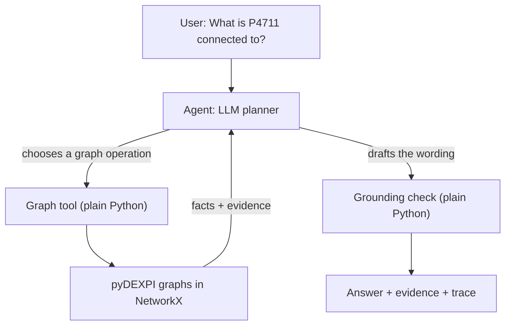
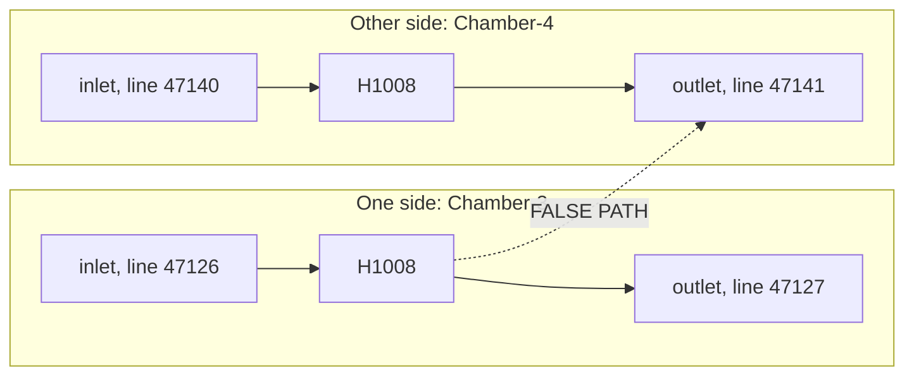
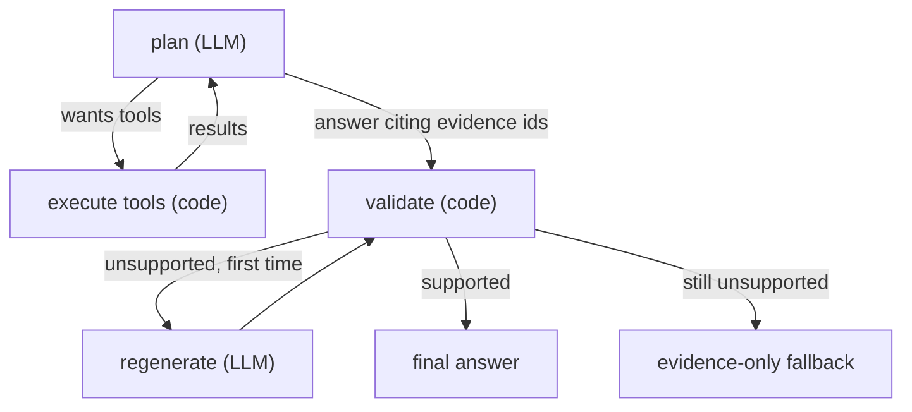

# How it works

A 10 to 15 minute read. For the full reference, see [ARCHITECTURE_DEEP_DIVE.md](ARCHITECTURE_DEEP_DIVE.md).

## The one-screen version

**What it is.** A program that answers plain-English questions about one plant drawing (the DEXPI reference P&ID "C01"): what is connected to what, what is downstream, which line, what size.

**Why it exists.** Engineers ask these questions of drawings all day. The drawing is already a graph, so the answers can be looked up exactly. The hard part is turning an arbitrary question into the right lookups, and that is the only part a language model does.

**How one question gets answered.**



The loop between the agent and the tools can repeat: look something up, read the result, decide whether another lookup is needed.

## The most important idea

**The LLM does not know the plant. The graph knows the plant.**

The model never sees the drawing or the graph. It only sees the results of the lookups it asked for.

| The LLM's job | The deterministic code's job |
|---|---|
| Understand the question | Load C01 through pyDEXPI |
| Decide which graph operation is needed | Resolve names to entities |
| Call the tool with arguments | Traverse connections |
| Read the result | Find paths |
| Decide whether another operation is needed | Retrieve properties |
| Phrase the supported result | Produce evidence for every fact |
| | Check the drafted answer against that evidence |

If the model is wrong about *which* lookup to do, the answer may be incomplete. It cannot be wrong about *what the plant contains*, because it has no other source for it, and what it writes is checked.

## Walkthrough 1: a simple question

> "What is P4711 connected to, and through which pipes?"

This is a real run (Groq `openai/gpt-oss-20b`, during development): 2 tool calls, 3 model calls, 6,046 tokens.

**Step 1. The model asks to find the entity.**

```text
TOOL CALL    find_entities(query = "P4711")
TOOL RESULT  CentrifugalPump-1 · name P4711 · type CentrifugalPump
             matched on: tagName = 'P4711' (exact tag)
             links: 1 pipe upstream, 1 pipe downstream
```

**Step 2. The model asks for its direct neighbours.**

```text
TOOL CALL    get_connections(entity_id = "CentrifugalPump-1", relationship = "piping")
TOOL RESULT  FlowInPipeOffPageConnector-1 -> CentrifugalPump-1 (P4711)
               upstream · line 47121 · segment S1 · DN 80 (DIN 2448) · fluid MNb · class 75HB13 · into nozzle N1
             CentrifugalPump-1 (P4711) -> PlateHeatExchanger-1 (H1007)
               downstream · line 47122 · segment S1 · DN 80 (DIN 2448) · fluid MNb · class 75HB13
               from nozzle N2 · into nozzle N1 [Chamber-1]
```

**Step 3. The model writes the answer.**

| Direction | Connected to | Pipe details |
|---|---|---|
| Upstream | FlowInPipeOffPageConnector-1 | Line 47121, segment S1, DN 80 (DIN 2448), fluid MNb, piping class 75HB13, nozzle N1 |
| Downstream | PlateHeatExchanger-1 (H1007) | Line 47122, segment S1, DN 80 (DIN 2448), fluid MNb, piping class 75HB13, from nozzle N2 to nozzle N1 (Chamber-1) |

**Step 4. Grounding.** 19 plant-specific claims were extracted from the answer and each was found in the tool results. Status: `grounded`.

**Where each value came from:**

| Value in the answer | Came from |
|---|---|
| `P4711` is a centrifugal pump | step 1 result (`type`) |
| `FlowInPipeOffPageConnector-1`, `H1007` | step 2 result (`from` / `to`) |
| `47121`, `47122`, `S1`, `DN 80`, `MNb`, `75HB13` | step 2 result (pipe attributes on each connection) |
| `N1`, `N2`, `Chamber-1` | step 2 result (nozzles, recovered from the plant graph) |
| "Upstream" / "Downstream" | step 2 result (`neighbor_is`) |

Nothing in the answer came from the model's own knowledge.

## Walkthrough 2: a multi-step question

> "Which pumps are upstream of the tubular heat exchanger?"

A real saved evaluation run ([eval-04](../evals/runs/deepseek-deepseek-chat/transcripts/eval-04.txt), DeepSeek `deepseek-chat`): 3 tool calls, 9,460 tokens.

**Why one tool call was not enough.** The question names the exchanger by description, not by tag, and "upstream" means any number of pipes away, not just the neighbour.

```text
1  find_entities(query = "tubular heat exchanger")
   -> TubularHeatExchanger-1 (H1008), matched on type; it is the only one, so not ambiguous

2  list_entities(entity_type = "pump")
   -> CentrifugalPump-1 (P4711), ReciprocatingPump-1 (P4712)

3  traverse(start = "TubularHeatExchanger-1", direction = "upstream", entity_types = pumps)
   -> ReciprocatingPump-1 (P4712)   distance 6    through_equipment: none
   -> CentrifugalPump-1 (P4711)     distance 14   through_equipment: P4712, Tank-1, H1007
```

- **Entity resolved:** "the tubular heat exchanger" became `TubularHeatExchanger-1` by matching the type words.
- **Traversal:** a breadth-first search walking pipes *against* their direction, keeping only pumps.
- **Evidence that came back:** 20 items: the entities, a path to each pump, and every pipe on those paths.
- **How the answer was built:** the model reported both pumps and used `distance` and `through_equipment` to say that P4712 feeds the exchanger directly while P4711 only reaches it through P4712, the tank and H1007.
- **What grounding checked:** 22 claims (tags, ids, hop counts as written, line numbers, DN values). All supported.

## The two graphs

**The problem.** pyDEXPI gives you a graph of the drawing. Why not use it for everything?

Because in that graph a pipe is not a line between two things. It is a *thing*:

```text
PLANT GRAPH (what pyDEXPI loads: 214 nodes)

  CentrifugalPump-1 --owns--> Nozzle (N2)
                                 ^
                                 | sourceItem
                               Pipe  <--owned by-- PipingNetworkSegment-2 <-- line 47122 (DN 80, MNb)
                                 | targetItem
                                 v
  PlateHeatExchanger-1 --owns--> Nozzle (N1) --> Chamber-1
```

Every edge means "owns" or "refers to". None means "flows to". If you follow edges out of the pump you reach its own nozzles, not the heat exchanger.

pyDEXPI also offers a simplified graph that fixes exactly that:

```text
CONCEPTUAL GRAPH (pyDEXPI's abstraction: 36 nodes)

  CentrifugalPump-1 ===== pipe: line 47122, S1, DN 80, MNb =====> PlateHeatExchanger-1
```

Now a pipe is an edge with a direction, and "what is downstream" is a normal graph walk. But the simplification threw things away.

| | Plant graph | Conceptual graph |
|---|---|---|
| Good for | Exact facts: properties, nozzles, chambers, which line owns what | Shape: neighbours, downstream, routes |
| Bad for | Following flow | Details: no nozzles, no chambers, four pipes missing, one tee labelled with the wrong line |

**So the application uses both.** The conceptual graph answers "what connects to what, in which direction". The plant graph answers "what is true about this object", and is used to repair what the simplification lost (nozzles, chambers, the missing pipes). A normalizer merges them once at start-up into one index.

Code: [`graph/normalizer.py`](../src/pid_agent/graph/normalizer.py).

## The seven tools

| Tool | What I would ask it | What it actually does |
|---|---|---|
| `find_entities` | "Which thing is P4711? Which is 'the ball valve'?" | Looks the words up in indexes of tags, identifiers and type names |
| `list_entities` | "What pumps are there?" | Returns every entity of a type |
| `get_entity` | "Tell me about this valve." | Returns its properties, line, identifiers and parts |
| `get_connections` | "What touches it directly?" | Returns the pipes or instrument links on that one entity |
| `traverse` | "What can I reach from here?" | Breadth-first search along pipes, upstream or downstream |
| `find_path` | "How do I get from A to B?" | Shortest piping route between two entities |
| `get_properties` | "What is its design pressure?" | Reads named properties, and says which ones do not exist |

Three of them look similar and are not:

```text
get_connections(A)        A -- B                       one hop: only B

traverse(A, downstream)   A -- B -- C -- D             everything reachable: B, C, D
                                    \-- E                                    and E

find_path(A, D)           A ===== B ===== C ===== D    one route between two known ends
```

- **Adjacency** (`get_connections`): "connected to", "directly".
- **Reachability** (`traverse`): "downstream of", "feeds", "ends up".
- **Path** (`find_path`): "between A and B", "route from A to B".

In this drawing the direct neighbour of a pump is usually a tee or a valve. Answering "where does it discharge to" with adjacency gives the tee, which is why the distinction matters.

There is no tool for a specific question. The same seven served every question asked so far.

Code: [`graph/service.py`](../src/pid_agent/graph/service.py).

## The heat exchanger problem

A heat exchanger has two sides. One fluid goes through one side, another fluid through the other. They exchange heat and never mix. An engineer would call them the process side and the utility side; the graph only calls them chambers.

In the simplified graph the exchanger is a single node, so both sides look joined:



A naive search arriving on line 47126 would continue out on line 47141 and report the valve there as "downstream of the pump". That fluid path does not exist.

**How it is prevented.** Every pipe remembers which nozzle it attaches to, and every nozzle remembers its chamber (both recovered from the plant graph). The search carries the chamber it entered through. It will not leave through a nozzle that belongs to a different chamber.

- Enter H1008 through Chamber-3: may only leave through Chamber-3.
- *Start* at H1008: no entry chamber, so both sides are followed. Both outlets really are downstream of the exchanger itself.
- The skipped crossing is reported in the result as a "chamber boundary", so nothing is silently hidden.

Code: [`graph/traversal.py`](../src/pid_agent/graph/traversal.py) → `FlowGraph.bfs`.

## Open ends

Some pipes on C01 have only one end on this drawing. Example: the pipe on line 47130 that enters heat exchanger H1007 at nozzle N3. The file does not say where it comes from.

| | |
|---|---|
| What the simplified graph lost | The whole pipe. An edge needs two ends, so pyDEXPI's abstraction drops it |
| What the plant graph still had | The pipe object, its line (47130, DN 50, fluid WKa), and the nozzle it attaches to |
| What we recovered | A connection marked `open_end`, with `source: null`, and a note saying it was taken from the plant graph |
| What we did not invent | Where it comes from. No source equipment, no other drawing, nothing |

Two different statements, kept apart:

- **Known open boundary:** "a DN 50 pipe on line 47130 enters H1007 here." This is in the data and is reported.
- **Unknown destination:** "it comes from X." This is not in the data and is never stated.

There are four such pipes. Traversal never walks through them.

## Grounding: a good and a bad answer

Every row of a tool result gets an **evidence id** from the application: `E2.3` is row 3 of step 2, `R2` is the whole result of step 2. The model does not restate facts. It cites ids, and plain Python checks each sentence against the facts those ids stand for. No model judges the answer.

```text
ANSWER SENTENCE    "P4711 feeds H1007 through line 47122, DN 80. [E2.3]"
      |
EVIDENCE ID        E2.3  (assigned by code to a row of get_connections, step 2)
      |
TYPED FACT         flows_to: CentrifugalPump-1 -> PlateHeatExchanger-1
                   (lineNumber 47122, nominalDiameterRepresentation DN 80, ...)
      |
GRAPH SOURCE       conceptual graph; DEXPI objects PipingNetworkSegment-2, PipingNetworkSystem-2
```

The check is about **association**, not presence:

**Good.** `P4711 has designShaftPower 60.0 kW. [E1.1]`: the cited fact is about P4711 and carries that value.

**Bad: right value, wrong item.**

```text
sentence   "P4712's line is DN 80. [R1, R2]"
facts      DN 80 belongs to the pipe P4711 -> H1007. P4712's pipe is DN 50.
result     rejected: the value does not belong to the item the sentence names
```

Both `P4712` and `DN 80` are in the evidence. That is not enough.

**Bad: relation that no tool result shows, or shows the other way.**

```text
"P4711 feeds T4750."            rejected: no result relates them that way
"H1007 is upstream of P4711."   rejected: the result shows it downstream
```

**Bad: unit reinterpreted** (the model really did this in the first evaluation).

```text
graph      nominalDiameter = 800.0 mm   (a chamber dimension)
sentence   "... DN 800 ..."
result     rejected. 800.0 mm is a length; DN is a size designation. Nothing is converted.
```

The rules:

1. **Facts come only from graph data in tool results.** Tool inputs, messages and warnings never become facts, so a value the user typed supports nothing.
2. **Ids come from code.** A made-up or malformed id is rejected.
3. **A value must belong to an item the sentence names.**
4. **A stated relation must be shown by a tool result, in that direction.** Checked wordings: connected, feeds / fed by, downstream / upstream of, operates, route. Single pipes may be followed one after another only under the chamber rule, so the two sides of a heat exchanger stay apart.
5. **One rewrite, then fail closed.** If something unsupported is still there, the user gets the tool results and "could not determine".
6. **Cut-off output is detected.** If the model hits its output limit, the incomplete text is discarded, not parsed.

**When no wording is needed.** If the answer is just what some rows say (an item, a property, a list of results), the model replies with ids only, for example `[R2]`, and the application prints those rows itself. The model is used for deciding what to look up and for explanations, not for reformatting facts.

The result carries a status set by this validation, not by the model: `grounded` (every factual sentence cited and supported), `limited` (supported, but only against all evidence because ids were missing), `ambiguous`, or `insufficient evidence`. There is no confidence percentage.

What it still cannot do: check a sentence that has no identifier, number or recognised relation word; untangle several items and several values packed into one sentence; know whether the P&ID itself is right.

Code: [`agent/evidence_refs.py`](../src/pid_agent/agent/evidence_refs.py) → `annotate_refs`, `check_sentence`, `check_answer`. Facts are built in [`agent/claims.py`](../src/pid_agent/agent/claims.py) → `build_facts`.

## What happens when things go wrong

| Problem | What the user sees | What the system does |
|---|---|---|
| Entity not found | "X was not found in the P&ID", possibly with near-miss suggestions | Resolver returns `not_found`; suggestions are never used as the answer |
| Ambiguous entity | A list of the candidates and a request to pick one | Resolver returns all matches flagged `ambiguous`; nothing is guessed |
| Property missing | "The P&ID does not contain a weight for H1007" | `get_properties` lists the property under `missing` |
| No path | "No downstream path from A to B" (and whether one exists the other way) | `find_path` returns `empty` with a message |
| Open end | "An open-ended pipe on line 47141; its destination is not shown" | Connection carries `open_end`; the far end is `null` |
| Truncated traversal | "The search stopped at depth N; piping continues beyond" | Entities at the cut are marked `continues_beyond_max_depth` |
| Unsupported statement | Usually nothing: the rewrite is clean. Otherwise an evidence list | Validation rejects, one regeneration, then fallback |
| Model cites no evidence ids | The answer, marked "partially grounded (limited)" | Checked against all tool results; never shown as grounded |
| Model output cut off | A shorter answer, or "the answer was cut off and withheld" | `finish_reason=length` is detected; incomplete text is never parsed |
| Question not about the plant | "I can only answer from the loaded P&ID graph" | No graph-supported statement was produced, so the model's text is withheld |
| Request for the key or the instructions | Same refusal | The model has no key to give; text quoting its instructions is withheld |
| Provider failure | "The model provider call failed. This is not a statement about the P&ID" | Error is categorised (rate limit, auth, ...) and kept out of evaluation scores |

## The agent loop



**Why this is an agent and not one LLM call.** The model cannot know what to look up second until it has seen the first result. "Which pumps are upstream of the tubular heat exchanger" needs the exchanger's id before it can traverse from it. So the model is called in a loop, each time with the results so far, until it decides it can answer.

The loop is bounded: at most 8 planning turns and 16 tool calls, and an identical repeated call is refused. The first turn must call a tool, so the graph is always consulted.

Code: [`agent/workflow.py`](../src/pid_agent/agent/workflow.py) → `PidAgent`.

## How to explain this in an interview

### 30 seconds

"I built an agent that answers questions about a P&ID. pyDEXPI turns the drawing into a graph. The language model's only job is to read the question and choose graph operations: find this entity, traverse downstream, get these properties. Plain Python runs those operations and returns facts with evidence. Then the model's answer is checked against that evidence before the user sees it. So the model plans, and the graph supplies every fact."

### 2 minutes

"The drawing is loaded with pyDEXPI into two NetworkX graphs. The detailed one has every object but its edges mean ownership, not flow. The simplified one has pipes as directed edges, which is what you want for 'downstream', but it loses nozzles, chambers and a few pipes. I use the simplified one for connectivity and the detailed one for facts, and merge them into one index at start-up.

On top of that are seven generic tools: find entities, list, get entity, direct connections, traverse, find path, get properties. There is nothing question-specific, because the review uses unseen questions.

The agent is a small LangGraph state machine. The model picks tools, the code runs them, and that repeats until the model answers. The answer cites evidence ids, and a deterministic validator checks each sentence against the typed facts behind those ids. If something is unsupported the model gets one rewrite; after that the user gets the raw evidence instead.

Two things I am most pleased with are the handling of the drawing's messiness: heat exchangers have two sides that must not be connected by a search, and some pipes leave the drawing with no destination, which I report as open ends without inventing where they go."

### 5 minutes, technical

Add to the above:

- **Resolution** is deterministic and tiered: exact tag, identifier, identifier inside a phrase, then type words. Only five items on C01 have tags, so valves are found by component codes or line plus component number. Shared identifiers come back as ambiguous. Fuzzy matches are suggestions only.
- **Direction** is DEXPI source-to-target, which I verified against the XML's `FromID`/`ToID` and the flow-arrow symbols. It is drawing direction, not live flow.
- **Chamber-aware search**: the search state is (entity, chamber), so a path cannot enter one side of an exchanger and leave the other. The boundary is reported as evidence.
- **Traversal results carry path facts**: distance, equipment passed through, real ends, and whether the search was cut off by its depth limit. Those exist because a real model misread a truncated search as "the line ends here".
- **Grounding** uses evidence ids: code labels every result row, the answer cites the ids, and each sentence is checked against the typed facts behind them for pairing (value belongs to the named item) and relation (shown by a tool result, in that direction). Simple results are printed by the application from the rows, without model prose.
- **Evaluation**: 15 questions with gold facts read from the graph, a deterministic scorer, no LLM judge. The final run on NVIDIA-hosted Nemotron 3 Super got 12 of 15 fully correct (13.42 of 15 points), 14 grounded and 1 limited, with no unsupported claims detected by the checks used for that run (it predates the post-evaluation validator hardening described in the README). An earlier run on DeepSeek scored 15 of 15 with a weaker grounding check, so the two are not comparable.
- **Honest limits**: NVIDIA-hosted inference is slow at times (a question can take minutes); the model sometimes answers "feeds" with the adjacent fitting; prose with nothing checkable is not detected; the model can make redundant calls; only C01 has been tested; one evaluation run.

### Questions you will be asked

**Why a graph instead of RAG?**
The questions are about structure: neighbours, reachability, routes. Those have exact answers in a graph. Similarity search over text finds passages that mention a pump, not what is downstream of it.

**Why NetworkX?**
pyDEXPI already produces NetworkX graphs, the drawing is small, and the algorithms needed are basic. A graph database would add setup for no gain at this size.

**Why two graph representations?**
One has the right shape for following flow, the other has the complete facts. Neither is enough alone.

**Why use an LLM at all?**
To map arbitrary wording onto graph operations and chain several of them. That is the part that has to work on questions nobody anticipated.

**How do you prevent hallucinations?**
The model has no plant knowledge to draw on and must call a tool first. Its answer cites evidence ids, and code checks each sentence against the facts those ids stand for: the value must belong to the item named, and a stated relation must be one a tool result shows. Unsupported content gets one rewrite and is then withheld. That reduces hallucination; it does not make it impossible: a sentence with nothing checkable in it is not verified (it only makes the answer "limited"), and a relation worded outside the validator's fixed vocabulary is checked only for the items it names.

**What does downstream mean?**
Following pipes in the direction they are drawn, source to target. It does not mean fluid is currently flowing; valve positions are not in a P&ID.

**What happens with heat exchangers?**
A search cannot enter through one chamber and leave through another. The boundary it did not cross is reported.

**What happens when data is missing?**
It is reported as missing: absent properties, unknown tags, pipes with no destination. Nothing is filled in.

**How did you evaluate it?**
Fifteen questions with graph-derived expected facts and a deterministic scorer. The final run got 12 fully correct and 3 partially correct, none with a false statement: two answers left something out and one stopped a lookup early. Median latency was 21 s, almost all of it hosted model inference.

**What are the biggest current limitations?**
Provider latency; "feeds" answered with the adjacent fitting; instrumentation chains cost one call per hop; only one drawing has been tried.

**What would you build next in production?**
Many drawings joined across sheets through the off-page connectors, a persistent graph store behind the same tool interface, stored traces for audit, and evaluation sets written by plant engineers.
